# Defensive Back Brain

The DB brain covers both **cornerbacks** and **safeties**, handling man and zone coverage, press technique, ball-hawking decisions, and run support.

---

## Overview

### DB Types

| Type | Primary Role | Alignment | Key Skills |
|------|--------------|-----------|------------|
| CB1/CB2 | Cover WR1/WR2 | Wide, on receiver | Man coverage, press |
| Slot CB | Cover slot receivers | Inside | Quick feet, zone |
| FS | Deep center field | 12-15 yards deep | Range, ball skills |
| SS | Run support + coverage | 8-10 yards, near box | Tackling, versatility |

### Responsibilities

| Phase | Primary Duties |
|-------|---------------|
| PRE_SNAP | Align, read formation, identify assignment |
| POST_SNAP | Execute coverage technique (man/zone) |
| BALL IN AIR | Play ball or play receiver |
| RUN SUPPORT | Fit run, force/contain, alley fill |
| PURSUIT | Chase ballcarrier with angle |

### Coverage Philosophy

**Man Coverage:** Stay attached to receiver, prevent separation
**Zone Coverage:** Protect area, read QB, react to threats
**Match Coverage:** Hybrid - pattern match within zones

---

## Interface Contract

### Inputs (from WorldState)

| Field | Usage |
|-------|-------|
| `offense` | Track receivers, identify threats |
| `ball` | React to throw, track ball flight |
| `coverage_assignments` | Get man/zone assignment |
| `spatial.get_influence_at()` | Evaluate coverage leverage |
| `clock.time_since_snap` | Route timing, break anticipation |

### Outputs (BrainDecision)

| Action | target_pos | target_id | data | Description |
|--------|------------|-----------|------|-------------|
| `"press"` | - | receiver_id | `{technique}` | Press at LOS |
| `"jam"` | - | receiver_id | `{direction}` | Jam receiver |
| `"backpedal"` | retreat pos | receiver_id | `{depth}` | Backpedal maintaining cushion |
| `"trail"` | - | receiver_id | `{leverage}` | Trail receiver in man |
| `"mirror"` | - | receiver_id | - | Mirror receiver movement |
| `"flip_hips"` | - | receiver_id | `{direction}` | Turn and run |
| `"zone_drop"` | zone anchor | - | `{zone, depth}` | Drop to zone |
| `"pattern_read"` | - | receiver_id | `{pattern}` | Read pattern in zone |
| `"break_on_ball"` | intercept point | - | - | Break toward ball |
| `"play_ball"` | ball position | - | `{int_attempt}` | Track and play ball |
| `"play_receiver"` | - | receiver_id | - | Play through receiver's hands |
| `"rally"` | tackle point | ballcarrier_id | - | Rally to ball |
| `"force"` | force point | - | - | Set edge, force inside |
| `"fill_alley"` | alley point | - | - | Fill run alley |

### State Variables

| Variable | Type | Description |
|----------|------|-------------|
| `coverage_type` | CoverageType | MAN, ZONE, PRESS_MAN, OFF_MAN |
| `receiver_key` | Optional[str] | Receiver being covered (man) |
| `zone_assignment` | Optional[Zone] | Zone being covered |
| `in_phase` | bool | Am I in phase with receiver |
| `separation` | float | Current separation from receiver |
| `cushion` | float | Current cushion (off man) |
| `hip_direction` | Direction | Which way hips are turned |
| `read_confidence` | float | Confidence in route read |
| `ball_in_air` | bool | Ball has been thrown |
| `is_target` | bool | Ball coming to my receiver |

---

## Behavior Tree

```mermaid
flowchart TB
    Root[["[Selector] DB Root"]]

    Root --> Down["(Is Down?)"]
    Down --> |Yes| Stay["<Stay Down>"]

    Root --> BallAir["[Selector] Ball In Air"]
    BallAir --> IsBallAir["(Ball In Air?)"]
    IsBallAir --> |Yes| BallSel["[Selector]"]

    BallSel --> ToMe["[Sequence] Ball to My Receiver"]
    ToMe --> IsTarget["(Ball to My Receiver?)"]
    IsTarget --> |Yes| TargetSel["[Selector] Contest Type"]

    TargetSel --> InPos["[Sequence] In Position"]
    InPos --> CloseEnough["(Within 1.5 Yards?)"]
    CloseEnough --> |Yes| InPosSel["[Selector] Ball Reaction"]
    InPosSel --> PlayBall["[Sequence] Play Ball"]
    PlayBall --> CanSee["(Can See Ball?)"]
    CanSee --> |Yes| PlayBallSeq["[Sequence]"]
    PlayBallSeq --> TrackBall["<Track Ball>"]
    PlayBallSeq --> IntDecision["[Selector] INT Decision"]
    IntDecision --> HighPoint["[Sequence]"]
    HighPoint --> CanHighPoint["(Can High Point?)"]
    CanHighPoint --> |Yes| DoHighPoint["<High Point / Intercept>"]
    IntDecision --> Undercut["[Sequence]"]
    Undercut --> CanUndercut["(Can Undercut?)"]
    CanUndercut --> |Yes| DoUndercut["<Undercut for INT>"]
    IntDecision --> PBU["<Break Up Pass>"]

    InPosSel --> PlayRec["[Sequence] Play Receiver"]
    PlayRec --> CantSee["(Can't See Ball?)"]
    CantSee --> |Yes| PlayRecSeq["[Sequence]"]
    PlayRecSeq --> ReadEyes["<Read Receiver Eyes>"]
    PlayRecSeq --> PlayHands["<Play Through Hands>"]
    PlayRecSeq --> DisruptCatch["<Disrupt Catch>"]

    TargetSel --> Trailing["[Sequence] Trailing"]
    Trailing --> FarBehind["(More Than 1.5 Yards?)"]
    FarBehind --> |Yes| TrailSeq["[Sequence]"]
    TrailSeq --> CloseGround["<Close Ground>"]
    TrailSeq --> DiveChoice["[Selector]"]
    DiveChoice --> DiveINT["[Sequence]"]
    DiveINT --> CanDiveINT["(Can Dive for INT?)"]
    CanDiveINT --> |Yes| DoDiveINT["<Dive for Ball>"]
    DiveChoice --> DiveTackle["<Dive to Tackle/Disrupt>"]

    BallSel --> NotMe["[Sequence] Ball Elsewhere"]
    NotMe --> BallAway["(Ball Not to Me?)"]
    BallAway --> |Yes| RallySel["[Selector]"]
    RallySel --> CanInt["[Sequence] Intercept Opportunity"]
    CanInt --> IntAngle["(Have Intercept Angle?)"]
    IntAngle --> |Yes| BreakInt["<Break for Interception>"]
    RallySel --> RallyBall["<Rally to Ball>"]

    Root --> Press["[Sequence] Press Coverage"]
    Press --> IsPress["(Press Technique?)"]
    IsPress --> |Yes| PressSel["[Selector] Press Phase"]

    PressSel --> Jam["[Sequence] Jam at LOS"]
    Jam --> AtLOS["(At LOS?)"]
    AtLOS --> |Yes| JamSeq["[Sequence]"]
    JamSeq --> ReadRelease["<Read Release>"]
    JamSeq --> JamSel["[Selector] Jam Type"]
    JamSel --> MirrorJam["[Sequence]"]
    MirrorJam --> InsideRel["(Inside Release?)"]
    InsideRel --> |Yes| MirrorIn["<Mirror + Jam Inside>"]
    JamSel --> RedirectJam["[Sequence]"]
    RedirectJam --> OutsideRel["(Outside Release?)"]
    OutsideRel --> |Yes| RedirectIn["<Redirect Inside>"]
    JamSel --> SpeedRel["[Sequence]"]
    SpeedRel --> SpeedRelease["(Speed Release?)"]
    SpeedRelease --> |Yes| CatchFunnel["<Catch + Funnel>"]
    JamSel --> DefaultJam["<Punch + React>"]

    PressSel --> PostJam["[Sequence] Post-Jam Phase"]
    PostJam --> PastJam["(Past LOS?)"]
    PastJam --> |Yes| PhaseSel["[Selector] Phase Position"]
    PhaseSel --> OnHip["[Sequence]"]
    OnHip --> AmOnHip["(On Hip?)"]
    AmOnHip --> |Yes| HipSeq["[Sequence]"]
    HipSeq --> Plaster["<Plaster to Hip>"]
    HipSeq --> ReadForBreak["<Read for Break>"]
    HipSeq --> ReactBreak["(WR Breaking?)"]
    ReactBreak --> |Yes| MatchBreak["<Match Break>"]
    PhaseSel --> Stacked["[Sequence]"]
    Stacked --> AmStacked["(Stacked?)"]
    AmStacked --> |Yes| StackSeq["[Sequence]"]
    StackSeq --> MaintainStack["<Maintain Stack Position>"]
    StackSeq --> UseLeverage["<Use Leverage>"]

    Root --> OffMan["[Sequence] Off Man Coverage"]
    OffMan --> IsOffMan["(Off Man Technique?)"]
    IsOffMan --> |Yes| OffManSel["[Selector] Off Man Phase"]

    OffManSel --> Backpedal["[Sequence] Backpedal Phase"]
    Backpedal --> PreBreak["(Pre-Break?)"]
    PreBreak --> |Yes| BPSeq["[Sequence]"]
    BPSeq --> BPDepth["<Backpedal to Cushion>"]
    BPSeq --> KeyWR["<Key Receiver Hips>"]
    BPSeq --> ReadHips["<Read for Hip Movement>"]

    OffManSel --> Transition["[Sequence] Transition"]
    Transition --> Breaking["(WR Breaking?)"]
    Breaking --> |Yes| TransSel["[Selector] Break Direction"]
    TransSel --> InBreak["[Sequence]"]
    InBreak --> BreakIn["(In-Breaking?)"]
    BreakIn --> |Yes| FlipIn["<Flip Hips Inside>"]
    TransSel --> OutBreak["[Sequence]"]
    OutBreak --> BreakOut["(Out-Breaking?)"]
    BreakOut --> |Yes| FlipOut["<Flip Hips Outside>"]
    TransSel --> Vertical["[Sequence]"]
    Vertical --> GoingDeep["(Vertical?)"]
    GoingDeep --> |Yes| TurnRun["<Turn and Run>"]

    OffManSel --> Closing["[Sequence] Closing Phase"]
    Closing --> PostBreak["(Post-Break?)"]
    PostBreak --> |Yes| CloseSel["[Selector]"]
    CloseSel --> InPhase2["[Sequence]"]
    InPhase2 --> AmIn["(In Phase?)"]
    AmIn --> |Yes| MirrorClose["<Mirror / Close>"]
    CloseSel --> OutPhase["[Sequence]"]
    OutPhase --> AmOut["(Out of Phase?)"]
    AmOut --> |Yes| TrailClose["<Trail / Recover>"]

    Root --> Zone["[Selector] Zone Coverage"]
    Zone --> IsZone["(Zone Assignment?)"]
    IsZone --> |Yes| ZoneSel["[Selector] Zone Type"]

    ZoneSel --> DeepThird["[Sequence] Deep Third"]
    DeepThird --> ThirdAssign["(Deep Third?)"]
    ThirdAssign --> |Yes| ThirdSeq["[Sequence]"]
    ThirdSeq --> Bail["<Bail to Depth>"]
    ThirdSeq --> FindNum1["<Find #1 Threat>"]
    ThirdSeq --> ThirdRead["[Selector] Vertical Threat"]
    ThirdRead --> Vert1["[Sequence]"]
    Vert1 --> Num1Vert["(#1 Vertical?)"]
    Num1Vert --> |Yes| Match1["<Match #1 Deep>"]
    ThirdRead --> NoVert["[Sequence]"]
    NoVert --> Num1Under["(#1 Not Vertical?)"]
    Num1Under --> |Yes| Rob["<Rob Underneath>"]

    ZoneSel --> DeepHalf["[Sequence] Deep Half"]
    DeepHalf --> HalfAssign["(Deep Half?)"]
    HalfAssign --> |Yes| HalfSeq["[Sequence]"]
    HalfSeq --> AlignHalf["<Align Hash to Sideline>"]
    HalfSeq --> ReadOneTwo["<Read #1 and #2>"]
    HalfSeq --> HalfRead["[Selector]"]
    HalfRead --> OneDeep["[Sequence]"]
    OneDeep --> Num1Deep["(#1 Deep Outside?)"]
    Num1Deep --> |Yes| CarrySide["<Carry to Sideline>"]
    HalfRead --> TwoSeam["[Sequence]"]
    TwoSeam --> Num2Seam["(#2 Up Seam?)"]
    Num2Seam --> |Yes| SqueezeSeam["<Squeeze Seam>"]
    HalfRead --> AllUnder["[Sequence]"]
    AllUnder --> NoneDeep["(All Underneath?)"]
    NoneDeep --> |Yes| SqueezeDown["<Squeeze Down>"]

    ZoneSel --> Quarter["[Sequence] Quarter Zone"]
    Quarter --> QuarterAssign["(Quarter?)"]
    QuarterAssign --> |Yes| QuarterSeq["[Sequence]"]
    QuarterSeq --> Cushion2["<Maintain Cushion>"]
    QuarterSeq --> ReadOneTwoQ["<Read #1 and #2>"]
    QuarterSeq --> QuarterRead["[Selector]"]
    QuarterRead --> OneVertTwo["[Sequence]"]
    OneVertTwo --> OneV["(#1 Vert, #2 Out?)"]
    OneV --> |Yes| Carry1["<Carry #1>"]
    QuarterRead --> TwoVert["[Sequence]"]
    TwoVert --> TwoV["(#2 Vert Inside?)"]
    TwoV --> |Yes| PassSafety["<Pass #2 to Safety, Sink>"]

    ZoneSel --> Flat["[Sequence] Flat Zone"]
    Flat --> FlatAssign["(Flat Zone?)"]
    FlatAssign --> |Yes| FlatSeq["[Sequence]"]
    FlatSeq --> Funnel["<Funnel #1 Inside>"]
    FlatSeq --> Sink["<Sink to Flat>"]
    FlatSeq --> ReadNum2["<Read #2>"]
    FlatSeq --> FlatRead["[Selector]"]
    FlatRead --> TwoToFlat["(#2 to Flat?)"]
    TwoToFlat --> |Yes| JumpFlat["<Jump #2 in Flat>"]
    FlatRead --> TwoVert2["<Squeeze Under #1>"]

    Root --> RunSupport["[Sequence] Run Support"]
    RunSupport --> RunDiag["(Run Diagnosed?)"]
    RunDiag --> |Yes| RunSel["[Selector]"]

    RunSel --> Force["[Sequence] Force Player"]
    Force --> ForceAssign["(Force Responsibility?)"]
    ForceAssign --> |Yes| ForceSeq["[Sequence]"]
    ForceSeq --> AttackAlley["<Attack Alley>"]
    ForceSeq --> TakeOnBlock["<Take On Block>"]
    ForceSeq --> TurnInside["<Turn Play Inside>"]

    RunSel --> Contain["[Sequence] Contain"]
    Contain --> ContainAssign["(Contain?)"]
    ContainAssign --> |Yes| ContainSeq["[Sequence]"]
    ContainSeq --> Widen["<Widen / Get Depth>"]
    ContainSeq --> Squeeze["<Squeeze Ballcarrier>"]
    ContainSeq --> NoOutside["<Don't Get Beat Outside>"]

    RunSel --> AlleyFill["[Sequence] Alley Fill"]
    AlleyFill --> AlleyAssign["(Alley Player?)"]
    AlleyAssign --> |Yes| AlleySeq["[Sequence]"]
    AlleySeq --> TriggerDown["<Trigger Downhill>"]
    AlleySeq --> FillInside["<Fill Inside Force>"]
    AlleySeq --> MakeTackle["<Make Tackle>"]

    RunSel --> Cutback["[Sequence] Cutback"]
    Cutback --> CutbackAssign["(Cutback Player?)"]
    CutbackAssign --> |Yes| CutbackSeq["[Sequence]"]
    CutbackSeq --> SlowRead["<Slow Read>"]
    CutbackSeq --> FillBackside["<Fill Backside>"]
    CutbackSeq --> CutOff["<Cut Off Cutback>"]

    Root --> Blitz2["[Sequence] DB Blitz"]
    Blitz2 --> BlitzAssign["(Blitz Assignment?)"]
    BlitzAssign --> |Yes| BlitzSel["[Selector]"]
    BlitzSel --> CornerBlitz["[Sequence]"]
    CornerBlitz --> CBBlitz["(Corner Blitz?)"]
    CBBlitz --> |Yes| CBSeq["[Sequence]"]
    CBSeq --> CreepEdge["<Creep to Edge>"]
    CBSeq --> TimeSnap["<Time Snap>"]
    CBSeq --> BendCorner["<Bend Around Edge>"]
    BlitzSel --> SafetyBlitz["[Sequence]"]
    SafetyBlitz --> SBlitz["(Safety Blitz?)"]
    SBlitz --> |Yes| SSeq["[Sequence]"]
    SSeq --> CreepGap["<Creep to Gap>"]
    SSeq --> HitGap["<Hit Gap at Snap>"]
    SSeq --> GetQB["<Get to QB>"]

    Root --> Stance["<Hold Stance>"]
```



---

## Decision Deep-Dives

### 1. Ball-Hawking Decision Matrix

The critical decision: When to abandon coverage responsibility to play the ball.

**INT Attempt Requirements:**

| Factor | Threshold for INT Attempt |
|--------|--------------------------|
| Ball location | Can reach ball before receiver |
| Angle | Clean angle to ball (not through receiver) |
| Competition | Not being high-pointed by receiver |
| Risk | Acceptable miss consequences |

**Decision Matrix:**

| Separation | Ball Placement | Action | Reasoning |
|------------|---------------|--------|-----------|
| > 2 yards ahead | Any | Play ball, INT | Clear advantage |
| 1-2 yards ahead | Good | INT attempt | Good odds |
| 1-2 yards ahead | Perfect | PBU | INT risky, prevent catch |
| Even | Under/behind | INT attempt | Ball coming to you |
| Even | Over receiver | Let receiver, PBU | Can't win high point |
| Behind < 2 yards | Any | Play receiver | Play hands, disrupt |
| Behind > 2 yards | Any | Rally | Can't affect catch |

**INT vs PBU Decision:**
```
if can_reach_ball_first and angle_clear:
    if completion_probability_if_miss < 0.3:
        attempt_int()  # Worth the risk
    else:
        attempt_pbu()  # Safer play
elif separation < 1.5:
    play_through_hands()  # Disrupt
else:
    rally_for_tackle()  # Can't affect
```

### 2. Press Coverage Technique

**Press Phases:**

| Phase | Duration | Focus |
|-------|----------|-------|
| Read | 0.0-0.1s | Identify release |
| Jam | 0.1-0.4s | Disrupt timing |
| Mirror | 0.4-1.0s | Stay attached |
| Trail | 1.0s+ | Maintain phase |

**Release Counters:**

| Receiver Release | CB Counter | Risk |
|-----------------|------------|------|
| Inside | Jam inside shoulder, funnel out | Speed release |
| Outside | Redirect inside | Get beat outside |
| Speed | Quick feet, maintain cushion | Clean release |
| Double move | React to second move | Bite first move |

**Jam Technique:**
```
at_release:
    if receiver.release_direction == INSIDE:
        jam_point = receiver.inside_shoulder
        redirect_direction = OUTSIDE
    elif receiver.release_direction == OUTSIDE:
        jam_point = receiver.outside_shoulder
        redirect_direction = INSIDE
    else:  # Speed release
        backpedal_react()

jam_success_rate = base_rate * (press_rating / 80)
if successful:
    receiver.route_delayed(0.2-0.4s)
    cb.maintains_phase()
else:
    cb.enters_trail()
```

### 3. Off-Man Technique

**Cushion Management:**

| Alignment | Cushion | Route Defended | Weakness |
|-----------|---------|----------------|----------|
| 5 yards | Short | Quick game | Go routes |
| 7 yards | Medium | All-around | N/A |
| 10 yards | Deep | Deep | Short game |

**Backpedal Technique:**
```
while receiver.in_stem:
    maintain_cushion(target_cushion)
    key_receiver.hips()

    if receiver.hips_turn:
        anticipate_break_direction()
        begin_transition()
```

**Hip Flip Timing:**

| Read Quality | Flip Timing | Result |
|--------------|-------------|--------|
| Perfect | Pre-break | In phase |
| Good | At break | Slight trail |
| Late | Post-break | Out of phase |
| Wrong | Any | Beaten badly |

**Flip Penalty Phase:**
```
flip_time = 0.15 + (1 - man_coverage / 100) * 0.15
# 0.15s (elite) to 0.30s (poor)

during_flip:
    vulnerable_to_double_move = True
    speed_reduced = 0.7  # 30% speed loss
```

### 4. Zone Coverage Reads

**Zone Landmarks:**

| Zone | Depth | Width | Primary Key |
|------|-------|-------|-------------|
| Deep Third | 12-15 yards | Sideline to far hash | #1 vertical |
| Deep Half | 15-18 yards | Hash to sideline | #1 and seam |
| Quarter | 10-12 yards | Quarter of field | #1 and #2 |
| Flat | 5-8 yards | Numbers to sideline | #2 to flat |

**Pattern Reading:**

| Pattern | #1 Route | #2 Route | Zone Response |
|---------|----------|----------|---------------|
| Smash | Hitch | Corner | Deep carries corner |
| Flood | Clear out | Flat | Flat jumps #2 |
| Mills | Post | Dig | Bracket post |
| Four Verts | Go | Seam | Match verticals |

**Zone Trigger:**
```
in_zone:
    if receiver_enters_zone and within_threat_range:
        if is_vertical_threat:
            match_vertical()
        elif is_sitting:
            drive_on_receiver()
        else:
            track_through_zone()

    if ball_thrown_to_zone:
        break_on_ball()
```

### 5. Run Support Roles

**Coverage-Based Run Triggers:**

| Coverage | CB Role | Safety Role | Trigger Time |
|----------|---------|-------------|--------------|
| Cover 1 | Contain | Force | Immediate |
| Cover 2 | Force | Alley | 0.3-0.5s |
| Cover 3 | Force | Deep cutback | 0.2-0.4s |
| Cover 4 | Contain | Alley | 0.3-0.5s |
| Man | Rally | Rally | 0.5s+ |

**Force vs Contain:**

| Role | Responsibility | Technique |
|------|---------------|-----------|
| Force | Set edge, turn play in | Attack, wrong-arm kick |
| Contain | Don't get beat outside | Squeeze, maintain leverage |
| Alley | Fill inside force | Downhill, make tackle |
| Cutback | Backside pursuit | Slow play, fill cutback |

### 6. Safety-Specific Decisions

**Single High (Cover 1/3):**
```
pre_snap:
    align_center_field(12-15 yards)

post_snap:
    read_qb_eyes()
    triangulate_deep_threats()

    if post_route_developing:
        break_on_post()
    elif seam_threat:
        help_over_seam()
    else:
        maintain_deep_middle()
```

**Split Safety (Cover 2/4):**
```
pre_snap:
    align_hash_to_sideline(12 yards)

post_snap:
    read_receivers_in_zone()

    if receiver_1_deep_outside:
        carry_to_sideline()
    elif receiver_2_up_seam:
        squeeze_seam()
    else:
        squeeze_down_rob()
```

**Robber Technique:**
```
pre_snap:
    show_deep_look()

post_snap:
    wait_for_route_development(0.5-1.0s)
    identify_target_route()  # Usually dig/cross

on_throw:
    if ball_to_target_area:
        drive_for_interception()
    else:
        rally_to_ball()
```

---

## Perception Model

### Vision by Position

| Position | Primary Focus | Peripheral |
|----------|--------------|------------|
| CB (man) | Receiver | Ball on throw |
| CB (zone) | QB → Receivers | Zone threats |
| FS | QB eyes, deep threats | Full field |
| SS | Box, #2 receiver | Run/pass keys |

### Ball Tracking Ability

| Attribute | Effect on Ball Tracking |
|-----------|------------------------|
| awareness | Speed of ball location |
| catching | High-point ability |
| speed | Recovery to ball |

**Ball Reaction Time:**
```
reaction_time = 0.2 - (awareness / 100) * 0.1
# 0.1s (elite) to 0.2s (average)
```

---

## Special Scenarios

### Scramble Drill

When QB leaves pocket:

| Coverage Type | Response |
|---------------|----------|
| Man | Maintain coverage, find QB |
| Zone | Collapse zone toward QB, match nearest |
| Press | Convert to trail, find QB |

**Scramble Drill Priority:**
1. Contain scramble (edge player)
2. Maintain deep coverage (FS)
3. Rally to ball (everyone else)

### Communication

**DB Calls:**

| Call | Meaning |
|------|---------|
| "Over/Under" | Leverage position |
| "In/Out" | Help location |
| "Ball!" | Ball thrown |
| "Cross!" | Crosser coming |
| "Stack!" | Receivers stacked |
| "Passing off!" | Zone exchange |
| "Me!" | Taking responsibility |

### Bracket Coverage

Two defenders on one receiver:

| Bracket Type | Inside Player | Outside Player |
|--------------|---------------|----------------|
| High-Low | Short routes | Deep routes |
| In-Out | Inside breaks | Outside breaks |
| Funnel | Redirect inside | Match anywhere |

---

## Attribute Mapping

### Primary Attributes

| Attribute | Effect |
|-----------|--------|
| `man_coverage` | Stay in phase, break reaction, trail technique |
| `zone_coverage` | Pattern reading, zone drops, ball reaction |
| `press` | Jam success, reroute ability |
| `speed` | Recovery, deep coverage, close ground |

### Secondary Attributes

| Attribute | Effect |
|-----------|--------|
| `awareness` | Ball location, play recognition |
| `play_recognition` | Route anticipation, run triggers |
| `tackling` | Run support, after-catch tackles |
| `catching` | Interception ability |

### Threshold Tables

**Man Coverage → Phase Retention:**
| Rating | Press Win Rate | Break Reaction | Trail Success |
|--------|---------------|----------------|---------------|
| 95+ | 85% | 0.1s | 90% |
| 85-94 | 70% | 0.15s | 80% |
| 75-84 | 55% | 0.2s | 65% |
| 65-74 | 40% | 0.25s | 50% |
| < 65 | 25% | 0.3s | 35% |

**Zone Coverage → Pattern Reading:**
| Rating | Read Speed | Trigger Speed | INT Opportunity |
|--------|------------|---------------|-----------------|
| 95+ | 0.1s | Immediate | High |
| 85-94 | 0.15s | Quick | Good |
| 75-84 | 0.2s | Normal | Moderate |
| 65-74 | 0.25s | Slow | Low |
| < 65 | 0.3s | Very slow | Rare |

---

## Integration Points

### Events Consumed

| Event | Response |
|-------|----------|
| `SNAP` | Begin coverage |
| `ROUTE_BREAK` | React to break |
| `THROW` | Break on ball |
| `CATCH` | Rally to ballcarrier |
| `RUN_DIAGNOSED` | Trigger run support |
| `SCRAMBLE` | Adjust coverage |

### Events Emitted (via BrainDecision)

| Event | Trigger |
|-------|---------|
| `COVERAGE_BROKEN` | Lost receiver |
| `INTERCEPTION_ATTEMPT` | Going for INT |
| `PASS_BREAKUP` | PBU attempt |
| `TACKLE_ATTEMPT` | Run support tackle |
| `FORCE_SET` | Edge responsibility |

### Coordination with Other Brains

| Brain | Coordination |
|-------|--------------|
| LB Brain | Zone hand-offs, run fit |
| Other DBs | Bracket coverage, deep help |
| DL Brain | Contain responsibility |

---

## Example Decisions

### Example 1: Press Coverage
```
Time: 0.15s post-snap
Technique: Press man
Receiver: Outside release
Press rating: 82

Decision: REDIRECT_JAM (inside)
Reasoning: "WR taking outside release. Redirecting inside with jam.
           Press rating 82 = 55% success rate. Maintaining inside leverage."
```

### Example 2: Zone Break on Ball
```
Time: 1.8s post-snap
Coverage: Cover 3 (deep third)
Ball: Thrown to seam, 15 yards
Receiver: Crossing through zone

Decision: BREAK_ON_BALL
Reasoning: "Ball thrown to seam. Receiver crossing at 12 yards.
           Have inside angle. Breaking for interception."
```

### Example 3: Ball-Hawking Decision
```
Time: 2.1s post-snap
Coverage: Man, trailing by 1.2 yards
Ball: Thrown to my receiver, back shoulder
Position: Inside leverage

Decision: PLAY_RECEIVER
Reasoning: "Trailing by 1.2 yards. Ball back shoulder, away from me.
           Cannot get to ball. Playing through receiver's hands."
```

### Example 4: Run Support
```
Time: 0.4s post-snap
Coverage: Cover 2
Diagnosis: Run right
Role: Force player

Decision: FORCE (attack alley)
Reasoning: "Run diagnosed right. Force responsibility in Cover 2.
           Attacking alley to set edge. Will wrong-arm if blocked."
```

---

## State Machine Summary

```
                    ┌──────────────┐
                    │   PRE_SNAP   │
                    └──────┬───────┘
                           │ SNAP
                           ▼
    ┌──────────────────────┴──────────────────────┐
    │                 COVERAGE                     │
    └──────────────────────┬──────────────────────┘
                           │
    ┌──────────────────────┼──────────────────────┐
    ▼                      ▼                      ▼
┌─────────┐          ┌──────────┐          ┌─────────┐
│  PRESS  │          │   ZONE   │          │ OFF_MAN │
└────┬────┘          └────┬─────┘          └────┬────┘
     │                    │                     │
     ▼                    ▼                     ▼
┌─────────┐          ┌──────────┐          ┌─────────┐
│  TRAIL  │          │ PATTERN  │          │BACKPEDAL│
│  PHASE  │          │   READ   │          └────┬────┘
└────┬────┘          └────┬─────┘               │
     │                    │                     ▼
     │                    │               ┌─────────┐
     │                    │               │TRANSITION│
     │                    │               └────┬────┘
     └────────────────────┼────────────────────┘
                          │
                          ▼
                    ┌──────────────┐
                    │ BALL IN AIR  │
                    └──────┬───────┘
                           │
         ┌─────────────────┼─────────────────┐
         ▼                 ▼                 ▼
    ┌─────────┐      ┌──────────┐      ┌─────────┐
    │PLAY BALL│      │PLAY RECV │      │  RALLY  │
    └─────────┘      └──────────┘      └─────────┘
         │                 │                 │
         ▼                 ▼                 ▼
    ┌─────────┐      ┌──────────┐      ┌─────────┐
    │  INT    │      │   PBU    │      │ TACKLE  │
    └─────────┘      └──────────┘      └─────────┘
```
