# Linebacker Brain

The linebacker brain is the most versatile defensive brain, responsible for diagnosing plays, fitting gaps against the run, dropping into coverage, and executing blitzes.

---

## Overview

### Responsibilities

| Phase | Primary Duties |
|-------|---------------|
| PRE_SNAP | Align, read formation, anticipate play type |
| POST_SNAP READ | Diagnose run vs pass (0.2-0.4s) |
| RUN RESPONSE | Fit assigned gap, take on blockers, pursue |
| PASS RESPONSE | Execute zone drop or man coverage |
| BLITZ | Rush QB through assigned gap |
| PURSUIT | Chase ballcarrier with proper angle |

### LB Types and Tendencies

| Type | Run Priority | Coverage Priority | Blitz Frequency |
|------|--------------|-------------------|-----------------|
| MIKE (MLB) | Gap fit, anchor | Hook zones, RB | Moderate |
| WILL (WLB) | Cutback, pursuit | Flat/curl zones, RB | Low |
| SAM (SLB) | Edge, contain | TE coverage, force | Moderate |
| ILB | Gap fit | Short zones | Moderate |
| OLB (3-4) | Edge set | Seam/flat | High |

### When Active

- From SNAP until play dead
- Brain focus shifts based on run/pass diagnosis
- Transitions to pursuit mode when ballcarrier identified

---

## Interface Contract

### Inputs (from WorldState)

| Field | Usage |
|-------|-------|
| `offense` | Read OL, identify ballcarrier, find receivers |
| `defense` | Coordinate with other defenders |
| `ball` | Track ball location and state |
| `spatial.find_threats()` | Identify receivers in zone |
| `coverage_assignments` | Get zone/man responsibility |
| `clock.time_since_snap` | Read timing, trigger delays |

### Outputs (BrainDecision)

| Action | target_pos | target_id | data | Description |
|--------|------------|-----------|------|-------------|
| `"read"` | - | - | `{read_focus}` | Still diagnosing |
| `"fit_gap"` | gap location | - | `{gap, fit_type}` | Attack assigned gap |
| `"scrape"` | scrape point | - | `{direction}` | Scrape over top |
| `"spill"` | force point | blocker_id | - | Wrong-arm, spill outside |
| `"squeeze"` | squeeze point | - | - | Squeeze play inside |
| `"zone_drop"` | zone anchor | - | `{zone_type, depth}` | Drop to zone |
| `"man_cover"` | - | receiver_id | - | Cover man assignment |
| `"wall"` | wall point | - | `{direction}` | Wall off crossers |
| `"break_on_ball"` | ball_target | - | - | Break on thrown ball |
| `"blitz"` | rush lane | - | `{gap, timing}` | Rush QB |
| `"pursue"` | intercept point | - | `{angle}` | Chase ballcarrier |
| `"tackle"` | ballcarrier pos | ballcarrier_id | - | Attempt tackle |

### State Variables

| Variable | Type | Description |
|----------|------|-------------|
| `read_complete` | bool | Has diagnosed run/pass |
| `play_diagnosis` | PlayType | RUN, PASS, RPO, SCREEN, DRAW, UNKNOWN |
| `read_confidence` | float | 0-1, how sure of diagnosis |
| `gap_assignment` | Gap | Assigned gap (A, B, C, D) |
| `zone_assignment` | Zone | Assigned zone if in coverage |
| `man_assignment` | Optional[str] | Player ID if man coverage |
| `time_since_read` | float | Time since read completed |
| `blitz_assignment` | Optional[BlitzPath] | Blitz gap and timing |
| `pursuit_angle` | float | Current pursuit angle |

---

## Behavior Tree

```mermaid
flowchart TB
    Root[["[Selector] LB Root"]]

    Root --> Down["(Is Down?)"]
    Down --> |Yes| Stay["<Stay Down>"]

    Root --> Blitz["[Sequence] Blitz Assignment"]
    Blitz --> HasBlitz["(Blitz Called?)"]
    HasBlitz --> |Yes| BlitzSel["[Selector] Blitz Execution"]
    BlitzSel --> AGapBlitz["[Sequence] A-Gap"]
    AGapBlitz --> AGap["(A-Gap Blitz?)"]
    AGap --> |Yes| ASeq["[Sequence]"]
    ASeq --> TimeSnap["<Time Snap Count>"]
    ASeq --> HitAGap["<Hit A-Gap at Snap>"]
    ASeq --> AvoidCenter["<Avoid/Defeat Center>"]
    ASeq --> GetQB["<Get to QB>"]
    BlitzSel --> BGapBlitz["[Sequence] B-Gap"]
    BGapBlitz --> BGap["(B-Gap Blitz?)"]
    BGap --> |Yes| BSeq["[Sequence]"]
    BSeq --> TimingB["<Time Snap>"]
    BSeq --> HitBGap["<Shoot B-Gap>"]
    BSeq --> DefeatGuard["<Avoid/Defeat Guard>"]
    BlitzSel --> EdgeBlitz["[Sequence] Edge"]
    EdgeBlitz --> EdgeGap["(C/D-Gap Blitz?)"]
    EdgeGap --> |Yes| EdgeSeq["[Sequence]"]
    EdgeSeq --> TimingEdge["<Time Snap>"]
    EdgeSeq --> BendEdge["<Bend Around Edge>"]
    EdgeSeq --> ContainQB["<Contain + Collapse>"]
    BlitzSel --> Delayed["[Sequence] Delayed Blitz"]
    Delayed --> IsDelay["(Delayed Blitz?)"]
    IsDelay --> |Yes| DelaySeq["[Sequence]"]
    DelaySeq --> FakeDrop["<Fake Zone Drop>"]
    DelaySeq --> ReadBlockers["<Read Blocking Scheme>"]
    DelaySeq --> FindLane["<Find Rush Lane>"]
    DelaySeq --> Attack["<Attack QB>"]

    Root --> Reading["[Sequence] Run/Pass Read"]
    Reading --> NeedRead["(Read Not Complete?)"]
    NeedRead --> |Yes| ReadSeq["[Sequence] Diagnose"]
    ReadSeq --> ReadOL["<Read OL Hat Level>"]
    ReadSeq --> ReadBackfield["<Read Backfield Flow>"]
    ReadSeq --> ReadTE["<Read TE Action>"]
    ReadSeq --> DiagnosePlay["[Selector] Diagnosis"]
    DiagnosePlay --> RunKeys["[Sequence]"]
    RunKeys --> SeeRun["(Run Keys Present?)"]
    SeeRun --> |Yes| DiagRun["<Diagnose RUN>"]
    DiagnosePlay --> PassKeys["[Sequence]"]
    PassKeys --> SeePass["(Pass Keys Present?)"]
    SeePass --> |Yes| DiagPass["<Diagnose PASS>"]
    DiagnosePlay --> RPOKeys["[Sequence]"]
    RPOKeys --> SeeRPO["(RPO Keys?)"]
    SeeRPO --> |Yes| DiagRPO["<Diagnose RPO>"]
    DiagnosePlay --> ScreenKeys["[Sequence]"]
    ScreenKeys --> SeeScreen["(Screen Keys?)"]
    SeeScreen --> |Yes| DiagScreen["<Diagnose SCREEN>"]
    DiagnosePlay --> DrawKeys["[Sequence]"]
    DrawKeys --> SeeDraw["(Draw Keys?)"]
    SeeDraw --> |Yes| DiagDraw["<Diagnose DRAW>"]
    DiagnosePlay --> Continue["<Continue Reading>"]

    Root --> RunFit["[Selector] Run Response"]
    RunFit --> IsRun["(Diagnosed RUN?)"]
    IsRun --> |Yes| RunSel["[Selector] Run Fit"]

    RunSel --> GapFit["[Sequence] Gap Responsibility"]
    GapFit --> HasGap["(Gap Assignment?)"]
    HasGap --> |Yes| GapSeq["[Sequence]"]
    GapSeq --> AttackGap["<Attack Assigned Gap>"]
    GapSeq --> BlockerRead["[Selector] Blocker"]
    BlockerRead --> Unblocked["[Sequence]"]
    Unblocked --> NoBlocker["(Unblocked?)"]
    NoBlocker --> |Yes| MakeTackle["<Make Tackle>"]
    BlockerRead --> KickBlock["[Sequence]"]
    KickBlock --> KickComing["(Kick Block Coming?)"]
    KickComing --> |Yes| KickSel["[Selector]"]
    KickSel --> WrongArm["[Sequence]"]
    WrongArm --> SpillCall["(Spill Responsibility?)"]
    SpillCall --> |Yes| DoWrongArm["<Wrong Arm, Spill>"]
    KickSel --> Squeeze2["[Sequence]"]
    Squeeze2 --> SqueezeCall["(Squeeze Responsibility?)"]
    SqueezeCall --> |Yes| DoSqueeze["<Squeeze Inside>"]
    BlockerRead --> ZoneBlock["[Sequence]"]
    ZoneBlock --> ZoneFlow["(Zone Blocking?)"]
    ZoneFlow --> |Yes| ZoneReact["[Selector]"]
    ZoneReact --> Stack["[Sequence]"]
    Stack --> CanStack["(Can Stack Blocker?)"]
    CanStack --> |Yes| DoStack["<Stack + Read>"]
    ZoneReact --> Shed["<Shed to Ball>"]

    RunSel --> Scrape2["[Sequence] Scrape"]
    Scrape2 --> ScrapeCall["(Scrape Assignment?)"]
    ScrapeCall --> |Yes| ScrapeSeq["[Sequence]"]
    ScrapeSeq --> ReadDLFit["<Read DL Fit>"]
    ScrapeSeq --> ScrapeOver["<Scrape Over Top>"]
    ScrapeSeq --> FillCutback["<Fill Cutback Lane>"]

    RunSel --> Pursuit2["[Sequence] Pursuit"]
    Pursuit2 --> BallPast["(Ball Past LOS?)"]
    BallPast --> |Yes| PursuitSeq["[Sequence]"]
    PursuitSeq --> CalcAngle["<Calculate Pursuit Angle>"]
    PursuitSeq --> AvoidTrash["<Avoid Trash>"]
    PursuitSeq --> CloseOnBall["<Close on Ballcarrier>"]
    PursuitSeq --> BreakDown["<Break Down for Tackle>"]

    Root --> PassCov["[Selector] Pass Response"]
    PassCov --> IsPass["(Diagnosed PASS?)"]
    IsPass --> |Yes| PassSel["[Selector] Coverage"]

    PassSel --> ZoneCov["[Sequence] Zone Coverage"]
    ZoneCov --> ZoneAssign["(Zone Assignment?)"]
    ZoneAssign --> |Yes| ZoneSel["[Selector] Zone Type"]

    ZoneSel --> Hook["[Sequence] Hook Zone"]
    Hook --> HookZone["(Hook/Curl Zone?)"]
    HookZone --> |Yes| HookSeq["[Sequence]"]
    HookSeq --> DropHook["<Drop to Hook Depth>"]
    HookSeq --> ReadQBEyes["<Read QB Eyes>"]
    HookSeq --> FindCrossers["<Find Crossing Routes>"]
    HookSeq --> WallCross["<Wall Off Crossers>"]
    HookSeq --> BallReact["[Selector]"]
    BallReact --> BallThrown["(Ball Thrown to Zone?)"]
    BallThrown --> |Yes| BreakBall["<Break on Ball>"]
    BallReact --> StayZone["<Maintain Zone Position>"]

    ZoneSel --> CurlFlat["[Sequence] Curl-Flat"]
    CurlFlat --> CFZone["(Curl-Flat Zone?)"]
    CFZone --> |Yes| CFSeq["[Sequence]"]
    CFSeq --> OpenToCurl["<Open Hips to Curl>"]
    CFSeq --> ReadTwo["<Read #2 Receiver>"]
    CFSeq --> CFReact["[Selector]"]
    CFReact --> TwoFlat["[Sequence]"]
    TwoFlat --> TwoToFlat["(#2 to Flat?)"]
    TwoToFlat --> |Yes| DriveFlat["<Drive to Flat>"]
    CFReact --> TwoVert["[Sequence]"]
    TwoVert --> TwoVertical["(#2 Vertical?)"]
    TwoVertical --> |Yes| SitCurl["<Sit in Curl Window>"]
    CFReact --> Default2["<Split Difference>"]

    ZoneSel --> MiddleZone["[Sequence] Middle Zone"]
    MiddleZone --> MidZone["(Middle/Tampa 2?)"]
    MidZone --> |Yes| MidSeq["[Sequence]"]
    MidSeq --> SprintMiddle["<Sprint to Deep Middle>"]
    MidSeq --> ReadSeams["<Read Seam Threats>"]
    MidSeq --> MatchSeam["<Match Vertical Seam>"]

    ZoneSel --> Hole["[Sequence] Hole/Robber"]
    Hole --> HoleZone["(Hole Player?)"]
    HoleZone --> |Yes| HoleSeq["[Sequence]"]
    HoleSeq --> ReadFormation["<Read Formation>"]
    HoleSeq --> AnticipateBall["<Anticipate Ball Location>"]
    HoleSeq --> JumpRoute["<Jump Route>"]

    PassSel --> ManCov["[Sequence] Man Coverage"]
    ManCov --> ManAssign["(Man Assignment?)"]
    ManAssign --> |Yes| ManSeq["[Sequence]"]
    ManSeq --> FindMan["<Find Man>"]
    ManSeq --> CloseOnMan["<Close to Coverage Position>"]
    ManSeq --> ManPhase["[Selector] Phase"]
    ManPhase --> InPhase["[Sequence]"]
    InPhase --> AmInPhase["(In Phase?)"]
    AmInPhase --> |Yes| Mirror["<Mirror Route>"]
    ManPhase --> Trailing["[Sequence]"]
    Trailing --> AmTrailing["(Trailing?)"]
    AmTrailing --> |Yes| Close["<Close Gap>"]
    ManPhase --> Stacked["[Sequence]"]
    Stacked --> AmStacked["(Stacked?)"]
    AmStacked --> |Yes| Maintain["<Maintain Position>"]
    ManSeq --> ContestThrow["(Ball Coming?)"]
    ContestThrow --> |Yes| Contest["<Contest Catch>"]

    PassSel --> ScreenReact["[Sequence] Screen Recognition"]
    ScreenReact --> IsScreen["(Diagnosed SCREEN?)"]
    IsScreen --> |Yes| ScreenSeq["[Sequence]"]
    ScreenSeq --> AbortDrop["<Abort Drop>"]
    ScreenSeq --> FindScreen["<Find Screen Target>"]
    ScreenSeq --> RallyScreen["<Rally to Screen>"]

    Root --> PlayAction["[Sequence] Play Action Response"]
    PlayAction --> IsPA["(Play Action?)"]
    IsPA --> |Yes| PASel["[Selector]"]
    PASel --> BitPA["[Sequence] Bit on Fake"]
    BitPA --> LowRec["(Play Recognition < 75?)"]
    LowRec --> |Yes| StepUp["<Step Up to Run>"]
    PASel --> RecoverPA["[Sequence] Recovered"]
    RecoverPA --> HighRec["(Play Recognition >= 75?)"]
    HighRec --> |Yes| GetDepth["<Get to Zone Depth>"]

    Root --> Stance["<Hold Stance>"]
```



---

## Decision Deep-Dives

### 1. Run/Pass Read

The most critical LB skill - diagnosing the play quickly and correctly.

**Read Keys (in order of reliability):**

| Key | Run Indicator | Pass Indicator | Read Time |
|-----|---------------|----------------|-----------|
| OL Hat Level | Low (drive block) | High (pass set) | 0.1s |
| Guard Pull | Pulling = power/counter | Setting = pass | 0.15s |
| TE Action | Blocking = run | Releasing = pass | 0.2s |
| Backfield | RB toward LOS | RB in protection | 0.2s |
| QB | Mesh/Handoff | Dropping back | 0.25s |

**Read Time Calculation:**
```
base_read_time = 0.4  # seconds
recognition_modifier = (play_recognition - 75) / 100  # -0.15 to +0.24
final_read_time = base_read_time - (recognition_modifier * 0.2)
# Results: 0.2s (elite) to 0.45s (poor)
```

**Read Confidence:**
```
confidence = 0.0
if ol_hat_low: confidence += 0.3  # Strong run indicator
if ol_hat_high: confidence -= 0.3  # Strong pass indicator
if guard_pulling: confidence += 0.25
if te_blocking: confidence += 0.2
if te_releasing: confidence -= 0.2
if rb_toward_los: confidence += 0.15
if rb_in_protection: confidence -= 0.15

# confidence > 0.5 = RUN diagnosis
# confidence < -0.5 = PASS diagnosis
# between = keep reading
```

### 2. Deceptive Plays

**Play Action:**
| Play Recognition | Response |
|-----------------|----------|
| < 65 | Bite hard, out of position for 0.3-0.5s |
| 65-74 | Step toward run, delayed recovery |
| 75-84 | Slight step, quick recovery |
| 85+ | No bite, read through fake |

**Screen Recognition:**
| Indicator | Weight |
|-----------|--------|
| OL releasing downfield | +0.4 |
| QB looking at RB late | +0.2 |
| RB setting up behind LOS | +0.2 |
| Defenders clearing out | +0.2 |

**Draw Play Recognition:**
| Indicator | Weight |
|-----------|--------|
| OL pass set then run block | +0.3 |
| QB ball fake late | +0.2 |
| RB delayed run | +0.2 |
| Linemen letting rushers through | +0.2 |

**RPO Recognition:**
- Most difficult read - must honor both threats
- High `play_recognition` (85+) required to diagnose correctly
- Default: honor run responsibility first

### 3. Gap Fit Technique

| Gap | Location | Primary Defender | LB Role |
|-----|----------|-----------------|---------|
| A | C-G | Nose/DT | Fill if DT pushed |
| B | G-T | 3-tech | Primary fit gap |
| C | T-TE | DE | Outside run force |
| D | Wide | Edge | Contain |

**Fit Types:**

| Type | Technique | When Used |
|------|-----------|-----------|
| STACK | Engage blocker, find ball | Gap scheme, double team |
| SPILL | Wrong-arm, force outside | Kick blocks, power |
| SQUEEZE | Constrict hole, force cutback | Zone runs |
| SCRAPE | Avoid blocks, get to ball | When DL winning |

**Blocker Engagement:**
```
if blocker.is_kick_block:
    if my_responsibility == SPILL:
        wrong_arm(blocker)  # Attack with inside arm
        force_ball_outside()
    else:  # SQUEEZE
        inside_shoulder(blocker)
        force_ball_inside()
elif blocker.is_zone_block:
    if can_stack(blocker):
        stack_and_read()
    else:
        shed_to_ball()
```

### 4. Zone Coverage

**Zone Types and Depths:**

| Zone | Depth | Width | Key Read | Primary Threat |
|------|-------|-------|----------|----------------|
| Hook | 10-12 yds | Hash to numbers | QB eyes | Dig, cross |
| Curl | 12-15 yds | Numbers to sideline | #1 receiver | Curl, comeback |
| Flat | 5-7 yds | Outside numbers | #2 receiver | Flat, swing |
| Hole | 8-10 yds | Middle | QB | Cross, seam |
| Tampa 2 | 15-20 yds | Deep middle | Seam threats | Post, seam |

**Zone Drop Technique:**
```
1. Read keys (0.0-0.2s)
2. Diagnose pass (0.2-0.4s)
3. Open hips to zone (0.4-0.6s)
4. Get to zone depth (0.6-1.0s)
5. Read QB/find threats (1.0s+)
6. React to throw or threat
```

**Pattern Reading:**
- Hook/curl LB reads #2 receiver
- If #2 goes vertical → Wall off, look for crosser
- If #2 goes flat → Drive on flat
- If #2 sits → Sit in curl window

### 5. Man Coverage

LBs typically cover: TE, RB, occasionally slot

| Matchup | Technique | Help |
|---------|-----------|------|
| vs TE | Inside leverage, jam | Safety over top |
| vs RB | Key backfield, match release | Zone behind |
| vs Slot | Trail technique | Not typical |

**LB Man Coverage Limitations:**
- Slower than DBs (4.6-4.8 vs 4.4-4.5 40-time)
- Less fluid hips
- Better vs underneath routes
- Vulnerable to speed releases

### 6. Blitz Execution

**Blitz Types:**

| Type | Path | Timing | Key |
|------|------|--------|-----|
| A-Gap | Between C-G | At snap | Beat center |
| B-Gap | Between G-T | At snap | Avoid guard |
| C-Gap | Outside tackle | At snap | Bend edge |
| Edge | Wide rush | At snap | Speed to power |
| Delayed | Any gap | Post-read | Find opening |
| Zone Dog | Coverage fake → rush | 1-2s | Sell coverage |

**Blitz Path Calculation:**
```
target = qb.position - (qb.dropback_depth * Vec2(0, 1))
if gap == A_GAP:
    entry_point = center.position + Vec2(1.5, 0)  # Offset from center
elif gap == B_GAP:
    entry_point = guard.position + Vec2(2, 0)  # Between G and T
# ...

rush_angle = angle_to(target)
contain_modifier = edge_rusher ? -15° : 0°  # Contain adjustment
```

### 7. Pursuit Angles

**Angle Calculation:**
```
# Don't run directly at ballcarrier - take intercept angle
bc_pos = ballcarrier.position
bc_vel = ballcarrier.velocity
my_speed = movement_profile.max_speed

# Calculate where we'll meet
time_to_intercept = calculate_intercept_time(
    my_pos, my_speed, bc_pos, bc_vel
)
intercept_point = bc_pos + bc_vel * time_to_intercept

pursuit_angle = angle_to(intercept_point)
```

**Pursuit Angle by Position:**

| Situation | MIKE | WILL | SAM |
|-----------|------|------|-----|
| Run to strength | Cutback | Flow | Force/contain |
| Run to weakness | Flow | Cutback | Backside pursuit |
| Sweep | Inside-out | Deep pursuit | Primary force |

**Avoiding Trash:**
- Don't run through blockers
- Take clear path even if longer
- Maintain leverage (don't let ball get outside)

---

## Perception Model

### Read Recognition Tiers

| Play Recognition | Diagnosis Speed | Accuracy | Deception Resistance |
|-----------------|-----------------|----------|---------------------|
| 90+ | 0.2s | 95% | Reads through PA, RPO |
| 80-89 | 0.3s | 85% | Quick PA recovery |
| 70-79 | 0.35s | 75% | Slight PA bite |
| 60-69 | 0.4s | 65% | Bites on PA |
| < 60 | 0.45s | 50% | Often fooled |

### What LB Can See

| Always | Awareness-Gated | Play Recognition-Gated |
|--------|-----------------|----------------------|
| Ball position | Backside receivers | Play type pre-snap |
| Primary blockers | Secondary rotation | Blitz pickup scheme |
| Assigned receiver | Pattern combinations | Screen developing |
| Nearest threats | Pursuit angles | Draw/PA tells |

---

## Special Scenarios

### RPO Response

When offense runs RPO:

| LB Responsibility | Response |
|-------------------|----------|
| Gap player | Honor run first |
| Zone dropper | Split responsibility |
| Man coverage | Match receiver |

**RPO Conflict:**
```
if play_diagnosis == RPO:
    if gap_assignment:
        # Must honor run
        fit_gap()
        if ball_handed_off == False:
            # Recover to passing responsibility
            late_zone_drop()
    else:
        # Can play pass-first
        drop_to_zone()
```

### Screen Recognition and Response

**Screen Tells:**
1. OL releasing without engaging
2. RB sliding behind LOS
3. QB looking off then back to RB
4. Defenders "letting you through"

**Response:**
```
if diagnose_screen():
    abort_drop()
    find_screen_target()
    rally_to_ball()
    # Don't overrun - screen depends on that
```

### Communication

**Calls LB Makes:**

| Call | Meaning |
|------|---------|
| "Run!" | Diagnosed run, fit gaps |
| "Pass!" | Diagnosed pass, coverage |
| "Screen!" | Screen developing |
| "Watch draw!" | Draw play developing |
| "Crosser!" | Alert zone defenders |
| "Passing off!" | Zone hand-off |

---

## Attribute Mapping

### Primary Attributes

| Attribute | Effect |
|-----------|--------|
| `play_recognition` | Read speed, diagnosis accuracy, deception resistance |
| `awareness` | Screen/draw recognition, pursuit angles |
| `tackling` | Tackle success rate |
| `speed` | Range, pursuit effectiveness |

### Secondary Attributes

| Attribute | Effect |
|-----------|--------|
| `man_coverage` | TE/RB coverage ability |
| `zone_coverage` | Zone drops, pattern reading |
| `strength` | Taking on blocks, shedding |
| `agility` | Change of direction, hip fluidity |

### Threshold Tables

**Play Recognition → Read Speed:**
| Rating | Read Time | PA Resistance |
|--------|-----------|---------------|
| 95+ | 0.18s | Immune |
| 85-94 | 0.25s | Minor step |
| 75-84 | 0.32s | Small bite |
| 65-74 | 0.38s | Full step |
| < 65 | 0.45s | Out of position |

**Tackling → Success Rate:**
| Rating | Open Field | In Traffic | Pursuit Angle |
|--------|------------|------------|---------------|
| 90+ | 85% | 80% | 75% |
| 80-89 | 75% | 70% | 65% |
| 70-79 | 65% | 60% | 55% |
| 60-69 | 55% | 50% | 45% |
| < 60 | 45% | 40% | 35% |

---

## Integration Points

### Events Consumed

| Event | Response |
|-------|----------|
| `SNAP` | Begin read |
| `HANDOFF` | Confirm run, pursue |
| `THROW` | Break on ball or maintain zone |
| `ROUTE_BREAK` | Track if in man coverage |
| `CATCH` | Rally to ballcarrier |
| `BLOCK_SHED` | Adjust pursuit |

### Events Emitted (via BrainDecision)

| Event | Trigger |
|-------|---------|
| `RUN_DIAGNOSED` | Confirmed run play |
| `PASS_DIAGNOSED` | Confirmed pass play |
| `BLITZ_COMMIT` | Rushing QB |
| `TACKLE_ATTEMPT` | Attempting tackle |
| `COVERAGE_TRIGGER` | Breaking on ball |

### Coordination with Other Brains

| Brain | Coordination |
|-------|--------------|
| DL Brain | Gap responsibilities, stunts |
| DB Brain | Coverage hand-offs, deep help |
| Other LBs | Gap exchanges, zone boundaries |

---

## Example Decisions

### Example 1: Run Diagnosis
```
Time: 0.25s post-snap
Keys: OL hats low, guard pulling right, TE blocking down
Read confidence: 0.75 (RUN)
Gap: B-gap right

Decision: FIT_GAP (B-gap)
Reasoning: "Run diagnosed at 0.25s (confidence 0.75). Guard pulling right
           indicates power/counter. Fitting B-gap. Kick blocker coming,
           will wrong-arm to spill."
```

### Example 2: Zone Drop
```
Time: 0.4s post-snap
Keys: OL hats high, TE releasing, QB dropping
Read confidence: -0.7 (PASS)
Zone: Hook

Decision: ZONE_DROP (hook, 12 yards)
Reasoning: "Pass diagnosed at 0.4s. Dropping to hook zone. #2 releasing
           vertical, will wall off and look for crossing routes."
```

### Example 3: Pursuit
```
Time: 1.2s post-snap
Ball: RB has ball, 3 yards past LOS, running left
Position: 5 yards from ball, backside

Decision: PURSUE (intercept at +12 yards)
Reasoning: "Ball past LOS, running away. Taking pursuit angle to intercept
           at +12 yards. Avoiding OL trash. Maintaining inside leverage."
```

---

## State Machine Summary

```
                    ┌──────────────┐
                    │   PRE_SNAP   │
                    └──────┬───────┘
                           │ SNAP
                           ▼
                    ┌──────────────┐
                    │    READING   │
                    └──────┬───────┘
                           │
         ┌─────────────────┼─────────────────┐
         │                 │                 │
         ▼                 ▼                 ▼
    ┌─────────┐      ┌──────────┐      ┌─────────┐
    │ RUN_FIT │      │   BLITZ  │      │ COVERAGE│
    └────┬────┘      └────┬─────┘      └────┬────┘
         │                │                 │
         ▼                │                 ▼
    ┌─────────┐           │           ┌──────────┐
    │ PURSUIT │◄──────────┘           │ZONE/MAN  │
    └────┬────┘                       └────┬─────┘
         │                                 │
         ▼                                 ▼
    ┌─────────┐                      ┌──────────┐
    │ TACKLE  │                      │ BREAK_ON │
    └─────────┘                      │   BALL   │
                                     └──────────┘
```
