# Offensive Line Brain

The OL brain controls **tackles (LT, RT)**, **guards (LG, RG)**, and **centers (C)** in pass protection, run blocking, and communication. The OL operates as a coordinated unit.

---

## Overview

### Responsibilities

| Situation | Primary Duties |
|-----------|---------------|
| Pass Protection | Protect QB, counter DL moves, pick up stunts |
| Run Blocking | Execute scheme, create lanes, sustain blocks |
| Communication | ID MIKE, call protections, stunt alerts |
| Combo Blocks | Double team, climb to second level |

### OL Positions

| Position | Alignment | Primary Matchup | Key Traits |
|----------|-----------|-----------------|------------|
| LT | Protect blind side | DE/Edge | Pass pro, feet |
| LG | Interior | DT, 3-tech | Power, agility |
| C | Anchor | NT, 0-tech | Awareness, strength |
| RG | Interior | DT, 3-tech | Power, pulling |
| RT | Strong side | DE/Edge | Power, pass pro |

### When Active

- From snap until play dead
- Continuous engagement with DL
- Scheme-dependent behavior

---

## Interface Contract

### Inputs (from WorldState)

| Field | Usage |
|-------|-------|
| `defense` | Identify DL, read blitz |
| `ball` | Track ball for run blocking |
| `qb` | Protect QB position |
| `play_call` | Protection scheme, run scheme |
| `adjacent_ol` | Coordinate combo blocks |

### Outputs (BrainDecision)

| Action | target_pos | target_id | data | Description |
|--------|------------|-----------|------|-------------|
| `"pass_set"` | set depth | - | `{technique}` | Set in pass protection |
| `"kick_slide"` | slide position | defender_id | - | Kick slide to rusher |
| `"engage"` | - | defender_id | - | Engage blocker |
| `"anchor"` | - | - | - | Anchor against bull rush |
| `"mirror"` | mirror pos | defender_id | - | Mirror rusher movement |
| `"punch"` | - | defender_id | - | Hand strike |
| `"counter_move"` | - | defender_id | `{counter}` | Counter DL move |
| `"combo"` | - | defender_id | `{partner_id}` | Combo block |
| `"climb"` | climb point | - | - | Climb to second level |
| `"drive"` | drive direction | defender_id | - | Drive block |
| `"zone_step"` | zone direction | - | - | Zone blocking step |
| `"pull"` | pull path | - | `{kick_or_lead}` | Pull to hole |
| `"pass_off"` | - | defender_id | `{to_id}` | Pass off stunt |
| `"pickup"` | - | defender_id | - | Pick up new threat |

### State Variables

| Variable | Type | Description |
|----------|------|-------------|
| `protection_scheme` | Protection | MAN, ZONE, SLIDE |
| `run_scheme` | Scheme | GAP, ZONE, COUNTER, POWER |
| `assigned_defender` | Optional[str] | Defender assigned to block |
| `combo_partner` | Optional[str] | Adjacent OL for combo |
| `rep_status` | RepStatus | WINNING, STALEMATE, LOSING |
| `mike_id` | str | Identified MIKE linebacker |
| `stunt_detected` | bool | Stunt in progress |

---

## Behavior Tree

```mermaid
flowchart TB
    Root[["[Selector] OL Root"]]

    Root --> Down["(Is Down?)"]
    Down --> |Yes| Stay["<Stay Down>"]

    Root --> PassPro["[Selector] Pass Protection"]
    PassPro --> IsPass["(Pass Protection?)"]
    IsPass --> |Yes| PassSel["[Selector] Protection Scheme"]

    PassSel --> ManPro["[Sequence] Man Protection"]
    ManPro --> ManScheme["(Man Scheme?)"]
    ManScheme --> |Yes| ManSeq["[Sequence]"]
    ManSeq --> IdentifyMan["<Identify My Man>"]
    ManSeq --> SetPass["<Set in Pass Pro>"]
    ManSeq --> EngageRep["[Selector] Win Rep"]
    EngageRep --> InitialEngage["[Sequence]"]
    InitialEngage --> NotEngaged["(Not Yet Engaged?)"]
    NotEngaged --> |Yes| KickSlide["<Kick Slide to Rusher>"]
    EngageRep --> EngagedRep["[Sequence]"]
    EngagedRep --> AmEngaged["(Engaged?)"]
    AmEngaged --> |Yes| CounterSel["[Selector] Counter DL Move"]
    CounterSel --> VsBull["[Sequence]"]
    VsBull --> IsBull["(Bull Rush?)"]
    IsBull --> |Yes| Anchor["<Anchor>"]
    CounterSel --> VsSwim["[Sequence]"]
    VsSwim --> IsSwim["(Swim Move?)"]
    IsSwim --> |Yes| PunchMirror["<Punch and Mirror>"]
    CounterSel --> VsSpin["[Sequence]"]
    VsSpin --> IsSpin["(Spin Move?)"]
    IsSpin --> |Yes| ReLeverage["<Re-leverage>"]
    CounterSel --> VsRip["[Sequence]"]
    VsRip --> IsRip["(Rip Move?)"]
    IsRip --> |Yes| RefitHands["<Re-fit Hands>"]
    CounterSel --> VsSpeed["[Sequence]"]
    VsSpeed --> IsSpeed["(Speed Rush?)"]
    IsSpeed --> |Yes| DeepKick["<Deep Kick Slide>"]
    CounterSel --> Maintain["<Maintain Leverage>"]

    PassSel --> SlidePro["[Sequence] Slide Protection"]
    SlidePro --> SlideScheme["(Slide Scheme?)"]
    SlideScheme --> |Yes| SlideSeq["[Sequence]"]
    SlideSeq --> SlideDir["<Slide to Call Direction>"]
    SlideSeq --> ZoneRespond["[Selector] Zone Response"]
    ZoneRespond --> ThreatIn["[Sequence]"]
    ThreatIn --> InMyZone["(Threat in My Zone?)"]
    InMyZone --> |Yes| EngageThreat["<Engage Threat>"]
    ZoneRespond --> PassingThrough["[Sequence]"]
    PassingThrough --> ThreatPassing["(Threat Passing Through?)"]
    ThreatPassing --> |Yes| PassToAdj["<Pass Off to Adjacent>"]
    ZoneRespond --> HelpAdj["[Sequence]"]
    HelpAdj --> AdjNeedsHelp["(Adjacent Struggling?)"]
    AdjNeedsHelp --> |Yes| HelpDouble["<Help Adjacent>"]
    ZoneRespond --> LookForWork["<Look for Work>"]

    PassSel --> DoublePro["[Sequence] Double Team"]
    DoublePro --> DoubleAssign["(Double Team?)"]
    DoubleAssign --> |Yes| DoubleSeq["[Sequence]"]
    DoubleSeq --> CombineBlock["<Combine on Target>"]
    DoubleSeq --> PeelRead["[Selector] Peel Trigger"]
    PeelRead --> LBBlitz["[Sequence]"]
    LBBlitz --> LBComing["(LB Blitzing?)"]
    LBComing --> |Yes| PeelToLB["<Peel to LB>"]
    PeelRead --> StuntLoop["[Sequence]"]
    StuntLoop --> LooperComing["(Stunt Looper?)"]
    LooperComing --> |Yes| PeelToLoop["<Peel to Looper>"]
    PeelRead --> MaintainDbl["<Maintain Double>"]

    PassSel --> StuntPickup["[Sequence] Stunt Pickup"]
    StuntPickup --> StuntDetect["(Stunt Detected?)"]
    StuntDetect --> |Yes| StuntSel["[Selector] Stunt Type"]
    StuntSel --> TEStunt["[Sequence] TE Stunt"]
    TEStunt --> IsTEStunt["(Tackle-End?)"]
    IsTEStunt --> |Yes| TESeq["[Sequence]"]
    TESeq --> PassOffDT["<Pass Off DT to Guard>"]
    TESeq --> PickUpEnd["<Pick Up Looping End>"]
    StuntSel --> TwistStunt["[Sequence] Twist"]
    TwistStunt --> IsTwist["(Twist?)"]
    IsTwist --> |Yes| TwistSeq["[Sequence]"]
    TwistSeq --> JamPenetrator["<Jam Penetrator>"]
    TwistSeq --> PassAndPick["<Pass Off and Pick Up>"]
    StuntSel --> GameStunt["[Sequence] Game"]
    GameStunt --> IsGame["(Game?)"]
    IsGame --> |Yes| GameSeq["[Sequence]"]
    GameSeq --> Recognize["<Recognize Game>"]
    GameSeq --> Switch["<Switch Assignments>"]

    Root --> RunBlock["[Selector] Run Blocking"]
    RunBlock --> IsRun["(Run Play?)"]
    IsRun --> |Yes| RunSel["[Selector] Run Scheme"]

    RunSel --> ZoneBlock["[Sequence] Zone Blocking"]
    ZoneBlock --> ZoneScheme["(Zone Scheme?)"]
    ZoneScheme --> |Yes| ZoneSeq["[Sequence]"]
    ZoneSeq --> ZoneStep["<Zone Step Playside>"]
    ZoneSeq --> ComboRead["[Selector] Combo Decision"]
    ComboRead --> Covered["[Sequence]"]
    Covered --> AmCovered["(I'm Covered?)"]
    AmCovered --> |Yes| DriveMan["<Drive Defender>"]
    ComboRead --> Uncovered["[Sequence]"]
    Uncovered --> AmUncovered["(I'm Uncovered?)"]
    AmUncovered --> |Yes| ClimbLB["<Climb to LB>"]
    ComboRead --> ComboBlock["[Sequence]"]
    ComboBlock --> InCombo["(In Combo?)"]
    InCombo --> |Yes| ComboSel["[Selector]"]
    ComboSel --> WinCombo["[Sequence]"]
    WinCombo --> ComboWinning["(Winning Combo?)"]
    ComboWinning --> |Yes| ClimbOff["<Climb to 2nd Level>"]
    ComboSel --> StayCombo["<Stay on Combo>"]

    RunSel --> GapBlock["[Sequence] Gap Blocking"]
    GapBlock --> GapScheme["(Gap Scheme?)"]
    GapScheme --> |Yes| GapSel["[Selector] Block Type"]

    GapSel --> DownBlock["[Sequence] Down Block"]
    DownBlock --> DownAssign["(Down Block?)"]
    DownAssign --> |Yes| DownSeq["[Sequence]"]
    DownSeq --> StepPlayside["<Step Playside>"]
    DownSeq --> DriveDown["<Drive Defender Down>"]
    DownSeq --> SealInside["<Seal Inside>"]

    GapSel --> Kickout["[Sequence] Kickout"]
    Kickout --> KickAssign["(Kickout?)"]
    KickAssign --> |Yes| KickSeq["[Sequence]"]
    KickSeq --> PullPath["<Pull to Target>"]
    KickSeq --> KickOutBlock["<Kick Out Block>"]

    GapSel --> PullBlock["[Sequence] Pull"]
    PullBlock --> PullAssign["(Pull?)"]
    PullAssign --> |Yes| PullSeq["[Sequence]"]
    PullSeq --> OpenPull["<Open/Skip Pull>"]
    PullSeq --> FindTarget["<Find Target>"]
    PullSeq --> PullSel["[Selector]"]
    PullSel --> LeadPull["[Sequence]"]
    LeadPull --> IsLead["(Lead Through?)"]
    IsLead --> |Yes| LeadThru["<Lead Through Hole>"]
    PullSel --> KickPull["[Sequence]"]
    KickPull --> IsKickPull["(Kick Out?)"]
    IsKickPull --> |Yes| KickTarget["<Kick Out EMLOS>"]

    GapSel --> Trap["[Sequence] Trap Block"]
    Trap --> TrapAssign["(Trap?)"]
    TrapAssign --> |Yes| TrapSeq["[Sequence]"]
    TrapSeq --> LetPenetrate["<Let DL Penetrate>"]
    TrapSeq --> TrapKick["<Trap Kick>"]

    GapSel --> BaseBlock["[Sequence] Base Block"]
    BaseBlock --> BaseAssign["(Base Block?)"]
    BaseAssign --> |Yes| BaseSeq["[Sequence]"]
    BaseSeq --> FireOff["<Fire Off Ball>"]
    BaseSeq --> DriveBlock["<Drive Block>"]
    BaseSeq --> SustainDrive["<Sustain / Move Feet>"]

    Root --> Stance["<Hold Stance>"]
```



---

## Decision Deep-Dives

### 1. Pre-Snap Communication

**MIKE Identification:**
```
pre_snap:
    center_identifies_mike():
        scan_lbs()
        identify_mike_lb()  # Key for protection
        point_and_call("MIKE 54!")

    protection_adjustments:
        if blitz_look:
            call_slide_direction()
        if heavy_box:
            call_max_protect()
```

**Protection Calls:**

| Call | Meaning | Response |
|------|---------|----------|
| "BOB" | Big on Big | Man protection |
| "Slide Right/Left" | Zone slide direction | Slide that way |
| "54 is MIKE" | LB 54 is key | Count from MIKE |
| "Check hot!" | Blitz coming | Hot route activated |

### 2. Pass Protection Techniques

**Kick Slide:**
```
kick_slide:
    technique:
        kick_outside_foot_back()
        slide_inside_foot()
        maintain_balance()
        keep_inside_hand_ready()

    depth:
        vs_speed_rusher: deeper_set()
        vs_power_rusher: shorter_set()

    timing:
        set_depth = rusher_alignment * technique_modifier
        # Further rusher = deeper set
```

**Anchor Technique:**
```
anchor_vs_bull:
    on_contact:
        sink_hips()
        wide_base()
        drive_into_ground()

    key_attributes:
        strength: Core anchor ability
        weight: Natural anchor
        technique: Leverage
```

**Counter Techniques:**

| DL Move | OL Counter | Key |
|---------|------------|-----|
| Bull Rush | Anchor, absorb | Get low, wide base |
| Swim | Punch shoulder, mirror | Hands ready |
| Spin | Quick feet, re-leverage | Stay square |
| Rip | Re-fit hands inside | Hand fighting |
| Speed Rush | Deep kick, patience | Don't overset |
| Long Arm | Inside hand punch | Stay tight |

### 3. Stunt Pickup

**TE Stunt Response:**
```
te_stunt:
    guard_responsibility:
        engage_crashing_dt()
        control_dt()
        pass_to_center_if_slanting()

    tackle_responsibility:
        recognize_end_crash()
        pass_off_to_guard()
        pick_up_looping_end()

    communication:
        "Twist! Twist!"  # Alert call
```

**TED Stunt (Tackle-End-DT):**
```
ted_stunt:
    tackle: pass_off_end(), pick_up_looper()
    guard: jam_crashing_dt(), pass_to_center()
    center: pick_up_dt_if_slanting()
```

### 4. Zone Blocking

**Zone Step:**
```
zone_blocking:
    at_snap:
        playside_zone_step()
        get_hip_to_playside_gap()

    read:
        if covered:
            drive_defender_playside()
        elif uncovered:
            climb_to_lb()
        elif combo:
            combo_until_lb_shows()
            then_one_climbs()
```

**Combo Block Rules:**
```
combo_to_climb:
    initial:
        double_team_dt()
        generate_movement()

    read_lb:
        if lb_commits_to_playside:
            playside_lineman_stays()
            backside_lineman_climbs()
        elif lb_flows_backside:
            backside_lineman_stays()
            playside_lineman_climbs()
```

### 5. Gap Scheme Blocking

**Power Scheme:**
```
power_scheme:
    pst (playside tackle): down_block()
    psg (playside guard): down_block() OR base()
    c (center): back_block()
    bsg (backside guard): pull_and_kick()
    bst (backside tackle): cutoff()
```

**Counter Scheme:**
```
counter_scheme:
    pst: down_block()
    psg: down_block()
    c: back_block()
    bsg: pull_and_lead()
    bst: pull_and_kick()
```

### 6. Pulling Technique

**Pull Types:**

| Type | Technique | Target |
|------|-----------|--------|
| Kick | Log/kick out EMLOS | DE/Edge |
| Lead | Lead through hole | LB |
| Wrap | Pull around | Backside LB |

**Pull Execution:**
```
pull_technique:
    open_pull:
        open_hips_to_playside()
        take_depth()
        accelerate_to_hole()

    skip_pull:
        crossover_first_step()
        flat_to_hole()
        stay_tight_to_los()

    target_selection:
        if kick_assignment:
            target = first_defender_outside_hole()
        elif lead_assignment:
            target = first_defender_inside_hole()
```

---

## Perception Model

### Defense Recognition

| Awareness | Recognition |
|-----------|-------------|
| 90+ | Pre-snap blitz ID, coverage shell |
| 80-89 | Post-snap stunt recognition |
| 70-79 | Basic threat identification |
| < 70 | React only |

### Stunt Recognition

```
stunt_recognition:
    triggers:
        - defender_crosses_behind_another()
        - unusual_rush_angle()
        - exchange_after_contact()

    recognition_time:
        base = 0.25s
        modifier = awareness / 100 * 0.15
        # 0.1-0.25s recognition
```

---

## Special Scenarios

### Max Protection

All eligible receivers block:

```
max_protect:
    te: inline_block()
    rb: pick_up_blitz()
    ol: no_combo_blocks()  # All man assignments

    priority:
        protect_qb_at_all_costs()
        only_1-2_receivers_in_pattern()
```

### Screen Blocking

**Screen Development:**
```
screen_block:
    initial:
        let_rushers_pass()
        look_like_pass_pro()

    release:
        after(1.0-1.5s):
            release_downfield()
            find_defenders()
            lead_block_for_rb()
```

### Sprint Out Protection

```
sprint_out:
    playside:
        reach_block()
        get_to_edge()
        seal_defenders()

    backside:
        cutoff_block()
        prevent_backside_pursuit()
```

---

## Attribute Mapping

### Primary Attributes

| Attribute | Effect |
|-----------|--------|
| `block_power` | Drive blocking, anchor, bull rush counter |
| `block_finesse` | Pass pro technique, mirror ability |
| `awareness` | Stunt pickup, blitz recognition |
| `strength` | Sustain blocks, double teams |

### Secondary Attributes

| Attribute | Effect |
|-----------|--------|
| `agility` | Pulling, second level blocks |
| `speed` | Pulling, screen blocking |
| `acceleration` | First step, combo timing |

### Threshold Tables

**Block Power → Anchor:**
| Rating | Bull Rush Anchor | Drive Block Power |
|--------|------------------|-------------------|
| 95+ | 90% | Excellent |
| 85-94 | 80% | Good |
| 75-84 | 65% | Average |
| 65-74 | 50% | Below average |
| < 65 | 35% | Poor |

**Block Finesse → Pass Pro:**
| Rating | Mirror Success | Counter Speed |
|--------|----------------|---------------|
| 95+ | 90% | Immediate |
| 85-94 | 80% | Quick |
| 75-84 | 65% | Normal |
| 65-74 | 50% | Slow |
| < 65 | 35% | Very slow |

---

## Integration Points

### Events Consumed

| Event | Response |
|-------|----------|
| `SNAP` | Begin blocking |
| `STUNT_DETECTED` | Pick up stunt |
| `BLITZ_COMING` | Adjust protection |
| `SCRAMBLE` | Sustain blocks |
| `HANDOFF` | Transition to run sustain |

### Events Emitted (via BrainDecision)

| Event | Trigger |
|-------|---------|
| `PROTECTION_SET` | In pass pro position |
| `BLOCK_BEATEN` | Lost rep |
| `STUNT_ALERT` | Stunt detected |
| `CLIMB` | Climbing to 2nd level |
| `PASS_OFF` | Passing off defender |

### Coordination with Other Brains

| Brain | Coordination |
|-------|--------------|
| QB Brain | MIKE call, protection adjustments |
| RB Brain | Blitz pickup responsibility |
| Other OL | Combo blocks, stunts |

---

## Example Decisions

### Example 1: Pass Protection
```
Position: LT
Rusher: DE, speed rush
Block finesse: 85
Speed diff: -3 (rusher faster)

Decision: DEEP_KICK_SLIDE
Reasoning: "Speed rush from DE. Speed disadvantage (-3). Setting deep,
           maintaining leverage. Will punch if rusher gets even."
```

### Example 2: Stunt Pickup
```
Position: RG
Stunt: TE stunt (DT crashing, DE looping)
Awareness: 82

Decision: PASS_OFF (DT to C), PICKUP (looping DE)
Reasoning: "TE stunt recognized at 0.2s. Passing DT to center.
           Picking up looping DE. Called 'Twist!'"
```

### Example 3: Zone Combo
```
Position: LG
Scheme: Inside zone right
Covered: No (DT on center)
LB: Reading flow

Decision: COMBO (with C), read LB
Reasoning: "Uncovered in zone right. Combo with C on 3-tech.
           Reading LB flow. Will climb when LB commits."
```

---

## State Machine Summary

```
                    ┌──────────────┐
                    │   PRE_SNAP   │
                    │  (ID MIKE)   │
                    └──────┬───────┘
                           │ SNAP
                           ▼
    ┌──────────────────────┴──────────────────────┐
    │              SCHEME CHECK                    │
    └──────────────────────┬──────────────────────┘
                           │
         ┌─────────────────┼─────────────────┐
         ▼                 │                 ▼
    ┌─────────┐            │          ┌───────────┐
    │  PASS   │            │          │    RUN    │
    │   PRO   │            │          │  BLOCK    │
    └────┬────┘            │          └─────┬─────┘
         │                 │                │
         ▼                 │                ▼
    ┌─────────┐            │          ┌───────────┐
    │   SET   │            │          │  EXECUTE  │
    │         │            │          │  SCHEME   │
    └────┬────┘            │          └─────┬─────┘
         │                 │                │
         ▼                 │                ▼
    ┌─────────┐            │          ┌───────────┐
    │ ENGAGE  │◄───────────┘          │  SUSTAIN  │
    │   REP   │                       │   BLOCK   │
    └────┬────┘                       └─────┬─────┘
         │                                  │
         ▼                                  │
    ┌─────────┐                             │
    │ COUNTER │                             │
    │  MOVES  │                             │
    └────┬────┘                             │
         │                                  │
         └──────────────────┬───────────────┘
                            │
                            ▼
                    ┌──────────────┐
                    │   SUSTAIN    │
                    │  UNTIL DEAD  │
                    └──────────────┘
```
