# QB Brain

The quarterback brain is the most complex decision-maker in the simulation. It manages dropback execution, read progression, pressure response, and the throw/scramble decision.

---

## Overview

### Responsibilities

| Phase | Primary Duties |
|-------|---------------|
| PRE_SNAP | Read defensive alignment, identify coverage shell, consider audibles |
| DROPBACK | Execute dropback to set depth, begin internal clock |
| POCKET | Manage read progression, evaluate receivers, respond to pressure |
| DECISION | Throw to open receiver, scramble, or throw away |

### When Active

- From SNAP until ball is thrown, handed off, or QB is sacked
- Transitions to **BallcarrierBrain** if scramble committed
- Deactivates after throw (ball in flight)

### Brain Lifecycle

```
PRE_SNAP → SNAP Event → DROPBACK → POCKET → THROW/SCRAMBLE/SACK
                                      ↓
                               [If scramble]
                                      ↓
                            BallcarrierBrain
```

---

## Interface Contract

### Inputs (from WorldState)

| Field | Usage |
|-------|-------|
| `offense` | Find receivers, identify blockers |
| `defense` | Calculate pressure, find rushers |
| `ball` | Confirm possession |
| `route_assignments` | Get receiver routes, read order, break timing |
| `spatial.find_threats()` | Identify incoming rushers |
| `spatial.get_influence_at()` | Evaluate pocket integrity |
| `clock.time_since_snap` | Internal clock management |

### Outputs (BrainDecision)

| Action | target_pos | target_id | data | Description |
|--------|------------|-----------|------|-------------|
| `"dropback"` | dropback spot | - | `{depth: float}` | Continue dropback |
| `"set"` | - | - | - | Plant and scan (dropback complete) |
| `"throw"` | lead point | receiver_id | `{throw_type, anticipation}` | Throw to receiver |
| `"pump_fake"` | - | receiver_id | - | Fake throw to move safety |
| `"scramble"` | escape direction | - | `{commit: bool}` | Leave pocket (may return) |
| `"throw_away"` | safe spot | - | - | Intentional grounding avoidance |
| `"slide_pocket"` | new position | - | `{direction}` | Move within pocket |
| `"step_up"` | new position | - | - | Step up to avoid edge |
| `"climb"` | new position | - | - | Climb pocket (edge pressure) |

### State Variables

| Variable | Type | Description |
|----------|------|-------------|
| `dropback_complete` | bool | Has reached set point |
| `current_read` | int | Index in read progression (1-4) |
| `read_start_time` | float | When current read began |
| `pressure_level` | PressureLevel | CLEAN → CRITICAL scale |
| `time_in_pocket` | float | Time since dropback complete |
| `scramble_committed` | bool | Past point of no return |
| `last_pump_fake_time` | float | Cooldown tracking |
| `hot_route_triggered` | bool | Blitz detected, hot active |
| `escape_direction` | Optional[Vec2] | Preferred escape path |

---

## Behavior Tree

```mermaid
flowchart TB
    Root[["[Selector] QB Root"]]

    Root --> Down["(Is Down?)"]
    Down --> |Yes| Stay["<Stay Down>"]

    Root --> Sacked["[Sequence] Being Sacked"]
    Sacked --> InTackle["(In Tackle?)"]
    InTackle --> |Yes| Brace["<Protect Ball>"]

    Root --> PreSnap["[Sequence] Pre-Snap"]
    PreSnap --> NotSnapped["(Pre-Snap?)"]
    NotSnapped --> |Yes| PreSnapActions["[Sequence]"]
    PreSnapActions --> ReadDefense["<Read Coverage Shell>"]
    PreSnapActions --> IdentifyMike["<Identify MIKE>"]
    PreSnapActions --> CheckHot["<Set Hot Route if Blitz>"]
    PreSnapActions --> Audible["(Should Audible?)"]
    Audible --> |Yes| CallAudible["<Audible>"]

    Root --> Scramble["[Sequence] Scramble Mode"]
    Scramble --> IsScramble["(Scramble Committed?)"]
    IsScramble --> |Yes| BCTree["→ Ballcarrier Brain"]

    Root --> Dropback["[Sequence] Execute Dropback"]
    Dropback --> InDropback["(Dropback Incomplete?)"]
    InDropback --> |Yes| DropbackSel["[Selector]"]
    DropbackSel --> HotCheck["[Sequence] Hot Route Check"]
    HotCheck --> BlitzComing["(Blitz Detected?)"]
    BlitzComing --> |Yes| HotSel["[Selector]"]
    HotSel --> ThrowHot["(Hot Open?) → <Quick Throw Hot>"]
    HotSel --> ContinueDrop["<Accelerate Dropback>"]
    DropbackSel --> NormalDrop["<Execute Dropback>"]

    Root --> Pocket["[Selector] Pocket Management"]

    Pocket --> Critical["[Sequence] Critical Pressure"]
    Critical --> IsCritical["(Pressure = CRITICAL?)"]
    IsCritical --> |Yes| CriticalSel["[Selector]"]
    CriticalSel --> PanicThrow["[Sequence]"]
    PanicThrow --> AnyOpen["(Any Receiver Open?)"]
    AnyOpen --> |Yes| QuickRelease["<Quick Release to Best>"]
    CriticalSel --> ThrowAway["[Sequence]"]
    ThrowAway --> CanThrowAway["(Outside Tackle Box?)"]
    CanThrowAway --> |Yes| ExecThrowAway["<Throw Away>"]
    CriticalSel --> TakeHit["[Sequence]"]
    TakeHit --> MustThrow["(Better Than Sack?)"]
    MustThrow --> |Yes| ForcedThrow["<Forced Throw to Best>"]
    CriticalSel --> Scramble2["<Commit Scramble>"]

    Pocket --> Heavy["[Sequence] Heavy Pressure"]
    Heavy --> IsHeavy["(Pressure = HEAVY?)"]
    IsHeavy --> |Yes| HeavySel["[Selector]"]
    HeavySel --> EscapeThrow["[Sequence]"]
    EscapeThrow --> CanEscape["(Escape Lane?)"]
    CanEscape --> |Yes| EscapeSeq["[Sequence]"]
    EscapeSeq --> MoveEscape["<Move to Escape>"]
    EscapeSeq --> QuickEval["<Evaluate Current Read>"]
    QuickEval --> OpenNow["(Receiver Open?)"]
    OpenNow --> |Yes| ThrowOnMove["<Throw On Move>"]
    HeavySel --> StepUp["[Sequence]"]
    StepUp --> CanStep["(Lane Up Middle?)"]
    CanStep --> |Yes| DoStep["<Step Up>"]
    HeavySel --> Climb["[Sequence]"]
    Climb --> EdgePressure["(Edge Collapsing?)"]
    EdgePressure --> |Yes| DoClimb["<Climb Pocket>"]
    HeavySel --> Slide["<Slide Away>"]

    Pocket --> Moderate["[Sequence] Moderate Pressure"]
    Moderate --> IsMod["(Pressure = MODERATE?)"]
    IsMod --> |Yes| ModSel["[Selector]"]
    ModSel --> BuyTime["[Sequence]"]
    BuyTime --> TimeAvail["(Can Buy Time?)"]
    TimeAvail --> |Yes| BuySeq["[Sequence]"]
    BuySeq --> SlideAway["<Slide to Space>"]
    BuySeq --> ResetRead["<Reset Read if Needed>"]
    ModSel --> AccelRead["<Accelerate Read Progression>"]

    Pocket --> Clean["[Sequence] Clean Pocket"]
    Clean --> IsClean["(Pressure = CLEAN/LIGHT?)"]
    IsClean --> |Yes| ReadProg["[Sequence] Read Progression"]

    ReadProg --> EvalRead["<Evaluate Current Read>"]
    EvalRead --> ReadResult["[Selector]"]

    ReadResult --> ThrowOpen["[Sequence] Throw to Open"]
    ThrowOpen --> IsOpen["(Receiver Open?)"]
    IsOpen --> |Yes| ThrowSel["[Selector] Throw Type"]
    ThrowSel --> Anticipation["[Sequence]"]
    Anticipation --> PreBreak["(Pre-Break + Trust?)"]
    PreBreak --> |Yes| AnticThrow["<Anticipation Throw>"]
    ThrowSel --> Window["[Sequence]"]
    Window --> InWindow["(In Window?)"]
    InWindow --> |Yes| WindowThrow["<Throw to Window>"]
    ThrowSel --> Late["[Sequence]"]
    Late --> PostBreak["(Post-Break?)"]
    PostBreak --> |Yes| LateThrow["<Throw Behind Receiver>"]

    ReadResult --> NextRead["[Sequence] Next Read"]
    NextRead --> MoreReads["(More Reads?)"]
    MoreReads --> |Yes| AdvanceRead["<Advance to Next Read>"]

    ReadResult --> Checkdown["[Sequence] Checkdown"]
    Checkdown --> AllCovered["(All Reads Covered?)"]
    AllCovered --> |Yes| CheckSel["[Selector]"]
    CheckSel --> HasCheck["(Checkdown Available?)"]
    HasCheck --> |Yes| ThrowCheck["<Throw Checkdown>"]
    CheckSel --> ResetProg["<Reset Progression>"]

    ReadResult --> PumpFake["[Sequence] Pump Fake"]
    PumpFake --> SafetyHelp["(Safety Shading?)"]
    SafetyHelp --> |Yes| PumpSel["[Selector]"]
    PumpSel --> CanPump["(Pump Cooldown Clear?)"]
    CanPump --> |Yes| DoPump["<Pump Fake>"]

    ReadResult --> Hold["<Hold Ball / Reset Eyes>"]

    Root --> TimeUp["[Sequence] Clock Expired"]
    TimeUp --> MaxTime["(Time > MAX_HOLD?)"]
    MaxTime --> |Yes| ForceSel["[Selector]"]
    ForceSel --> BestAvail["(Any Receiver?)"]
    BestAvail --> |Yes| ForceBest["<Force to Best Available>"]
    ForceSel --> LastScramble["<Commit Scramble>"]
```



---

## Decision Deep-Dives

### 1. Internal Clock

The QB has an internal clock that drives urgency:

| Time Since Set | State | Behavior |
|---------------|-------|----------|
| 0.0 - 1.5s | EARLY | Patient, work through reads |
| 1.5 - 2.5s | NORMAL | Normal progression speed |
| 2.5 - 3.0s | LATE | Accelerate reads, consider scramble |
| 3.0 - 3.5s | CRITICAL | Must make decision |
| 3.5s+ | FORCED | Force throw or scramble |

**Time Modifiers:**
- `awareness` 90+ → Add 0.3s to each threshold
- `awareness` < 70 → Subtract 0.2s from each threshold
- Pressure level affects acceleration

### 2. Pressure Level Calculation

Pressure is calculated from rusher proximity and trajectory:

```
For each unblocked rusher:
    eta = distance_to_qb / rusher_speed
    threat_score = 1.0 / (eta + 0.1)  # Inverse of time-to-arrival

total_threat = sum(threat_scores)

Pressure mapping:
    total_threat < 0.5  → CLEAN
    total_threat < 1.0  → LIGHT
    total_threat < 2.0  → MODERATE
    total_threat < 3.5  → HEAVY
    total_threat >= 3.5 → CRITICAL
```

**Modifiers:**
- Rusher from blind side (left for right-handed QB): +50% threat
- Rusher with clear lane: +30% threat
- `awareness` affects how early pressure is detected:
  - 90+ awareness: Detect 0.2s earlier
  - < 70 awareness: Detect 0.1s later (feels pressure "suddenly")

### 3. Read Progression

QB works through receivers in predetermined order:

| Read | Typical Assignment | Time Budget |
|------|-------------------|-------------|
| 1st | Primary outside receiver | 0.0 - 0.8s |
| 2nd | Secondary receiver | 0.8 - 1.4s |
| 3rd | Slot / TE | 1.4 - 2.0s |
| 4th | Checkdown (RB) | 2.0s+ |
| Hot | Blitz beater | Immediate |

**Read Evaluation Criteria:**

A receiver is considered:

| Status | Separation | Defender Position | Window |
|--------|------------|-------------------|--------|
| OPEN | > 2.5 yards | Not in throwing lane | Wide open |
| WINDOW | 1.5 - 2.5 yards | Tight but hittable | Small window |
| CONTESTED | 0.5 - 1.5 yards | In phase | Risky throw |
| COVERED | < 0.5 yards | Bracketed or jumped | Don't throw |

**Separation Calculation:**
```
separation = distance(receiver, nearest_defender)

Modifiers:
    - Defender behind receiver: +1.0 yard effective separation
    - Defender in front (undercutting): -0.5 yard effective separation
    - Defender closing fast: -0.3 yard per yard/sec closing speed
```

### 4. Throw Decision

When deciding to throw:

| Factor | Weight | Description |
|--------|--------|-------------|
| Separation | 40% | How open is receiver |
| Route timing | 25% | Is receiver at optimal point |
| Pressure | 20% | How urgent is the throw |
| Window closing | 15% | Is defender closing |

**Throw Types:**

| Type | Use Case | Ball Speed | Arc |
|------|----------|------------|-----|
| BULLET | Short/intermediate, tight windows | Fast | Flat |
| TOUCH | Over LB, under safety | Medium | Medium arc |
| LOB | Back shoulder, fade | Slow | High arc |

**Throw Type Selection:**
```
If distance < 10 yards and window tight → BULLET
If defender underneath, space over → TOUCH
If fade/corner route or back shoulder → LOB
Default → BULLET for < 15 yards, TOUCH for > 15 yards
```

### 5. Anticipation Throws

Elite QBs throw before receiver breaks:

| QB Accuracy | Anticipation Window |
|------------|---------------------|
| 90+ | Can throw 0.3s before break |
| 80-89 | Can throw 0.15s before break |
| 70-79 | Must wait for break |
| < 70 | Must wait until receiver is open |

**Anticipation Requirements:**
1. Route is a known breaking route (not scramble drill)
2. Receiver is on schedule (not jammed)
3. Defender is in trail position (not undercutting)
4. QB has clean pocket (not pressure-throwing)

### 6. Scramble Decision

QB transitions from passer to ballcarrier:

| Scramble Type | Trigger | Commitment |
|---------------|---------|------------|
| Pocket movement | Pressure avoidance | Not committed, can still throw |
| Designed rollout | Play call | Can throw or run |
| Scramble drill | Pocket collapse | Partially committed |
| Full scramble | No receivers, pressure | Fully committed → Ballcarrier Brain |

**Commit Triggers:**
- Crossed LOS → Fully committed
- Passed both tackles laterally → Fully committed
- Time > MAX_HOLD with no open receiver → Consider commit
- CRITICAL pressure with no escape → Commit or throw away

### 7. Throw Away Decision

Requirements for legal throw away:
1. QB is outside tackle box (> 3 yards from center laterally)
2. Ball reaches LOS or past
3. No receivers in area (intentional grounding check)

**Decision:**
```
If pressure = CRITICAL and outside_tackle_box:
    If no receiver remotely open → THROW_AWAY
    Else → Try forced throw (better than sack)
```

### 8. Hot Route Recognition

When blitz is detected pre-snap or immediately post-snap:

| Blitz Type | Hot Route Trigger |
|------------|------------------|
| 5+ rushers | Activate designated hot |
| Corner blitz | Hot opposite side |
| Safety blitz | Hot to vacated zone |
| A-gap blitz | Quick slant hot |

**Hot Route Timing:**
- If blitz diagnosed pre-snap: Hot becomes Read 1
- If blitz diagnosed post-snap: Abort current read, go to hot
- Hot throw should happen within 1.5s of snap

---

## Perception Model

### What QB Can See

| Awareness | Field of Vision | Detail Level |
|-----------|-----------------|--------------|
| 90+ | 180° (full half) | Sees all receivers, secondary rotation |
| 80-89 | 150° | Sees primary side well, backside awareness |
| 70-79 | 120° | Must turn head to see backside |
| < 70 | 100° | Tunnel vision on current read |

### Information Available

| Always Available | Awareness-Gated | Attribute-Gated |
|-----------------|-----------------|-----------------|
| Current read position | Backside receivers | Defender leverage (play_recognition) |
| Primary rusher | Secondary rotation | Coverage shell (play_recognition) |
| Pocket shape | Closing windows | Anticipation opportunities (throw_accuracy) |

### Blind Side Awareness

For right-handed QB (flip for lefty):
- Left side is blind side
- `awareness` < 80: Delayed blind side pressure detection
- `awareness` 90+: Full blind side awareness

---

## Special Scenarios

### Scramble Drill

When QB leaves pocket but hasn't committed:

1. **Receivers:**
   - Break off routes
   - Find open space
   - Keep moving, give QB a target

2. **QB:**
   - Look for scramble drill targets
   - Can still throw if receiver gets open
   - Commit to run if no targets within 2 seconds

### Bootleg/Rollout

Designed movement outside pocket:

| Type | Protection | Primary Target |
|------|------------|----------------|
| Naked boot | No protection, misdirection | TE drag, backside receiver |
| Half roll | RB chips, rolls out | Flat, corner route to roll side |
| Full sprint out | Full protection slides | Any receiver to roll side |

**Rollout Read Progression:**
1. Flat route (quick)
2. Corner/Out route (intermediate)
3. Crosser from backside (if available)
4. Scramble run

### Play Action

After play fake:

| Time | QB Focus |
|------|----------|
| 0.0 - 0.5s | Sell fake (back to defense) |
| 0.5 - 1.0s | Complete fake, begin scan |
| 1.0s+ | Normal read progression |

Play action typically targets:
- LBs who bit on fake → Over the middle
- Safeties who came up → Deep shots

### Two-Minute Drill

Urgency modifiers:
- All time thresholds reduced by 20%
- Preference for sideline throws
- Checkdown value increased (stop clock, conserve time)
- Scramble value decreased (clock runs)

### Red Zone

Inside 20 yards:
- Compressed field → Tighter windows
- End zone throws → Back shoulder, fade value increases
- Scramble run value increases (QB can score)

---

## Attribute Mapping

### Primary Attributes

| Attribute | Effect on Decisions |
|-----------|-------------------|
| `throw_accuracy` | Anticipation window, contested throw success |
| `throw_power` | Max distance, bullet pass velocity |
| `awareness` | Pressure detection timing, blind side awareness |
| `play_recognition` | Coverage shell ID, blitz recognition |

### Secondary Attributes

| Attribute | Effect on Decisions |
|-----------|-------------------|
| `speed` | Scramble viability, escape speed |
| `agility` | Pocket movement, throw on run accuracy |
| `strength` | Arm strength in contact, breaking tackles |

### Threshold Tables

**Throw Accuracy → Anticipation:**
| Rating | Pre-Break Throw | Window Tolerance |
|--------|-----------------|------------------|
| 95+ | 0.35s early | ±0.5 yards |
| 90-94 | 0.25s early | ±0.7 yards |
| 85-89 | 0.15s early | ±1.0 yards |
| 80-84 | At break | ±1.2 yards |
| < 80 | After break | ±1.5 yards |

**Awareness → Pressure Detection:**
| Rating | Detection Lead | Blind Side Penalty |
|--------|---------------|-------------------|
| 95+ | 0.25s early | None |
| 90-94 | 0.15s early | 0.05s delay |
| 80-89 | On time | 0.1s delay |
| 70-79 | 0.1s late | 0.15s delay |
| < 70 | 0.2s late | 0.25s delay |

---

## Integration Points

### Events Consumed

| Event | Response |
|-------|----------|
| `SNAP` | Begin dropback, start clock |
| `ROUTE_BREAK` | Update receiver status |
| `BLOCK_SHED` | Recalculate pressure |
| `COVERAGE_ROTATION` | Update read evaluations |

### Events Emitted (via BrainDecision)

| Event | Trigger | Data |
|-------|---------|------|
| `THROW` | Throw decision | receiver_id, throw_type, target_pos, anticipation |
| `PUMP_FAKE` | Pump fake | direction |
| `SCRAMBLE_COMMIT` | Full commit to run | - |
| `HANDOFF` | Handoff (run play) | ballcarrier_id |

### Coordination with Other Brains

| Brain | Coordination |
|-------|--------------|
| ReceiverBrain | Route timing, scramble drill behavior |
| OLBrain | Protection calls (MIKE ID) |
| RusherBrain | Handoff timing, blitz pickup |

---

## Example Decisions

### Example 1: Clean Pocket Throw
```
Time: 1.8s post-snap
Pressure: CLEAN
Read: 2 of 4 (slot receiver)
Separation: 2.8 yards
Window: Open but closing

Decision: THROW
Reasoning: "Read 2 (slot): 2.8 yard separation, defender closing at 1.2 yds/s,
           window open for 0.4s more. Clean pocket. Throwing touch pass to curl."
```

### Example 2: Pressure Escape
```
Time: 2.2s post-snap
Pressure: HEAVY (edge rusher at 2 yards, ETA 0.4s)
Read: 1 of 4 (X receiver)
Escape: Lane to right

Decision: SLIDE_POCKET (right)
Reasoning: "Heavy pressure from blind side, ETA 0.4s. X receiver not yet open
           (1.2 yard separation). Escape lane right, sliding to buy time."
```

### Example 3: Forced Decision
```
Time: 3.3s post-snap
Pressure: CRITICAL
Reads completed: 4 of 4, all covered
Best option: RB in flat (1.5 yard separation, contested)

Decision: THROW (checkdown)
Reasoning: "Clock expired, critical pressure, all reads covered. Best option
           RB in flat (contested, 1.5 yard separation). Throwing to avoid sack."
```

---

## State Machine Summary

```
                    ┌──────────────┐
                    │   PRE_SNAP   │
                    └──────┬───────┘
                           │ SNAP
                           ▼
                    ┌──────────────┐
         ┌──────────│   DROPBACK   │──────────┐
         │          └──────┬───────┘          │
         │                 │ Set              │ Hot route
         │                 ▼                  ▼
         │          ┌──────────────┐   ┌──────────────┐
         │ Pressure │    POCKET    │   │  QUICK_THROW │
         │          └──────┬───────┘   └──────────────┘
         │                 │
    ┌────┴────┬───────────┼───────────┬────────────┐
    ▼         ▼           ▼           ▼            ▼
┌───────┐ ┌───────┐ ┌──────────┐ ┌────────┐ ┌──────────┐
│ THROW │ │SCRAMBLE│ │THROW_AWAY│ │  SACK  │ │ PUMP_FAKE│
└───────┘ └───┬───┘ └──────────┘ └────────┘ └────┬─────┘
              │                                   │
              ▼                                   │
       Ballcarrier                                │
          Brain                                   │
              ◄───────────────────────────────────┘
                         (return to POCKET)
```
