# Receiver Brain

The receiver brain controls **wide receivers (WR)** and **tight ends (TE)** during route running, blocking, and catch execution. After the catch, control transfers to the **Ballcarrier Brain**.

---

## Overview

### Responsibilities

| Phase | Primary Duties |
|-------|---------------|
| PRE_SNAP | Align, read coverage, identify hot route triggers |
| RELEASE | Win release vs press, get into route |
| STEM | Sell vertical, set up defender |
| BREAK | Execute crisp break, create separation |
| POST_BREAK | Find window, present target |
| CATCH | Track ball, secure catch |
| BLOCKING (Run) | Execute assigned block |
| SCRAMBLE DRILL | Find space, give QB target |

### Receiver Types

| Type | Alignment | Primary Traits | Route Tree |
|------|-----------|---------------|------------|
| X (Split End) | Outside, weak side | Speed, release | Go, post, dig |
| Z (Flanker) | Outside, strong side | Speed, RAC | Go, corner, slant |
| Slot | Inside, off LOS | Quickness, hands | Slant, cross, out |
| TE | Inline or wing | Size, blocking | Seam, corner, flat |

### When Active

- From snap until catch (then Ballcarrier Brain)
- Throughout run plays (blocking)
- During scramble drill (find space)

---

## Interface Contract

### Inputs (from WorldState)

| Field | Usage |
|-------|-------|
| `route_assignments` | Get assigned route, timing |
| `defense` | Identify covering defender |
| `ball` | Track throw, adjust to ball |
| `qb` | Read QB status, scramble |
| `spatial.get_separation()` | Calculate separation from defender |
| `clock.time_since_snap` | Route timing |

### Outputs (BrainDecision)

| Action | target_pos | target_id | data | Description |
|--------|------------|-----------|------|-------------|
| `"release"` | release point | defender_id | `{release_type}` | Win release at LOS |
| `"stem"` | stem target | - | `{sell_vertical}` | Run stem portion |
| `"break"` | break point | - | `{break_direction}` | Execute break |
| `"settle"` | settle spot | - | - | Settle in zone |
| `"continue"` | target pos | - | - | Continue route |
| `"adjust"` | adjusted pos | - | `{ball_location}` | Adjust to throw |
| `"comeback"` | comeback spot | - | - | Come back to ball |
| `"scramble_mode"` | open space | qb_id | - | Find space for QB |
| `"block"` | - | defender_id | `{block_type}` | Execute block |
| `"stalk_block"` | - | defender_id | - | Stalk block DB |
| `"track_ball"` | ball intercept | - | - | Track thrown ball |
| `"high_point"` | catch point | - | - | High point catch |
| `"rac_position"` | - | - | - | Position for RAC |

### State Variables

| Variable | Type | Description |
|----------|------|-------------|
| `route_phase` | RoutePhase | RELEASE, STEM, BREAK, POST_BREAK, COMPLETE |
| `current_waypoint` | int | Index in route path |
| `assigned_route` | RouteDefinition | Current route assignment |
| `covering_defender` | Optional[str] | DB covering me |
| `separation` | float | Yards from defender |
| `is_target` | bool | Ball thrown to me |
| `scramble_mode` | bool | QB scrambling |
| `break_direction` | Optional[Direction] | Direction of route break |
| `on_schedule` | bool | Route timing intact |

---

## Behavior Tree

```mermaid
flowchart TB
    Root[["[Selector] Receiver Root"]]

    Root --> Down["(Is Down?)"]
    Down --> |Yes| Stay["<Stay Down>"]

    Root --> HasBall["[Sequence] Has Ball"]
    HasBall --> IsBallCarrier["(Has Ball?)"]
    IsBallCarrier --> |Yes| BCTree["→ Ballcarrier Brain"]

    Root --> BallInAir["[Selector] Ball In Air"]
    BallInAir --> BallAir["(Ball In Air?)"]
    BallAir --> |Yes| BallSel["[Selector]"]

    BallSel --> ToMe["[Sequence] Ball to Me"]
    ToMe --> IsTarget["(Am I Target?)"]
    IsTarget --> |Yes| CatchSeq["[Sequence] Catch Execution"]
    CatchSeq --> TrackBall["<Track Ball>"]
    CatchSeq --> AdjustToBall["[Selector] Ball Adjustment"]
    AdjustToBall --> HighBall["[Sequence]"]
    HighBall --> BallHigh["(Ball High?)"]
    BallHigh --> |Yes| HighPoint["<High Point Catch>"]
    AdjustToBall --> LowBall["[Sequence]"]
    LowBall --> BallLow["(Ball Low?)"]
    BallLow --> |Yes| DigOut["<Dig Ball Out>"]
    AdjustToBall --> BackShoulder["[Sequence]"]
    BackShoulder --> BallBack["(Back Shoulder?)"]
    BallBack --> |Yes| TurnBack["<Turn Back to Ball>"]
    AdjustToBall --> Leading["[Sequence]"]
    Leading --> BallAhead["(Ball Leading?)"]
    BallAhead --> |Yes| RunToBall["<Run to Ball>"]
    AdjustToBall --> InStride["<Catch In Stride>"]
    CatchSeq --> SecureCatch["[Selector] Catch Type"]
    SecureCatch --> Contested["[Sequence]"]
    Contested --> DefClose["(Defender Close?)"]
    DefClose --> |Yes| BodyCatch["<Body Catch / Protect>"]
    SecureCatch --> OpenCatch["<Hands Catch>"]

    BallSel --> ToTeammate["[Sequence] Ball to Teammate"]
    ToTeammate --> BallElsewhere["(Ball to Teammate?)"]
    BallElsewhere --> |Yes| BlockSeq["[Sequence]"]
    BlockSeq --> FindTarget["<Find Nearest Defender>"]
    BlockSeq --> BlockForRAC["<Block for RAC>"]

    Root --> Blocking["[Sequence] Run Play Blocking"]
    Blocking --> IsRunPlay["(Run Play?)"]
    IsRunPlay --> |Yes| BlockSel["[Selector] Block Type"]

    BlockSel --> Stalk["[Sequence] Stalk Block"]
    Stalk --> StalkAssign["(Stalk Block?)"]
    StalkAssign --> |Yes| StalkSeq["[Sequence]"]
    StalkSeq --> ApproachDB["<Approach DB>"]
    StalkSeq --> BreakdownDB["<Break Down>"]
    StalkSeq --> ReadDBReact["<Read DB Reaction>"]
    StalkSeq --> SustainStalk["<Sustain Block>"]

    BlockSel --> Crack["[Sequence] Crack Block"]
    Crack --> CrackAssign["(Crack Block?)"]
    CrackAssign --> |Yes| CrackSeq["[Sequence]"]
    CrackSeq --> ReleaseInside["<Release Inside>"]
    CrackSeq --> TargetLB["<Target LB/Safety>"]
    CrackSeq --> ExecuteCrack["<Execute Crack Block>"]

    BlockSel --> CutBlock["[Sequence] Cut Block"]
    CutBlock --> CutAssign["(Cut Block?)"]
    CutAssign --> |Yes| CutSeq["[Sequence]"]
    CutSeq --> ApproachLow["<Approach Low>"]
    CutSeq --> CutDefender["<Cut Defender>"]

    BlockSel --> Release["[Sequence] Release Downfield"]
    Release --> NoBlockAssign["(No Block Assignment?)"]
    NoBlockAssign --> |Yes| ReleaseSeq["[Sequence]"]
    ReleaseSeq --> ReleaseDown["<Release Downfield>"]
    ReleaseSeq --> FindDefender["<Find Defender to Block>"]

    Root --> Scramble["[Sequence] Scramble Drill"]
    Scramble --> QBScramble["(QB Scrambling?)"]
    QBScramble --> |Yes| ScrambleSel["[Selector]"]
    ScrambleSel --> FindSpace["[Sequence] Find Space"]
    FindSpace --> HasSpace["(Open Space Available?)"]
    HasSpace --> |Yes| MoveToSpace["[Sequence]"]
    MoveToSpace --> BreakOffRoute["<Break Off Route>"]
    MoveToSpace --> FindWindow["<Find Throwing Window>"]
    MoveToSpace --> PresentTarget["<Present Target>"]
    ScrambleSel --> KeepMoving["[Sequence]"]
    KeepMoving --> NoSpace["(No Clear Space?)"]
    NoSpace --> |Yes| KeepSeq["[Sequence]"]
    KeepSeq --> StayInView["<Stay in QB's View>"]
    KeepSeq --> DriftToSpace["<Drift to Space>"]
    KeepSeq --> WaveForBall["<Signal QB>"]

    Root --> Route["[Sequence] Route Running"]
    Route --> IsPassPlay["(Pass Play?)"]
    IsPassPlay --> |Yes| RouteSel["[Selector] Route Phase"]

    RouteSel --> ReleasePhase["[Sequence] Release"]
    ReleasePhase --> AtLOS["(At LOS?)"]
    AtLOS --> |Yes| ReleaseSel["[Selector] Release vs Coverage"]
    ReleaseSel --> VsPress["[Sequence] vs Press"]
    VsPress --> IsPress["(DB in Press?)"]
    IsPress --> |Yes| PressRelSel["[Selector] Press Release"]
    PressRelSel --> Swim["[Sequence]"]
    Swim --> SwimGood["(Inside Release + Space?)"]
    SwimGood --> |Yes| SwimRel["<Swim Release>"]
    PressRelSel --> Rip["[Sequence]"]
    Rip --> RipGood["(Outside Release + Space?)"]
    RipGood --> |Yes| RipRel["<Rip Release>"]
    PressRelSel --> Speed["[Sequence]"]
    Speed --> SpeedGood["(Speed Advantage?)"]
    SpeedGood --> |Yes| SpeedRel["<Speed Release>"]
    PressRelSel --> HesitationRel["<Hesitation Release>"]
    ReleaseSel --> FreeRelease["<Free Release>"]

    RouteSel --> StemPhase["[Sequence] Stem"]
    StemPhase --> InStem["(Before Break Point?)"]
    InStem --> |Yes| StemSeq["[Sequence]"]
    StemSeq --> SellVertical["<Sell Vertical Threat>"]
    StemSeq --> SetUpDB["<Set Up DB Hips>"]
    StemSeq --> AccelStem["<Accelerate Through Stem>"]

    RouteSel --> BreakPhase["[Sequence] Break"]
    BreakPhase --> AtBreak["(At Break Point?)"]
    AtBreak --> |Yes| BreakSeq["[Sequence]"]
    BreakSeq --> PlantFoot["<Plant Foot>"]
    BreakSeq --> DropHips["<Drop Hips>"]
    BreakSeq --> SnapHead["<Snap Head Around>"]
    BreakSeq --> DriveOut["<Drive Out of Break>"]

    RouteSel --> PostBreakPhase["[Sequence] Post Break"]
    PostBreakPhase --> AfterBreak["(After Break?)"]
    AfterBreak --> |Yes| PostSel["[Selector] Route Type"]
    PostSel --> Settling["[Sequence] Settling Route"]
    Settling --> IsSettling["(Curl/Hitch/Comeback?)"]
    IsSettling --> |Yes| SettleSeq["[Sequence]"]
    SettleSeq --> FindWindow2["<Find Throwing Window>"]
    SettleSeq --> WorkBack["<Work Back to Ball>"]
    SettleSeq --> PresentChest["<Present Chest to QB>"]
    PostSel --> Continuing["[Sequence] Continuing Route"]
    Continuing --> IsContinuing["(Go/Post/Corner/Dig?)"]
    IsContinuing --> |Yes| ContSeq["[Sequence]"]
    ContSeq --> Accelerate["<Accelerate Away>"]
    ContSeq --> Separate["<Create Separation>"]
    ContSeq --> LookForBall["<Look for Ball>"]
    PostSel --> Finding["[Sequence] Zone Finder"]
    Finding --> IsFinder["(In Zone?)"]
    IsFinder --> |Yes| FindSeq["[Sequence]"]
    FindSeq --> FindSoft["<Find Soft Spot>"]
    FindSeq --> Settle["<Settle in Window>"]
    FindSeq --> FaceQB["<Face QB>"]

    RouteSel --> AdjustPhase["[Sequence] Hot/Sight Adjust"]
    AdjustPhase --> HotTriggered["(Hot Route Triggered?)"]
    HotTriggered --> |Yes| HotSeq["[Sequence]"]
    HotSeq --> ConvertHot["<Convert to Hot Route>"]
    HotSeq --> GetOpen["<Get Open Quick>"]
    HotSeq --> ExpectBall["<Expect Quick Throw>"]

    Root --> PreSnap["[Sequence] Pre-Snap"]
    PreSnap --> NotSnapped["(Pre-Snap?)"]
    NotSnapped --> |Yes| PreSnapSeq["[Sequence]"]
    PreSnapSeq --> SetAlign["<Set Alignment>"]
    PreSnapSeq --> ReadCoverage["<Read Coverage>"]
    PreSnapSeq --> IdentifyHot["<Identify Hot Route>"]

    Root --> Stance["<Hold Stance>"]
```



---

## Decision Deep-Dives

### 1. Release Technique

The first battle - winning at the line of scrimmage.

**Release Types:**

| Release | Technique | Best Against | Risk |
|---------|-----------|--------------|------|
| Swim | Arm over defender | Inside leverage | Gets grabbed |
| Rip | Arm under defender | Outside leverage | Gets jammed |
| Speed | Outrun jam | Press, slower DB | Gets redirected |
| Hesitation | Fake inside, go outside | Aggressive press | Timing disrupted |
| Push-off | Hand to chest, push | Tight coverage | OPI risk |

**Release Selection:**
```
if db.alignment == PRESS:
    if my_route.initial_direction == INSIDE:
        if has_inside_space and route_running >= 80:
            return SWIM_RELEASE
        else:
            return HESITATION_RELEASE
    elif my_route.initial_direction == OUTSIDE:
        if has_outside_space:
            return RIP_RELEASE
        else:
            return SPEED_RELEASE
    else:  # Vertical
        if speed_advantage >= 3:
            return SPEED_RELEASE
        else:
            return HESITATION_RELEASE
else:  # Off coverage
    return FREE_RELEASE
```

**Release Success Factors:**
```
base_success = 0.5
success_rate = base_success +
    (route_running / 100) * 0.25 +
    (speed_diff / 10) * 0.15 +
    release_type_modifier

release_time:
    success = 0.2-0.4s
    failure = 0.5-0.8s (jammed)
```

### 2. Route Concepts

**Route Phases:**

| Phase | Duration | Focus | Transition |
|-------|----------|-------|------------|
| RELEASE | 0.0-0.5s | Win vs press | Past DB |
| STEM | 0.5-1.2s | Sell route, set up break | Reach break depth |
| BREAK | 1.2-1.5s | Execute break | Direction change complete |
| POST_BREAK | 1.5s+ | Separate, find window | Ball thrown or reset |
| COMPLETE | - | Route finished | Settle or continue |

**Route Categories:**

| Category | Examples | Post-Break Behavior |
|----------|----------|---------------------|
| Settling | Curl, Hitch, Comeback | Stop, find window, work back |
| Continuing | Go, Post, Corner, Dig | Accelerate, separate, look back |
| Flat | Flat, Swing, Screen | Catch and turn upfield |
| Crossing | Slant, Cross, Drag | Continue across, find soft spot |

### 3. Break Technique

The moment separation is created.

**Break Quality Factors:**

| Factor | Effect |
|--------|--------|
| Plant foot firmness | Sharp vs rounded break |
| Hip drop depth | Explosion out of break |
| Head snap speed | Gets DB to open hips wrong |
| Arm drive | Acceleration out of break |

**Break Execution:**
```
at_break_point:
    # Plant
    plant_foot(opposite_of_break_direction)
    decelerate_to(0.7 * current_speed)

    # Drop and snap
    drop_hips()
    snap_head(break_direction)

    # Drive
    drive_arms(break_direction)
    accelerate_to(max_speed)

separation_gained:
    base = 1.5 yards
    modifier = (route_running / 100) * 1.5
    # Result: 1.5 - 3.0 yards at break
```

**Break vs DB Technique:**
```
separation_at_break = base_separation +
    route_running_advantage +
    stem_sell_bonus +
    db_hip_flip_penalty

if db.guessed_wrong_direction:
    separation += 2-3 yards
elif db.late_reaction:
    separation += 1-2 yards
elif db.perfect_read:
    separation += 0-0.5 yards
```

### 4. Separation Maintenance

After the break, maintaining or growing separation.

**Settling Routes:**
```
post_break (settling):
    find_throwing_window()
    if in_zone_coverage:
        find_soft_spot()
        settle()
        face_qb()
    else:  # Man coverage
        work_back_toward_qb()
        create_window()
        present_target()
```

**Continuing Routes:**
```
post_break (continuing):
    accelerate_to_max()
    if defender.trailing:
        stack_defender()  # Get directly in front
    elif defender.in_phase:
        create_angle()  # Force defender to turn
    look_for_ball()
```

### 5. Ball Adjustment

Adjusting to imperfect throws.

**Adjustment Types:**

| Ball Location | Adjustment | Technique |
|---------------|------------|-----------|
| High | High point | Jump, extend arms, attack highest point |
| Low | Dig out | Bend knees, hands down, scoop |
| Back shoulder | Turn back | Rotate body, shield defender |
| Leading | Run to ball | Accelerate to catch point |
| Behind | Comeback | Stop, come back to ball |
| Wide | Extend | Dive or reach |

**High Point Technique:**
```
if ball.trajectory == HIGH:
    calculate_apex_point()
    jump_timing = ball.eta - jump_duration
    at(jump_timing):
        jump()
        extend_arms()
        catch_at_highest_point()

high_point_success:
    base = 0.5
    modifier = (catching + height_advantage) / 200
    # Elite receiver + height: 80% success
```

### 6. Contested Catch Decision

When defender is close at catch point.

**Catch Types:**

| Situation | Catch Type | Technique |
|-----------|------------|-----------|
| Wide open | Hands catch | Arms extended, soft hands |
| Defender close | Body catch | Tuck into body, protect |
| Contested high | High point | Jump, aggressive catch |
| Contested possession | Secure first | Priority on possession |
| RAC opportunity | RAC position | Catch and turn |

**Contested Catch Calculation:**
```
if separation > 2.5:
    catch_type = HANDS_CATCH
    catch_prob = base_catch_rate * 1.2
elif separation > 1.5:
    catch_type = BODY_CATCH
    catch_prob = base_catch_rate * 0.9
else:  # Tight coverage
    catch_type = CONTESTED_CATCH
    catch_prob = base_catch_rate *
        (catching - defender.man_coverage) / 100
```

### 7. Scramble Drill

When QB leaves pocket.

**Scramble Drill Rules:**
```
when(qb.scrambling):
    abort_route()
    find_open_space():
        avoid_defenders()
        stay_in_qb_field_of_vision()
        move_to_level_appropriate():
            if was_deep_route: stay_deep()
            if was_short_route: find_intermediate_window()

    present_target():
        face_qb()
        wave_hands_if_open()
        maintain_position()

    if qb.throwing:
        track_ball()
        adjust_to_catch()
```

**Scramble Positioning:**
```
# Find space relative to QB's escape direction
if qb.escaping_right:
    receivers_on_right: drift_toward_sideline()
    receivers_on_left: cross_field_if_time, else_hold()

target_separation_from_nearest_defender: 5+ yards
stay_within_qb_throwing_range: 15-25 yards
```

### 8. Hot Route Execution

Quick throw against blitz.

**Hot Route Triggers:**
- Pre-snap: Identify blitz, convert to hot
- Post-snap: Recognize overload, adjust route

**Hot Route Conversion:**
```
if blitz_side == my_side:
    convert_to_hot()
    hot_routes:
        Go → Slant
        Out → Quick out
        Dig → Shallow cross
        Any → Sight adjust

hot_timing:
    get_open_within_1.0s
    expect_throw_within_1.5s
```

### 9. Blocking (Run Support)

**Block Types:**

| Block | Target | Technique | Duration |
|-------|--------|-----------|----------|
| Stalk | Covering DB | Mirror, sustain | Until whistle |
| Crack | LB/Safety | Surprise, knock off | Quick hit |
| Cut | DL/LB | Low, legs | Single block |
| Perimeter | Downfield | Lead, kick out | Create lane |

**Stalk Block Technique:**
```
approach_db():
    controlled_speed()  # Don't overrun
    break_down_at(3_yards)  # Get in position

engage_block():
    mirror_db_movement()
    stay_between_db_and_ball()
    sustain_until_ball_past()

read_db_reaction():
    if db.commits_inside: seal_inside()
    if db.commits_outside: seal_outside()
    if db.tries_to_shed: re-engage()
```

---

## Perception Model

### Route Awareness

| Route Running | Awareness Level |
|---------------|-----------------|
| 90+ | Know exact defender position, anticipate break |
| 80-89 | Good sense of coverage, adjust routes |
| 70-79 | Basic awareness, some adjustments |
| < 70 | Run route, limited awareness |

### Ball Tracking

| Catching | Ball Tracking |
|----------|---------------|
| 90+ | Perfect tracking, adjust in air |
| 80-89 | Good tracking, most adjustments |
| 70-79 | Average tracking, obvious adjustments |
| < 70 | Limited tracking, easy throws only |

---

## Special Scenarios

### Trips Formation

3 receivers to one side:

| Position | Route Responsibility |
|----------|---------------------|
| Outside | Vertical/Out route |
| Middle | Cross/Seam |
| Inside | Flat/Screen |

### Bunch Formation

3 receivers stacked:

| Technique | Purpose |
|-----------|---------|
| Pick routes | Create natural picks |
| Rub routes | Legal rub off each other |
| Flood | Multiple to same zone |

### Option Routes

Reading coverage and adjusting:

| Coverage Read | Route Adjustment |
|---------------|------------------|
| DB inside | Break outside |
| DB outside | Break inside |
| Zone soft spot | Sit in window |
| Man trailing | Accelerate away |

---

## Attribute Mapping

### Primary Attributes

| Attribute | Effect |
|-----------|--------|
| `route_running` | Break quality, separation, timing |
| `catching` | Catch probability, contested catches |
| `speed` | Deep threat, separation, RAC |
| `agility` | Release, breaks, direction change |

### Secondary Attributes

| Attribute | Effect |
|-----------|--------|
| `awareness` | Coverage recognition, adjustments |
| `strength` | Blocking, contested catches |
| `acceleration` | Route bursts, after catch |

### Threshold Tables

**Route Running → Separation:**
| Rating | Release Win | Break Separation | Timing |
|--------|-------------|------------------|--------|
| 95+ | 85% | 3.0 yards | Perfect |
| 85-94 | 70% | 2.5 yards | On time |
| 75-84 | 55% | 2.0 yards | Slight delay |
| 65-74 | 40% | 1.5 yards | Delayed |
| < 65 | 25% | 1.0 yards | Off schedule |

**Catching → Catch Rate:**
| Rating | Open | Contested | Difficult |
|--------|------|-----------|-----------|
| 95+ | 99% | 80% | 70% |
| 85-94 | 95% | 70% | 55% |
| 75-84 | 90% | 55% | 40% |
| 65-74 | 80% | 40% | 25% |
| < 65 | 70% | 25% | 10% |

---

## Integration Points

### Events Consumed

| Event | Response |
|-------|----------|
| `SNAP` | Begin route |
| `THROW` | Track ball |
| `HOT_TRIGGER` | Convert to hot route |
| `SCRAMBLE` | Enter scramble drill |
| `HANDOFF` | Begin blocking |

### Events Emitted (via BrainDecision)

| Event | Trigger |
|-------|---------|
| `ROUTE_BREAK` | Executing break |
| `ROUTE_COMPLETE` | Settled/finished |
| `CATCH` | Ball secured |
| `DROP` | Failed catch |
| `OPEN` | Created separation |

### Coordination with Other Brains

| Brain | Coordination |
|-------|--------------|
| QB Brain | Route timing, hot routes |
| OL Brain | Protection timing |
| Other receivers | Mesh timing, picks |

---

## Example Decisions

### Example 1: Release vs Press
```
Alignment: X receiver, press coverage
Route: Slant
DB: Inside leverage, press technique
Route Running: 84

Decision: SWIM_RELEASE (inside)
Reasoning: "Slant route requires inside release. DB has inside leverage.
           Route running 84 = 70% swim success. Executing swim release."
```

### Example 2: Route Break
```
Time: 1.3s post-snap
Phase: At break point
Route: Curl at 12 yards
Separation: 1.8 yards (in stem)
DB: Trailing, outside hip

Decision: EXECUTE_BREAK (curl)
Reasoning: "At break point for curl. DB trailing with outside leverage.
           Breaking inside, snapping head. Expecting 2.5 yards separation."
```

### Example 3: Ball Adjustment
```
Time: 2.1s post-snap
Ball: In air, high, to me
Location: Back shoulder, high
Defender: 1.2 yards, trailing

Decision: HIGH_POINT (back shoulder)
Reasoning: "Ball thrown back shoulder high. Defender trailing by 1.2 yards.
           Turning back, high pointing ball. Body will shield defender."
```

### Example 4: Scramble Drill
```
Time: 3.2s post-snap
QB: Scrambling right, outside pocket
Original route: Post (completed)
Defender: 4 yards away

Decision: SCRAMBLE_MODE (find space right)
Reasoning: "QB scrambling right. Aborting post route. Finding space
           in right flat area. Presenting target at 18 yards."
```

---

## State Machine Summary

```
                    ┌──────────────┐
                    │   PRE_SNAP   │
                    └──────┬───────┘
                           │ SNAP
                           ▼
                    ┌──────────────┐
                    │   RELEASE    │
                    └──────┬───────┘
                           │
    ┌──────────────────────┼──────────────────────┐
    ▼                      │                      ▼
┌─────────┐                │               ┌───────────┐
│ BLOCKED │                │               │CLEAN REL  │
│ (Jammed)│                │               └─────┬─────┘
└────┬────┘                │                     │
     │                     ▼                     │
     │               ┌──────────────┐            │
     └──────────────►│     STEM     │◄───────────┘
                     └──────┬───────┘
                            │
                            ▼
                     ┌──────────────┐
                     │    BREAK     │
                     └──────┬───────┘
                            │
         ┌──────────────────┼──────────────────┐
         ▼                  ▼                  ▼
    ┌─────────┐      ┌──────────┐       ┌─────────┐
    │ SETTLING│      │CONTINUING│       │SCRAMBLE │
    └────┬────┘      └────┬─────┘       │  DRILL  │
         │                │             └────┬────┘
         └────────────────┼──────────────────┘
                          │
                          ▼
                    ┌──────────────┐
                    │  BALL THROWN │
                    └──────┬───────┘
                           │
         ┌─────────────────┼─────────────────┐
         ▼                 ▼                 ▼
    ┌─────────┐      ┌──────────┐      ┌─────────┐
    │  CATCH  │      │  ADJUST  │      │  BLOCK  │
    └────┬────┘      └────┬─────┘      │ FOR RAC │
         │                │            └─────────┘
         └────────────────┘
                │
                ▼
         Ballcarrier Brain
```
