# Rusher Brain

The rusher brain controls **running backs (RB)** and **fullbacks (FB)** in their pre-handoff responsibilities: path execution, pass protection, route running, and motion. After receiving the ball, control transfers to the **Ballcarrier Brain**.

---

## Overview

### Responsibilities

| Situation | Primary Duties |
|-----------|---------------|
| Run Play | Execute initial path, receive handoff, read blocks |
| Pass Protection | Identify blitzes, pick up free rushers, chip |
| Pass Route | Run assigned route, catch, RAC |
| Motion | Execute motion path, timing |

### RB Types

| Type | Alignment | Primary Role | Key Traits |
|------|-----------|--------------|------------|
| HB | Offset/Shotgun | Ball carrier, receiving | Vision, agility, speed |
| TB | I-Form deep | Ball carrier, blocking | Power, vision |
| FB | I-Form lead | Lead blocking | Blocking, power |
| Scat Back | Various | Receiving | Speed, agility, catching |

### When Active

- From snap until handoff (then Ballcarrier Brain)
- Throughout pass plays (protection or route)
- During motion assignments (pre-snap)

---

## Interface Contract

### Inputs (from WorldState)

| Field | Usage |
|-------|-------|
| `play_call` | Get run scheme, protection, route |
| `offense` | Find blockers, mesh point |
| `defense` | Identify blitzers, threats |
| `ball` | Handoff timing |
| `qb` | Mesh point, ball fake |
| `clock.time_since_snap` | Mesh timing |

### Outputs (BrainDecision)

| Action | target_pos | target_id | data | Description |
|--------|------------|-----------|------|-------------|
| `"path"` | path point | - | `{path_type}` | Execute run path |
| `"mesh"` | mesh point | qb_id | - | Execute mesh with QB |
| `"receive_handoff"` | - | qb_id | - | Take handoff |
| `"fake"` | fake point | - | - | Sell play fake |
| `"pass_protect"` | - | - | - | Set in pass pro |
| `"pick_up"` | - | blitzer_id | - | Block blitzer |
| `"chip"` | chip point | defender_id | - | Chip and release |
| `"scan"` | - | - | - | Scan for threats |
| `"route"` | route point | - | `{route_phase}` | Run assigned route |
| `"motion"` | motion point | - | - | Execute motion |
| `"lead_block"` | - | defender_id | - | Lead block |

### State Variables

| Variable | Type | Description |
|----------|------|-------------|
| `assignment` | Assignment | Run path, protection, route |
| `path_phase` | PathPhase | SETUP, APPROACH, MESH, POST_MESH |
| `protection_phase` | ProtectionPhase | SCAN, ENGAGED, FREE |
| `has_identified_blitz` | bool | Recognized blitz responsibility |
| `blitz_pickup` | Optional[str] | ID of blitzer to block |
| `in_motion` | bool | Currently in pre-snap motion |
| `mesh_complete` | bool | Handoff received/faked |

---

## Behavior Tree

```mermaid
flowchart TB
    Root[["[Selector] Rusher Root"]]

    Root --> Down["(Is Down?)"]
    Down --> |Yes| Stay["<Stay Down>"]

    Root --> HasBall["[Sequence] Has Ball"]
    HasBall --> IsBallCarrier["(Has Ball?)"]
    IsBallCarrier --> |Yes| BCTree["→ Ballcarrier Brain"]

    Root --> Catching["[Sequence] Catching Ball"]
    Catching --> BallToMe["(Ball Thrown to Me?)"]
    BallToMe --> |Yes| CatchSeq["[Sequence]"]
    CatchSeq --> TrackBall["<Track Ball>"]
    CatchSeq --> SecureCatch["<Secure Catch>"]
    CatchSeq --> TurnUp["<Turn Upfield>"]

    Root --> Motion["[Sequence] Motion"]
    Motion --> InMotion["(Motion Assignment?)"]
    InMotion --> |Yes| MotionSeq["[Sequence]"]
    MotionSeq --> CheckTiming["<Check Snap Timing>"]
    MotionSeq --> ExecMotion["<Execute Motion Path>"]
    MotionSeq --> ReachMark["<Reach Mark at Snap>"]

    Root --> RunPlay["[Selector] Run Play"]
    RunPlay --> IsRunPlay["(Run Play Assignment?)"]
    IsRunPlay --> |Yes| RunSel["[Selector] Run Phase"]

    RunSel --> Setup["[Sequence] Setup"]
    Setup --> PreMesh["(Pre-Mesh?)"]
    PreMesh --> |Yes| SetupSeq["[Sequence]"]
    SetupSeq --> InitialSteps["<Take Initial Steps>"]
    SetupSeq --> ReadMeshPoint["<Read Mesh Point>"]
    SetupSeq --> TimeMesh["<Time Mesh>"]

    RunSel --> Approach["[Sequence] Approach"]
    Approach --> ApproachPhase["(Approaching Mesh?)"]
    ApproachPhase --> |Yes| ApproachSeq["[Sequence]"]
    ApproachSeq --> PathToMesh["<Path to Mesh Point>"]
    ApproachSeq --> OpenArms["<Open Arms for Ball>"]
    ApproachSeq --> FocusQB["<Focus on QB Hands>"]

    RunSel --> MeshPoint["[Sequence] Mesh"]
    MeshPoint --> AtMesh["(At Mesh Point?)"]
    AtMesh --> |Yes| MeshSel["[Selector]"]
    MeshSel --> TakeHandoff["[Sequence] Receive"]
    TakeHandoff --> BallComing["(Handoff Coming?)"]
    BallComing --> |Yes| TakeSeq["[Sequence]"]
    TakeSeq --> SecureBall["<Secure Ball>"]
    TakeSeq --> CoverBall["<Cover Ball>"]
    TakeSeq --> BecomeBallcarrier["→ Ballcarrier Brain"]
    MeshSel --> FakeHandoff["[Sequence] Fake"]
    FakeHandoff --> BallNotComing["(Fake/Keep?)"]
    BallNotComing --> |Yes| FakeSeq["[Sequence]"]
    FakeSeq --> SellFake["<Sell Handoff Fake>"]
    FakeSeq --> ContinueFake["<Continue Fake Path>"]
    FakeSeq --> FindBlock["<Find Blocking Assignment>"]

    RunSel --> PreRead["[Sequence] Pre-Read"]
    PreRead --> ZoneScheme["(Zone Scheme?)"]
    ZoneScheme --> |Yes| PreReadSeq["[Sequence]"]
    PreReadSeq --> TrackFrontside["<Track Frontside Hole>"]
    PreReadSeq --> FeeBlockers["<Feel Blocker Movement>"]
    PreReadSeq --> PrepareDecision["<Prepare Run Decision>"]

    Root --> PassPro["[Selector] Pass Protection"]
    PassPro --> IsPassPro["(Pass Protection?)"]
    IsPassPro --> |Yes| PassProSel["[Selector] Protection Type"]

    PassProSel --> BlitzPickup["[Sequence] Blitz Pickup"]
    BlitzPickup --> BlitzRecog["(Blitz Coming?)"]
    BlitzRecog --> |Yes| BlitzSeq["[Sequence]"]
    BlitzSeq --> IdentifyBlitzer["<Identify Unblocked Blitzer>"]
    BlitzSeq --> SetPath["<Set in Path>"]
    BlitzSeq --> EngageBlitzer["<Engage Block>"]
    BlitzSeq --> SustainBlock["<Sustain Block>"]

    PassProSel --> Chip["[Sequence] Chip and Release"]
    Chip --> ChipAssign["(Chip Assignment?)"]
    ChipAssign --> |Yes| ChipSeq["[Sequence]"]
    ChipSeq --> ApproachDE["<Approach Defensive End>"]
    ChipSeq --> ChipBlock["<Chip Block (0.5-1.0s)>"]
    ChipSeq --> Release["<Release to Route>"]

    PassProSel --> Scan["[Sequence] Scan Protection"]
    Scan --> ScanAssign["(Scan/Free?)"]
    ScanAssign --> |Yes| ScanSeq["[Sequence]"]
    ScanSeq --> SetPro["<Set in Protection>"]
    ScanSeq --> ScanField["<Scan for Threats>"]
    ScanSeq --> ScanReact["[Selector]"]
    ScanReact --> ThreatFound["[Sequence]"]
    ThreatFound --> HasThreat["(Threat Coming?)"]
    HasThreat --> |Yes| PickUp["<Pick Up Threat>"]
    ScanReact --> HelpInside["[Sequence]"]
    HelpInside --> InsideWeak["(Inside Pressure?)"]
    InsideWeak --> |Yes| HelpWeak["<Help Weakest Block>"]
    ScanReact --> StayHome["<Stay Alert>"]

    PassProSel --> MaxProtect["[Sequence] Max Protection"]
    MaxProtect --> MaxAssign["(Max Protect?)"]
    MaxAssign --> |Yes| MaxSeq["[Sequence]"]
    MaxSeq --> SetMax["<Set in Max Pro Position>"]
    MaxSeq --> FullProtect["<Full Protection Mode>"]
    MaxSeq --> NoRelease["<No Release>"]

    Root --> Route["[Sequence] Route Running"]
    Route --> RouteAssign["(Route Assignment?)"]
    RouteAssign --> |Yes| RouteSel["[Selector] Route Type"]

    RouteSel --> FlatRoute["[Sequence] Flat"]
    FlatRoute --> IsFlatRoute["(Flat/Swing?)"]
    IsFlatRoute --> |Yes| FlatSeq["[Sequence]"]
    FlatSeq --> ReleaseFlat["<Release to Flat>"]
    FlatSeq --> Settle["<Settle in Flat>"]
    FlatSeq --> FaceQB["<Face QB>"]

    RouteSel --> AngleRoute["[Sequence] Angle"]
    AngleRoute --> IsAngle["(Angle/Arrow?)"]
    IsAngle --> |Yes| AngleSeq["[Sequence]"]
    AngleSeq --> ReleaseAngle["<Release at Angle>"]
    AngleSeq --> FindWindow["<Find Window>"]
    AngleSeq --> ExpectBall["<Expect Ball>"]

    RouteSel --> WheelRoute["[Sequence] Wheel"]
    WheelRoute --> IsWheel["(Wheel Route?)"]
    IsWheel --> |Yes| WheelSeq["[Sequence]"]
    WheelSeq --> ReleaseFlat2["<Release to Flat>"]
    WheelSeq --> TurnVertical["<Turn Vertical>"]
    WheelSeq --> RunUpSideline["<Run Up Sideline>"]

    RouteSel --> CheckDown["[Sequence] Checkdown"]
    CheckDown --> IsCheckdown["(Checkdown?)"]
    IsCheckdown --> |Yes| CheckdownSeq["[Sequence]"]
    CheckdownSeq --> ChipFirst["<Chip First>"]
    CheckdownSeq --> ReleaseArea["<Release to Area>"]
    CheckdownSeq --> FindSoftSpot["<Find Soft Spot>"]

    RouteSel --> Screen["[Sequence] Screen"]
    Screen --> IsScreen["(Screen Route?)"]
    IsScreen --> |Yes| ScreenSeq["[Sequence]"]
    ScreenSeq --> PatienceScreen["<Patience in Backfield>"]
    ScreenSeq --> LetBlocksDevelop["<Let Blocks Develop>"]
    ScreenSeq --> BreakToScreen["<Break to Screen Point>"]
    ScreenSeq --> CatchScreen["<Catch Screen>"]

    Root --> LeadBlock["[Sequence] Lead Blocking"]
    LeadBlock --> LeadAssign["(Lead Block Assignment?)"]
    LeadAssign --> |Yes| LeadSeq["[Sequence]"]
    LeadSeq --> PathToHole["<Path to Hole>"]
    LeadSeq --> FindTarget["<Find Block Target>"]
    LeadSeq --> KickOrLead["[Selector]"]
    KickOrLead --> KickOut["[Sequence]"]
    KickOut --> EndMan["(End Man on LOS?)"]
    EndMan --> |Yes| DoKick["<Kick Out Block>"]
    KickOrLead --> LeadThrough["[Sequence]"]
    LeadThrough --> InsideDefender["(Inside Defender?)"]
    InsideDefender --> |Yes| DoLead["<Lead Through Hole>"]

    Root --> Stance["<Hold Stance>"]
```



---

## Decision Deep-Dives

### 1. Mesh Point Execution

The handoff exchange timing.

**Mesh Timing:**
```
mesh_point = qb.position + designed_mesh_offset
arrival_time = distance_to(mesh_point) / my_speed
qb_ready_time = qb.snap_to_mesh_timing

# Synchronize arrival
if arrival_time < qb_ready_time:
    slow_down()
elif arrival_time > qb_ready_time:
    accelerate()
```

**Handoff Technique:**
```
at_mesh:
    open_arms()  # Create pocket for ball
    eyes_on_qb_hands()  # Don't look at hole yet
    secure_ball()  # Two hands on ball
    cover_ball()  # Tuck before contact
```

### 2. Zone Read (RB Vision Pre-Handoff)

For zone schemes, RB is reading as he approaches mesh.

**Zone Read Keys:**
```
approaching_mesh:
    frontside_hole = identify_frontside_gap()
    cutback_lane = identify_cutback_gap()
    blocker_flow = read_oline_movement()

    # Mental note for post-handoff
    if frontside_hole.open:
        plan = HIT_FRONTSIDE
    elif cutback_lane.developing:
        plan = CUTBACK
    else:
        plan = NORTH_SOUTH
```

**Vision Pre-Filtering:**
```
# RB vision affects pre-read quality
if vision >= 85:
    see_second_level()
    anticipate_hole_development()
elif vision >= 75:
    see_frontside_and_cutback()
else:
    see_primary_hole_only()
```

### 3. Pass Protection

**Scan Protection Rules:**
```
post_snap:
    scan_for_threats():
        check_lb_blitz()
        check_db_blitz()
        check_delayed_blitz()

    if unblocked_threat:
        pick_up(threat)
    elif ol_being_beaten:
        help_weakest()
    else:
        stay_alert()
```

**Blitz Identification:**
```
blitz_triggers:
    - LB crosses LOS pre/post snap
    - DB showing blitz (creeping)
    - More rushers than blockers
    - OL not accounting for rusher

identification_speed:
    base = 0.3s
    modifier = awareness / 100 * 0.2
    # 0.1-0.3s recognition
```

**Protection Priority:**
```
1. Backside A-gap blitz (blindside)
2. Any unblocked rusher with clear lane
3. Weakest OL matchup
4. Frontside edge (if time)
```

### 4. Chip and Release

**Chip Technique:**
```
chip_assignment:
    approach_de_at_angle()
    engage(0.5-1.0s):
        punch_chest()
        slow_rush()
    release_to_route()

chip_timing:
    - 0.5s chip = Quick pass, need RB in pattern
    - 1.0s chip = Full chip, route delayed
```

### 5. Screen Execution

**Screen Patience:**
```
screen_route:
    # Don't tip screen early
    set_up_in_backfield()
    look_like_blocker()

    # Let blocks develop
    wait_for_ol_release(1.0-1.5s)

    # Break to screen point
    when_blockers_set:
        break_to_screen_side()
        catch_behind_los()
        follow_blockers()
```

### 6. Lead Blocking (FB)

**Lead Block Decisions:**

| Situation | Block Type | Target |
|-----------|------------|--------|
| End man on LOS | Kick out | DE/OLB |
| LB in hole | Lead through | MLB/ILB |
| Safety filling | ISO block | SS/FS |

**Lead Block Technique:**
```
approaching_hole:
    if defender_outside_hole:
        kick_out():
            attack_outside_shoulder()
            drive_to_sideline()
            create_lane_inside()
    else:
        lead_through():
            fill_hole()
            engage_first_threat()
            seal_either_direction()
```

---

## Perception Model

### Blitz Recognition

| Awareness | Recognition Speed | Accuracy |
|-----------|------------------|----------|
| 90+ | 0.15s | 95% |
| 80-89 | 0.2s | 85% |
| 70-79 | 0.25s | 70% |
| < 70 | 0.35s | 55% |

### Pre-Handoff Vision

| Vision | What RB Sees |
|--------|--------------|
| 90+ | Frontside, cutback, 2nd level, pursuit |
| 80-89 | Frontside, obvious cutback |
| 70-79 | Primary hole, nearest threats |
| < 70 | Primary hole only |

---

## Special Scenarios

### Play Action

After play fake:

| Assignment | Action |
|------------|--------|
| Leak route | Sell fake, release late |
| Boot route | Fake, release opposite |
| Stay in | Fake, continue protection |

**Sell the Fake:**
```
play_action:
    # Selling the fake is crucial
    take_handoff_steps()
    act_like_ball_carrier(0.5-1.0s)
    then:
        if leak_route:
            release_quietly()
        elif stay_in:
            find_block()
```

### Draw Play

**Draw Execution:**
```
draw_play:
    # Look like pass protection
    set_up_like_pass_pro()
    let_defenders_rush_upfield()

    # Delayed handoff
    at(1.5-2.0s):
        path_to_qb()
        receive_delayed_handoff()

    # Blockers now run blocking
    ol_transitions_to_run_block()
```

### Two-Back Sets

**I-Formation:**
```
fb_role: Lead blocker or fake
hb_role: Ball carrier or protection

coordination:
    if fb_kick_out:
        hb_follows_to_hole()
    elif fb_leads:
        hb_waits_for_fb_contact()
```

---

## Attribute Mapping

### Primary Attributes (Pre-Handoff)

| Attribute | Effect |
|-----------|--------|
| `awareness` | Blitz recognition, protection reads |
| `vision` | Pre-handoff hole recognition |
| `agility` | Path execution, route running |
| `catching` | Pass-catching ability |

### Secondary Attributes

| Attribute | Effect |
|-----------|--------|
| `block_power` | Pass protection, lead blocking |
| `speed` | Route depth, screen execution |
| `route_running` | Route crispness |

### Threshold Tables

**Awareness → Blitz Pickup:**
| Rating | Recognition | Success Rate |
|--------|-------------|--------------|
| 90+ | 0.15s | 85% |
| 80-89 | 0.2s | 75% |
| 70-79 | 0.25s | 60% |
| 60-69 | 0.3s | 45% |
| < 60 | 0.4s | 30% |

---

## Integration Points

### Events Consumed

| Event | Response |
|-------|----------|
| `SNAP` | Begin assignment |
| `HANDOFF` | Transition to Ballcarrier |
| `THROW` | Track ball if target |
| `BLITZ_IDENTIFIED` | Pick up blitzer |
| `MOTION_START` | Begin motion |

### Events Emitted (via BrainDecision)

| Event | Trigger |
|-------|---------|
| `HANDOFF_RECEIVED` | Got ball |
| `FAKE_COMPLETE` | Sold fake |
| `BLITZ_PICKED_UP` | Blocked blitzer |
| `ROUTE_RELEASED` | Released into route |

### Coordination with Other Brains

| Brain | Coordination |
|-------|--------------|
| QB Brain | Mesh timing, handoff |
| OL Brain | Protection calls |
| FB Brain | Lead blocking coordination |

---

## Example Decisions

### Example 1: Blitz Pickup
```
Time: 0.3s post-snap
Assignment: Pass protection
Blitz: MLB coming free through A-gap
Awareness: 82

Decision: PICK_UP (MLB)
Reasoning: "MLB blitzing A-gap, unblocked. Setting in path.
           Engaging block. Awareness 82 = 0.2s recognition."
```

### Example 2: Zone Run Pre-Read
```
Time: 0.4s (approaching mesh)
Scheme: Inside zone left
Vision: 85
Frontside: B-gap opening
Cutback: A-gap with one LB

Decision: PATH (to mesh, planning frontside)
Reasoning: "Zone left. B-gap opening frontside. Vision 85 = can see
           cutback developing but frontside is primary. Planning hit frontside."
```

### Example 3: Checkdown Route
```
Time: 1.8s post-snap
Assignment: Checkdown after chip
Chip: Complete
QB: Under pressure

Decision: FIND_SOFT_SPOT
Reasoning: "Chip complete, released to flat. QB under pressure.
           Finding soft spot in zone at 5 yards. Presenting target."
```

---

## State Machine Summary

```
                    ┌──────────────┐
                    │   PRE_SNAP   │
                    └──────┬───────┘
                           │ SNAP
                           ▼
    ┌──────────────────────┴──────────────────────┐
    │               ASSIGNMENT CHECK               │
    └──────────────────────┬──────────────────────┘
                           │
    ┌──────────────────────┼──────────────────────┐
    ▼                      ▼                      ▼
┌─────────┐          ┌──────────┐          ┌─────────┐
│ RUN PATH│          │ PASS PRO │          │  ROUTE  │
└────┬────┘          └────┬─────┘          └────┬────┘
     │                    │                     │
     ▼                    │                     │
┌─────────┐          ┌────┴────┐               │
│  MESH   │          │  SCAN   │               │
└────┬────┘          └────┬────┘               │
     │                    │                     │
     ▼                    ▼                     │
┌─────────────┐    ┌──────────┐               │
│ RECEIVE or  │    │ PICK UP  │               │
│    FAKE     │    │    or    │               │
└──────┬──────┘    │  RELEASE │               │
       │           └──────────┘               │
       │                │                     │
       ▼                │                     │
Ballcarrier            │◄────────────────────┘
   Brain               │
                       ▼
                ┌──────────────┐
                │    CATCH     │
                └──────┬───────┘
                       │
                       ▼
                Ballcarrier Brain
```
