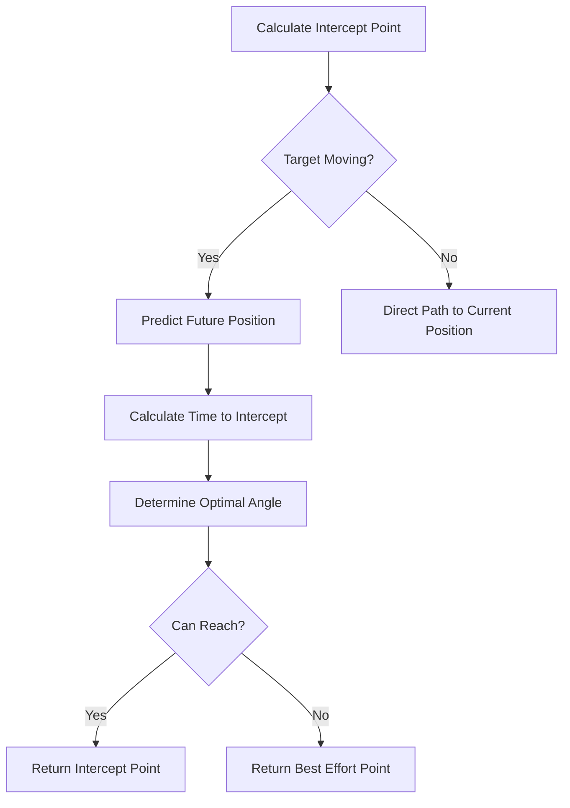
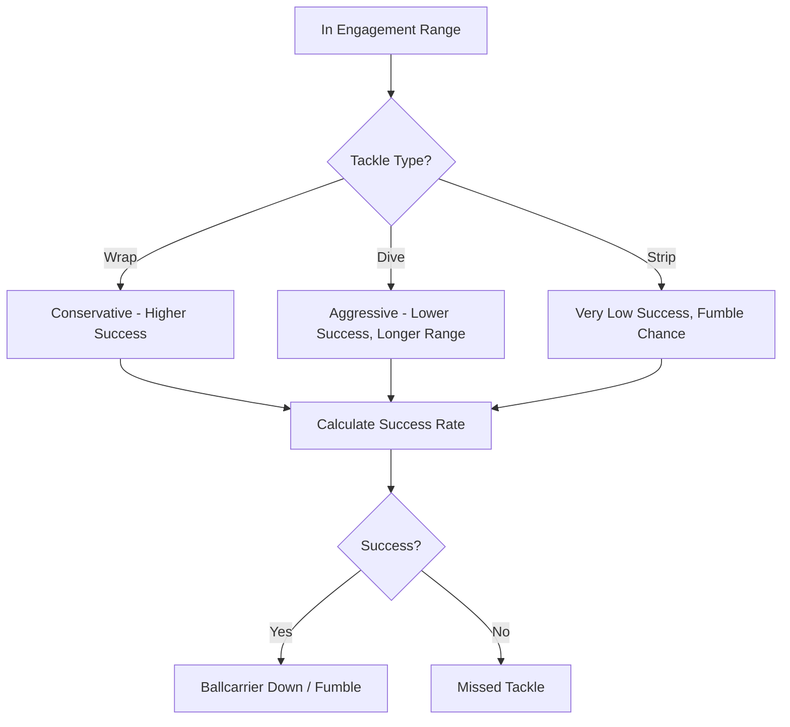
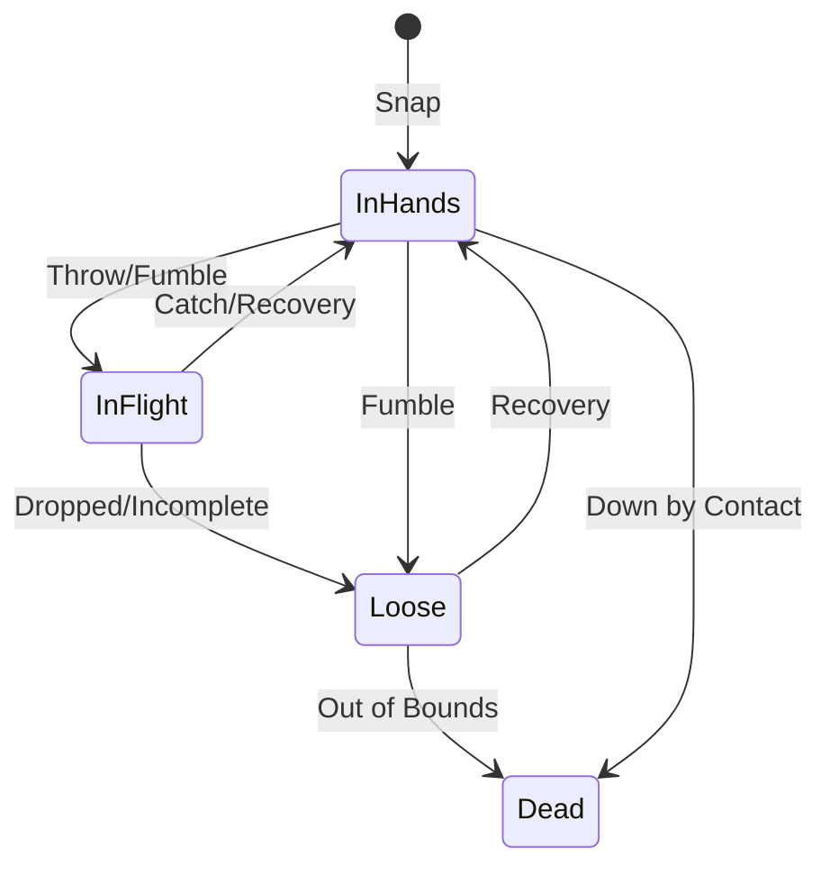
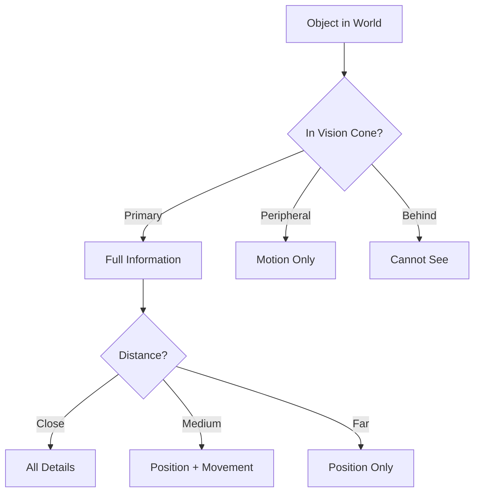
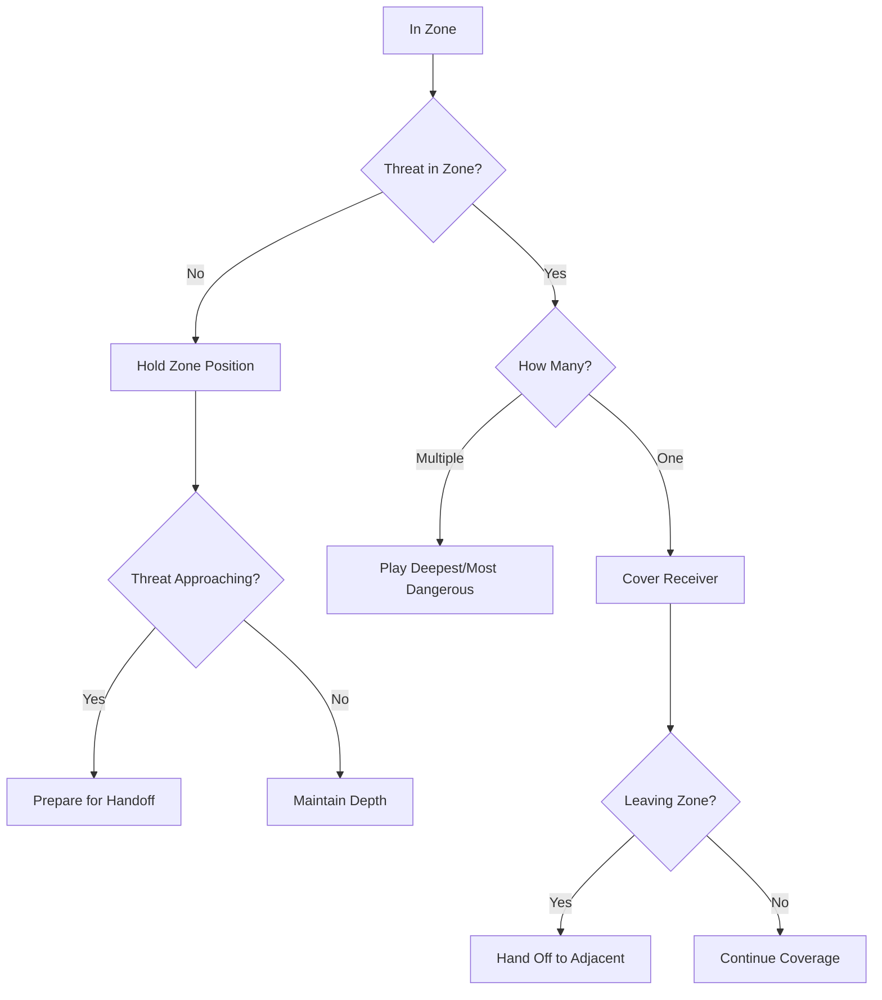
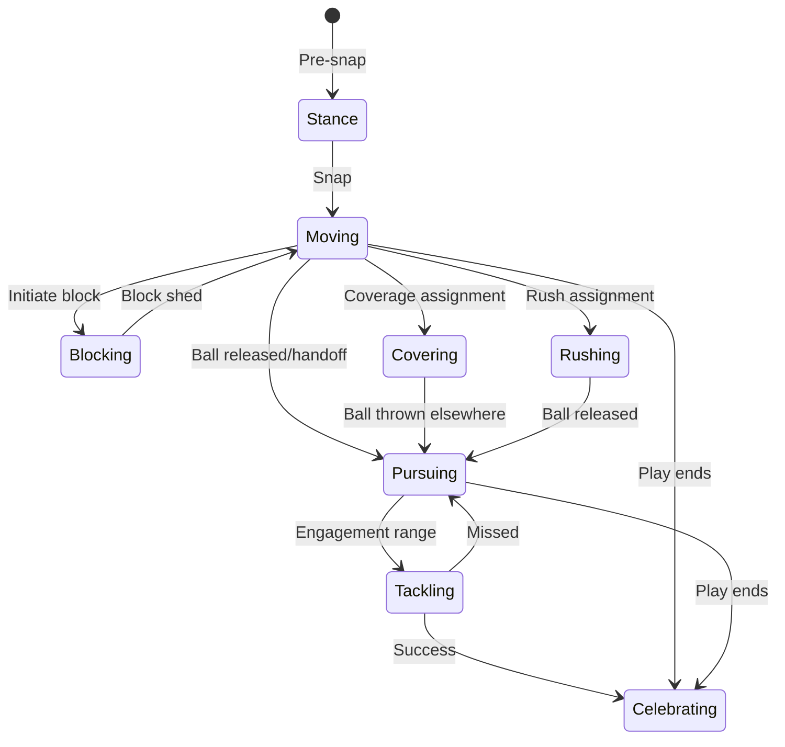

# Shared Concepts

Common systems and calculations used across multiple AI brains.

## Table of Contents

1. [Overview](#overview)
2. [Spatial Awareness](#spatial-awareness)
3. [Pursuit System](#pursuit-system)
4. [Tackle Attempts](#tackle-attempts)
5. [Ball Tracking](#ball-tracking)
6. [Contact Resolution](#contact-resolution)
7. [Vision and Perception](#vision-and-perception)
8. [Movement Physics](#movement-physics)
9. [Zone Mechanics](#zone-mechanics)
10. [Communication System](#communication-system)

---

## 1. Overview

Several gameplay systems are shared across position-specific brains. Rather than duplicate logic, these concepts are implemented as shared utilities that any brain can leverage.

### Concept Categories

| Category | Primary Users | Description |
|----------|--------------|-------------|
| Spatial Awareness | All | Position queries, distance, threat detection |
| Pursuit | Defense | Angle calculation, intercept prediction |
| Tackle Attempts | Defense | Contact initiation, tackle success |
| Ball Tracking | All | Ball location, trajectory, catch points |
| Contact Resolution | All | Block/tackle outcomes |
| Vision/Perception | All | What players can "see" |
| Movement Physics | All | Speed, acceleration, turning |
| Zone Mechanics | Defense | Area responsibility, handoffs |
| Communication | OL, LB, DB | Pre-snap and in-play calls |

---

## 2. Spatial Awareness

The spatial awareness system provides geometric queries for brain decision-making.

### 2.1 Core Queries

```
SpatialQuery Interface:
- get_nearest_threat(player, threat_type) → Player
- get_players_in_radius(pos, radius, filter) → List[Player]
- get_players_in_cone(pos, direction, angle, distance) → List[Player]
- get_open_space(pos, direction, distance) → List[OpenArea]
- get_lane_status(start_pos, end_pos) → LaneInfo
- get_pursuit_angles(target, pursuers) → List[PursuitInfo]
```

### 2.2 Threat Types

Different positions care about different threats:

| Position | Primary Threats | Secondary Threats |
|----------|-----------------|-------------------|
| QB | Pass rushers | Blitzers |
| Ballcarrier | Tacklers | Pursuit angles |
| Receiver | Press corner, Safety | LB zone |
| OL | DL, Blitzers | Stunting defenders |
| RB (blocking) | Blitzers | Delayed rushers |
| LB | Ballcarrier | Receivers (pass) |
| DB | Receivers | Ballcarrier (run support) |
| DL | Ballcarrier | Blockers |

### 2.3 Distance Thresholds

Standard distance constants used across brains:

```
ENGAGEMENT_RANGE = 1.5 yards     # Can initiate contact
THREAT_RANGE = 3.0 yards         # Must react to threat
AWARENESS_RANGE = 10.0 yards     # General field awareness
DEEP_ZONE_DEPTH = 15.0 yards     # Deep coverage threshold
PRESS_RANGE = 1.0 yards          # Press coverage distance
PASSING_LANE_WIDTH = 2.0 yards   # Window for throws
```

### 2.4 Lane Analysis

Evaluating running/passing lanes:

```
LaneInfo:
  start_pos: Vector2
  end_pos: Vector2
  width: float
  obstructions: List[Player]
  is_clear: bool
  closing_speed: float          # How fast lane is closing
  time_until_closed: float      # Seconds until lane closes
```

**Lane Evaluation Algorithm:**

```
def evaluate_lane(start, end, all_players):
    lane_vector = normalize(end - start)
    lane_length = distance(start, end)

    obstructions = []
    for player in all_players:
        # Project player onto lane
        projection = project_point_to_line(player.pos, start, lane_vector)

        # Check if projection is within lane bounds
        if 0 < projection < lane_length:
            # Check perpendicular distance
            perp_dist = perpendicular_distance(player.pos, start, lane_vector)
            if perp_dist < PASSING_LANE_WIDTH:
                obstructions.append(player)

    return LaneInfo(
        obstructions=obstructions,
        is_clear=len(obstructions) == 0,
        closing_speed=calculate_closing_speed(obstructions, lane_vector)
    )
```

---

## 3. Pursuit System

### 3.1 Pursuit Angle Calculation

The optimal angle to intercept a moving target:



**Intercept Point Formula:**

```
def calculate_intercept_point(pursuer, target):
    # Relative position and velocity
    rel_pos = target.pos - pursuer.pos
    rel_vel = target.velocity - pursuer.velocity

    # Time to intercept (quadratic solution)
    # |pursuer.pos + t * pursuer.max_speed * direction| = |target.pos + t * target.velocity|

    a = target.speed^2 - pursuer.max_speed^2
    b = 2 * dot(rel_pos, target.velocity)
    c = dot(rel_pos, rel_pos)

    discriminant = b^2 - 4*a*c

    if discriminant < 0:
        # Cannot intercept - pursue directly
        return target.pos

    t = (-b - sqrt(discriminant)) / (2*a)

    if t < 0:
        t = (-b + sqrt(discriminant)) / (2*a)

    if t < 0:
        return target.pos  # Cannot intercept

    return target.pos + t * target.velocity
```

### 3.2 Pursuit Angle Categories

| Angle Type | Description | When to Use |
|------------|-------------|-------------|
| Direct | Straight line to target | Target stationary or very close |
| Intercept | Angle to cut off target | Target moving, pursuer faster |
| Leverage | Force toward sideline | Contain situation |
| Cutback | Angle to prevent reversal | Target near open field |

### 3.3 Pursuit Attributes

How player attributes affect pursuit:

```
PursuitEffectiveness:
  base_speed = player.speed
  acceleration = player.acceleration

  # Angle calculation ability
  angle_quality = (player.awareness + player.play_recognition) / 2

  # How directly they run (no false steps)
  efficiency = player.awareness / 100

  # Adjusted intercept calculation
  effective_speed = base_speed * (0.8 + 0.2 * efficiency)
```

### 3.4 Gang Tackling

Multiple pursuers coordinate:

```
def coordinate_pursuit(pursuers, ballcarrier):
    positions_covered = []

    for pursuer in sorted(pursuers, key=lambda p: distance(p, ballcarrier)):
        # Primary pursuer takes direct angle
        if len(positions_covered) == 0:
            pursuer.target = calculate_intercept_point(pursuer, ballcarrier)
        else:
            # Secondary pursuers take contain/cutback angles
            pursuer.target = find_uncovered_angle(
                pursuer,
                ballcarrier,
                positions_covered
            )

        positions_covered.append(pursuer.target)
```

---

## 4. Tackle Attempts

### 4.1 Tackle Decision Tree



### 4.2 Tackle Success Formula

```
def calculate_tackle_success(tackler, ballcarrier, tackle_type):
    base_rate = TACKLE_TYPE_BASE_RATES[tackle_type]
    # Wrap: 0.75, Dive: 0.50, Strip: 0.25

    # Attribute modifiers
    tackle_mod = (tackler.tackling - 50) * 0.005  # -0.25 to +0.25
    elusiveness_mod = (ballcarrier.elusiveness - 50) * 0.005

    # Situational modifiers
    angle_mod = calculate_angle_modifier(tackler, ballcarrier)
    # Head-on: 1.0, Side: 0.9, From behind: 1.1

    speed_differential = ballcarrier.speed - tackler.speed
    speed_mod = speed_differential * 0.02  # +/- 0.2 max

    # Move modifiers (if ballcarrier performed move)
    move_mod = 0.0
    if ballcarrier.current_move:
        move_success = evaluate_move(ballcarrier, tackler)
        if move_success:
            move_mod = -0.3  # Successful move reduces tackle chance

    final_rate = base_rate + tackle_mod - elusiveness_mod + angle_mod - speed_mod + move_mod
    return clamp(final_rate, 0.05, 0.95)
```

### 4.3 Tackle Types by Situation

| Situation | Recommended Tackle | Reasoning |
|-----------|-------------------|-----------|
| Open field, closing | Wrap | Secure tackle |
| Open field, last defender | Dive | Extend range |
| In traffic | Wrap | Avoid collateral |
| Goal line | Wrap low | Stop forward progress |
| Ballcarrier stumbling | Any | Increased success |
| Strip drill active | Strip | Coached behavior |

### 4.4 Broken Tackle Consequences

When a tackle fails:

```
BrokenTackleResult:
  tackler_recovery_time: float      # 0.3-1.0 seconds
  tackler_position: Vector2         # Where they end up
  ballcarrier_speed_maintained: float  # % of pre-contact speed
  yards_after_contact: float        # Expected additional yards
```

### 4.5 Tackle Attempt Events

```
TackleAttemptEvent:
  tackler_id: PlayerId
  ballcarrier_id: PlayerId
  position: Vector2
  tackle_type: TackleType
  success: bool
  yards_after_contact: float
  fumble_caused: bool
```

---

## 5. Ball Tracking

### 5.1 Ball States



### 5.2 Ball in Flight Tracking

All players track thrown balls:

```
BallTrajectory:
  origin: Vector2
  current_pos: Vector3      # x, y, height
  velocity: Vector3
  target_pos: Vector2
  estimated_arrival: float  # Seconds
  intended_receiver: PlayerId

def calculate_catch_point(player, ball_trajectory):
    # Where player and ball can meet
    for t in range(0, ball_trajectory.estimated_arrival, 0.1):
        ball_pos = predict_ball_position(ball_trajectory, t)
        player_pos = predict_player_position(player, t)

        if distance(ball_pos.xy, player_pos) < CATCH_RADIUS:
            return CatchPoint(
                position=ball_pos.xy,
                time=t,
                contested=check_contested(ball_pos.xy, t)
            )

    return None  # Cannot reach ball
```

### 5.3 Ball Awareness by Position

| Position | Ball Awareness Priority | Tracking Behavior |
|----------|------------------------|-------------------|
| QB | N/A (has ball) | N/A |
| Receiver | Highest | Track from throw |
| DB | Very High | Read QB eyes, then track |
| LB | High (zone) | Key receiver, peripheral ball |
| DL | Medium | Rush until ball released |
| OL | Low | Block until whistle |
| RB (pass pro) | Medium | Check after assignment |

### 5.4 Ball Location Uncertainty

Vision-limited players may not know exact ball location:

```
def get_perceived_ball_position(player, actual_ball):
    if player.can_see(actual_ball):
        return actual_ball.position
    else:
        # Use last known position with decay
        time_since_seen = current_time - player.last_saw_ball
        uncertainty = time_since_seen * UNCERTAINTY_GROWTH_RATE

        # Could be anywhere in growing circle
        return PerceivedBall(
            estimated_pos=player.last_known_ball_pos,
            uncertainty_radius=uncertainty
        )
```

---

## 6. Contact Resolution

### 6.1 Contact Types

```
enum ContactType:
    BLOCK           # OL/blocker vs defender
    TACKLE_ATTEMPT  # Defender vs ballcarrier
    COLLISION       # Incidental contact
    SCREEN          # Receiver vs DB at LOS
    PILE            # Multiple players
```

### 6.2 Block Resolution

```
def resolve_block(blocker, defender, block_type):
    # Strength differential
    if block_type == BlockType.DRIVE:
        blocker_power = blocker.block_power
    else:  # PASS_PRO
        blocker_power = (blocker.block_power + blocker.block_finesse) / 2

    if defender.is_rushing:
        defender_power = defender.pass_rush
    else:
        defender_power = defender.strength

    differential = blocker_power - defender_power

    # Outcomes
    if differential > 20:
        return BlockResult.PANCAKE
    elif differential > 5:
        return BlockResult.SUSTAINED
    elif differential > -5:
        return BlockResult.STALEMATE
    elif differential > -20:
        return BlockResult.SHED
    else:
        return BlockResult.BEATEN
```

### 6.3 Contact Duration

How long contact events last:

```
CONTACT_DURATIONS = {
    BlockResult.PANCAKE: 2.0,      # Defender on ground
    BlockResult.SUSTAINED: 1.5,    # Blocker controlling
    BlockResult.STALEMATE: 0.8,    # Battling
    BlockResult.SHED: 0.5,         # Defender getting free
    BlockResult.BEATEN: 0.3,       # Blocker whiffed
}
```

---

## 7. Vision and Perception

### 7.1 Vision Cone

Each player has a vision cone based on attributes:

```
VisionCone:
  direction: Vector2      # Where player is looking
  primary_angle: float    # High-detail vision (40-60 degrees)
  peripheral_angle: float # Motion detection (100-140 degrees)

def calculate_vision_cone(player):
    base_primary = 50      # degrees
    base_peripheral = 120  # degrees

    # Awareness affects peripheral
    peripheral_bonus = (player.awareness - 50) * 0.4

    return VisionCone(
        direction=player.facing,
        primary_angle=base_primary,
        peripheral_angle=base_peripheral + peripheral_bonus
    )
```

### 7.2 What Players Can See



### 7.3 Information Available

| Vision Zone | Distance | Information Available |
|-------------|----------|----------------------|
| Primary | Close (<5 yds) | Position, velocity, facing, actions |
| Primary | Medium (5-15 yds) | Position, velocity, approximate facing |
| Primary | Far (>15 yds) | Position, general movement |
| Peripheral | Any | Movement detected, no details |
| Behind | Any | Nothing (must turn to see) |

### 7.4 Head Turning

Players can reorient their vision:

```
def update_facing(player, desired_direction, dt):
    turn_speed = 180 + player.awareness  # degrees per second

    angle_diff = angle_between(player.facing, desired_direction)
    max_turn = turn_speed * dt

    if abs(angle_diff) <= max_turn:
        player.facing = desired_direction
    else:
        player.facing = rotate_towards(player.facing, desired_direction, max_turn)
```

---

## 8. Movement Physics

### 8.1 Speed Model

```
def calculate_current_speed(player, dt):
    # Acceleration based on attribute
    accel_rate = 3.0 + (player.acceleration / 100) * 4.0  # 3-7 yds/s²

    # Direction change penalty
    direction_change = angle_between(player.velocity, player.desired_direction)
    direction_penalty = 1.0 - (direction_change / 180) * 0.5  # Up to 50% penalty

    effective_accel = accel_rate * direction_penalty

    # Apply acceleration
    current_speed = player.speed + effective_accel * dt

    # Cap at max speed
    max_speed = 4.0 + (player.speed / 100) * 6.0  # 4-10 yds/s

    return min(current_speed, max_speed)
```

### 8.2 Agility and Direction Change

```
def calculate_direction_change_cost(player, current_dir, new_dir):
    angle = angle_between(current_dir, new_dir)

    # Agility reduces cost
    agility_factor = player.agility / 100

    # Speed lost during cut
    if angle < 45:
        speed_loss = 0.1 * (1 - agility_factor * 0.5)
    elif angle < 90:
        speed_loss = 0.3 * (1 - agility_factor * 0.5)
    else:  # Sharp cut
        speed_loss = 0.5 * (1 - agility_factor * 0.5)

    # Time to complete cut
    cut_time = (angle / 180) * (0.3 - agility_factor * 0.1)

    return CutCost(speed_loss=speed_loss, time=cut_time)
```

### 8.3 Fatigue Effects

```
def apply_fatigue_modifier(player, base_value, attribute_type):
    fatigue = player.current_fatigue  # 0-100, 0 = fresh

    if attribute_type == AttributeType.PHYSICAL:
        # Physical attributes affected more
        modifier = 1.0 - (fatigue / 100) * 0.20  # Up to 20% reduction
    else:
        # Mental attributes less affected
        modifier = 1.0 - (fatigue / 100) * 0.10  # Up to 10% reduction

    return base_value * modifier
```

---

## 9. Zone Mechanics

### 9.1 Zone Definitions

```
ZoneDefinition:
  zone_type: ZoneType       # FLAT, CURL, HOOK, DEEP_THIRD, DEEP_HALF
  base_position: Vector2    # Center of zone
  dimensions: Vector2       # Width x Depth
  priority_area: Polygon    # Where to cheat toward
  handoff_rules: List[HandoffRule]
```

### 9.2 Zone Coverage Behavior



### 9.3 Zone Handoffs

When a receiver moves between zones:

```
def execute_handoff(current_defender, receiver, adjacent_defender):
    # Communicate handoff
    emit_event(ZoneHandoffEvent(
        from_defender=current_defender.id,
        to_defender=adjacent_defender.id,
        receiver=receiver.id
    ))

    # Current defender releases
    current_defender.zone_assignment = original_zone

    # Adjacent defender picks up
    adjacent_defender.coverage_target = receiver

    # Timing window for errors
    handoff_quality = (current_defender.zone_coverage + adjacent_defender.zone_coverage) / 2
    gap_window = 0.5 - (handoff_quality / 100) * 0.3  # 0.2-0.5 second gap
```

### 9.4 Zone vs Route Interactions

| Route Type | Zones Threatened | Challenge |
|------------|-----------------|-----------|
| Out | Flat | Quick throw |
| Slant | Hook/Curl | Crossing traffic |
| Dig/In | Hook | Sitting in zone |
| Post | Deep Third/Half | Splitting zones |
| Corner | Flat + Deep | Two-zone attack |
| Seam | Hook + Deep | Vertical threat |

---

## 10. Communication System

### 10.1 Pre-Snap Calls

```
PreSnapCall:
  caller: PlayerId
  call_type: CallType
  target: Optional[PlayerId]
  timing: float             # When call was made

enum CallType:
    PROTECTION_SLIDE        # OL slide direction
    MIKE_POINT             # LB identification
    MOTION_CALL            # Adjusting to motion
    COVERAGE_CHECK         # DB coverage change
    BLITZ_ALERT            # Recognizing blitz
    HOT_ROUTE              # Receiver adjustment
```

### 10.2 In-Play Communication

Limited to urgent situations:

```
InPlayCall:
  caller: PlayerId
  call_type: InPlayCallType
  urgency: float

enum InPlayCallType:
    SCRAMBLE_DRILL         # QB escaped, receivers adjust
    SCREEN                 # Screen alert
    BALL                   # Ball in air
    FIRE                   # Blitz
    SWITCH                 # Coverage switch
```

### 10.3 Communication Radius

```
def can_hear_call(caller, listener, call):
    distance = distance(caller.pos, listener.pos)

    # Base hearing range
    base_range = 15.0  # yards

    # Urgency increases range
    urgency_bonus = call.urgency * 5.0

    # Crowd noise reduces range (game state)
    crowd_penalty = game_state.crowd_noise * 5.0

    effective_range = base_range + urgency_bonus - crowd_penalty

    return distance <= effective_range
```

---

## 11. Common State Machines

### 11.1 Player Activity States

Used by all players:



### 11.2 Awareness States

```
enum AwarenessState:
    UNAWARE           # Hasn't processed situation
    PROCESSING        # Identifying what's happening
    AWARE             # Knows the situation
    REACTING          # Taking appropriate action

def update_awareness(player, event, dt):
    processing_time = 0.5 - (player.awareness / 100) * 0.3  # 0.2-0.5 seconds

    if player.awareness_state == AwarenessState.UNAWARE:
        if event_detected(player, event):
            player.awareness_state = AwarenessState.PROCESSING
            player.processing_timer = processing_time

    elif player.awareness_state == AwarenessState.PROCESSING:
        player.processing_timer -= dt
        if player.processing_timer <= 0:
            player.awareness_state = AwarenessState.AWARE
            # Brain can now make informed decision
```

---

## 12. Attribute Threshold Tables

### 12.1 Standard Thresholds

Used across all brains for categorization:

| Rating Range | Category | Description |
|--------------|----------|-------------|
| 0-49 | Poor | Below average, frequent failures |
| 50-64 | Average | Competent, occasional mistakes |
| 65-79 | Good | Reliable, rare mistakes |
| 80-89 | Elite | Exceptional, consistent success |
| 90-99 | Superstar | Best in league, game-changing |

### 12.2 Attribute to Capability Conversion

```
def rating_to_success_rate(rating, base_rate, scaling):
    """
    Convert 0-99 rating to success rate.

    rating: Player attribute (0-99)
    base_rate: Success rate at rating 50 (e.g., 0.5)
    scaling: How much rating affects rate (e.g., 0.004 = 40% range)
    """
    return base_rate + (rating - 50) * scaling

# Example usage:
# 80 tackling with base 0.6 and scaling 0.004
# = 0.6 + (80-50) * 0.004 = 0.6 + 0.12 = 0.72 success rate
```

### 12.3 Common Conversions

| Attribute | Base Rate | Scaling | Rating 50 | Rating 80 | Rating 99 |
|-----------|-----------|---------|-----------|-----------|-----------|
| Tackling | 0.60 | 0.004 | 60% | 72% | 80% |
| Catching | 0.70 | 0.004 | 70% | 82% | 90% |
| Block sustain | 1.0s | +0.02 | 1.0s | 1.6s | 2.0s |
| Route separation | 0.5yd | +0.02 | 0.5yd | 1.1yd | 1.5yd |
| Read time | 0.5s | -0.003 | 0.5s | 0.41s | 0.35s |

---

## 13. Integration Helpers

### 13.1 Common Decision Utilities

```python
# Used by all brains
def select_best_option(options: List[Option], evaluator: Callable) -> Option:
    """Select highest-scored option."""
    return max(options, key=evaluator)

def calculate_threat_level(threats: List[Player], player: Player) -> float:
    """Sum threat levels from nearby players."""
    return sum(
        1.0 / max(distance(t, player), 0.1)
        for t in threats
    )

def find_closest(player: Player, candidates: List[Player]) -> Player:
    """Find nearest player from list."""
    return min(candidates, key=lambda c: distance(c, player))

def is_in_position(player: Player, target: Vector2, tolerance: float) -> bool:
    """Check if player has reached target position."""
    return distance(player.pos, target) <= tolerance
```

### 13.2 Event Helpers

```python
# Standard event emission
def emit_brain_event(player: Player, event_type: str, data: dict):
    """Emit event from brain decision."""
    event = BrainEvent(
        player_id=player.id,
        event_type=event_type,
        timestamp=current_time(),
        data=data
    )
    event_bus.emit(event)
```

---

## 14. Debug and Visualization

### 14.1 Brain Debug Output

Each brain should support debug mode:

```
BrainDebugInfo:
  current_state: str
  decision: BrainDecision
  considered_options: List[Option]
  perception: PerceptionSnapshot
  timing: float                  # Time to make decision
  reasoning_chain: List[str]     # Why this decision
```

### 14.2 Visualization Hooks

```
VisualizationData:
  vision_cone: Polygon           # What player sees
  threat_indicators: List[ThreatMarker]
  target_position: Vector2
  pursuit_angle: Line
  zone_boundaries: Polygon
```

---

## Usage in Brain Implementation

Brains should import and use these shared concepts:

```python
from ai.shared import (
    SpatialQuery,
    PursuitCalculator,
    TackleResolver,
    BallTracker,
    VisionSystem,
    MovementPhysics,
    ZoneManager,
    CommunicationSystem
)

class LBBrain(Brain):
    def __init__(self):
        self.spatial = SpatialQuery()
        self.pursuit = PursuitCalculator()
        self.vision = VisionSystem()
        # ...

    def decide(self, player, world_state, clock, dt):
        # Use shared systems
        threats = self.spatial.get_nearest_threat(player, ThreatType.BALLCARRIER)
        pursuit_angle = self.pursuit.calculate_intercept_point(player, threats[0])
        # ...
```
