# Ballcarrier Brain

The ballcarrier brain is a **universal brain** that controls any player who has the football. It applies to:
- Running backs after handoff
- Wide receivers after catch
- Quarterbacks scrambling
- Tight ends after catch
- Defenders after interception or fumble recovery

---

## Overview

### Responsibilities

| Situation | Primary Duties |
|-----------|---------------|
| Open field | Find daylight, set up moves, maximize yards |
| Congested | Read holes, decide hit/cutback/bounce |
| Contact imminent | Select move or brace for contact |
| Scoring position | Get to end zone by any means |
| Protecting lead | Clock management, avoid fumble |

### When Active

- Activates when player receives ball (handoff, catch, scramble commit, turnover)
- Remains active until tackle, out of bounds, touchdown, or fumble
- Deactivates on play dead

### Brain Triggers

| Event | Activation |
|-------|-----------|
| `HANDOFF` | RB becomes ballcarrier |
| `CATCH` | Receiver becomes ballcarrier |
| `SCRAMBLE_COMMIT` | QB transitions from QB brain |
| `INTERCEPTION` | Defender becomes ballcarrier |
| `FUMBLE_RECOVERY` | Recovering player becomes ballcarrier |

---

## Interface Contract

### Inputs (from WorldState)

| Field | Usage |
|-------|-------|
| `defense` (or `offense` for turnovers) | Find threats, tacklers |
| `offense` (or `defense` for turnovers) | Find blockers |
| `spatial.find_threats()` | Identify incoming tacklers with ETA |
| `spatial.find_holes()` | Identify running lanes |
| `spatial.get_influence_at()` | Evaluate space control |
| `field.sidelines` | Boundary awareness |
| `field.goal_line` | Scoring position detection |

### Outputs (BrainDecision)

| Action | target_pos | target_id | data | Description |
|--------|------------|-----------|------|-------------|
| `"run_to"` | destination | - | `{speed_pct}` | Run toward point |
| `"cut"` | cut direction | - | `{cut_type}` | Sharp direction change |
| `"juke"` | - | defender_id | `{direction}` | Lateral juke move |
| `"spin"` | - | defender_id | `{direction}` | 360 spin move |
| `"stiff_arm"` | - | defender_id | `{arm}` | Stiff arm attempt |
| `"truck"` | - | defender_id | - | Lower shoulder, power through |
| `"hurdle"` | - | defender_id | - | Jump over low tackler |
| `"speed_burst"` | - | defender_id | - | Accelerate past |
| `"dead_leg"` | - | defender_id | `{direction}` | Subtle hesitation |
| `"protect_ball"` | - | - | - | Two hands, lower target |
| `"go_down"` | - | - | - | Give self up |
| `"dive"` | target | - | `{for_pylon, for_goal}` | Dive for yards/score |
| `"out_of_bounds"` | sideline | - | - | Run to sideline |

### State Variables

| Variable | Type | Description |
|----------|------|-------------|
| `yards_gained` | float | Yards from LOS |
| `time_with_ball` | float | Duration as ballcarrier |
| `last_cut_time` | float | Cooldown for cuts |
| `last_move_time` | float | Cooldown for special moves |
| `moves_used` | List[str] | Moves already used this play |
| `in_contact` | bool | Currently in tackle attempt |
| `perceived_threats` | List[Threat] | Threats visible to ballcarrier |
| `perceived_holes` | List[Hole] | Holes visible to ballcarrier |

---

## Behavior Tree

```mermaid
flowchart TB
    Root[["[Selector] Ballcarrier Root"]]

    Root --> Down["(Is Down?)"]
    Down --> |Yes| Stay["<Stay Down>"]

    Root --> Scoring["[Sequence] Scoring Position"]
    Scoring --> NearGoal["(Within 5 Yards of Goal?)"]
    NearGoal --> |Yes| ScoreSel["[Selector]"]
    ScoreSel --> ClearPath["[Sequence]"]
    ClearPath --> PathClear["(Clear Path to End Zone?)"]
    PathClear --> |Yes| Sprint["<Sprint to End Zone>"]
    ScoreSel --> DivePylon["[Sequence]"]
    DivePylon --> NearPylon["(Near Pylon + Defender Close?)"]
    NearPylon --> |Yes| Pylon["<Dive for Pylon>"]
    ScoreSel --> DiveGoal["[Sequence]"]
    DiveGoal --> AtGoal["(At Goal Line?)"]
    AtGoal --> |Yes| ReachBall["<Reach Ball Over Goal>"]
    ScoreSel --> FightForward["<Lower Pad, Fight Forward>"]

    Root --> Safety["[Sequence] Safety First"]
    Safety --> NeedSafe["(Protect Ball Situation?)"]
    NeedSafe --> |Yes| SafeSel["[Selector]"]
    SafeSel --> OOB["[Sequence]"]
    OOB --> NearSide["(Near Sideline + Late Game?)"]
    NearSide --> |Yes| GoOOB["<Go Out of Bounds>"]
    SafeSel --> Slide["[Sequence]"]
    Slide --> IsQB["(QB + Lead?)"]
    IsQB --> |Yes| DoSlide["<Slide>"]
    SafeSel --> GiveUp["[Sequence]"]
    GiveUp --> WrappedUp["(Wrapped Up + Risk?)"]
    WrappedUp --> |Yes| DoGiveUp["<Give Up>"]
    SafeSel --> TwoHands["<Cover Ball Two Hands>"]

    Root --> Contact["[Selector] Contact Imminent"]
    Contact --> TacklerClose["(Tackler Within 1.5 Yards?)"]
    TacklerClose --> |Yes| ContactSel["[Selector]"]

    ContactSel --> AvoidMove["[Sequence] Evasion Move"]
    AvoidMove --> CanEvade["(Space + Move Available?)"]
    CanEvade --> |Yes| MoveSel["[Selector] Move Selection"]
    MoveSel --> JukeSel["[Sequence] Juke"]
    JukeSel --> JukeGood["(Space Lateral + Agility 70+?)"]
    JukeGood --> |Yes| ExecJuke["<Execute Juke>"]
    MoveSel --> SpinSel["[Sequence] Spin"]
    SpinSel --> SpinGood["(Defender Committed + Agility 80+?)"]
    SpinGood --> |Yes| ExecSpin["<Execute Spin>"]
    MoveSel --> DeadLegSel["[Sequence] Dead Leg"]
    DeadLegSel --> DeadLegGood["(Defender Reaching + Agility 70+?)"]
    DeadLegGood --> |Yes| ExecDeadLeg["<Execute Dead Leg>"]
    MoveSel --> HurdleSel["[Sequence] Hurdle"]
    HurdleSel --> HurdleGood["(Low Tackler + Agility 85+?)"]
    HurdleGood --> |Yes| ExecHurdle["<Execute Hurdle>"]

    ContactSel --> PowerMove["[Sequence] Power Move"]
    PowerMove --> PowerGood["(Can Win Contact?)"]
    PowerGood --> |Yes| PowerSel["[Selector]"]
    PowerSel --> StiffArmSel["[Sequence]"]
    StiffArmSel --> StiffGood["(Defender Reaching + Str 75+?)"]
    StiffGood --> |Yes| ExecStiff["<Execute Stiff Arm>"]
    PowerSel --> TruckSel["[Sequence]"]
    TruckSel --> TruckGood["(Smaller Defender + Str 80+?)"]
    TruckGood --> |Yes| ExecTruck["<Truck>"]

    ContactSel --> SpeedMove["[Sequence] Speed Move"]
    SpeedMove --> SpeedAdv["(Speed Advantage 3+?)"]
    SpeedAdv --> |Yes| SpeedBurst["<Speed Burst>"]

    ContactSel --> BraceContact["[Sequence] Brace"]
    BraceContact --> MustHit["(No Escape?)"]
    MustHit --> |Yes| BraceSel["[Selector]"]
    BraceSel --> LowerPad["[Sequence]"]
    LowerPad --> CanLower["(Not Yet Low?)"]
    CanLower --> |Yes| DoLower["<Lower Pad Level>"]
    BraceSel --> ProtectBall["<Protect Ball>"]

    Root --> OpenField["[Selector] Open Field"]
    OpenField --> InSpace["(No Defender Within 5 Yards?)"]
    InSpace --> |Yes| OpenSel["[Selector]"]

    OpenSel --> NoThreat["[Sequence] Clear Ahead"]
    NoThreat --> Clear7["(No Defender Within 7 Yards?)"]
    Clear7 --> |Yes| ClearSeq["[Sequence]"]
    ClearSeq --> PickLane["<Pick Best Lane>"]
    ClearSeq --> MaxSpeed["<Accelerate to Max>"]
    ClearSeq --> SetupBlock["<Position Behind Blocker>"]

    OpenSel --> SingleThreat["[Sequence] One Defender"]
    SingleThreat --> OneDef["(One Defender to Beat?)"]
    OneDef --> |Yes| OneSel["[Selector]"]
    OneSel --> SetupSpeed["[Sequence]"]
    SetupSpeed --> HasSpeed["(Speed Advantage?)"]
    HasSpeed --> |Yes| SpeedSetup["[Sequence]"]
    SpeedSetup --> SetAngle["<Set Up Angle>"]
    SpeedSetup --> BurstBy["<Burst Past>"]
    OneSel --> SetupMove["[Sequence]"]
    SetupMove --> NoSpeed["(No Speed Advantage?)"]
    NoSpeed --> |Yes| SetupMoveSeq["[Sequence]"]
    SetupMoveSeq --> ApproachDef["<Approach Defender>"]
    SetupMoveSeq --> ReadDef["<Read Defender Commit>"]
    SetupMoveSeq --> ExecSetupMove["→ Move Selection"]

    OpenSel --> MultiThreat["[Sequence] Multiple Defenders"]
    MultiThreat --> MultDef["(2+ Defenders Ahead?)"]
    MultDef --> |Yes| MultSel["[Selector]"]
    MultSel --> FindSeam["[Sequence]"]
    FindSeam --> SeamExists["(Seam Between?)"]
    SeamExists --> |Yes| HitSeam["<Split Defenders>"]
    MultSel --> UseBlocker["[Sequence]"]
    UseBlocker --> BlockerNear["(Blocker Available?)"]
    BlockerNear --> |Yes| BlockerSeq["[Sequence]"]
    BlockerSeq --> SetupBlocker2["<Set Up Blocker>"]
    BlockerSeq --> ReadBlock["<Read Block>"]
    BlockerSeq --> CutOffBlock["<Cut Off Block>"]
    MultSel --> Boundary["[Sequence]"]
    Boundary --> NearBound["(Can Use Sideline?)"]
    NearBound --> |Yes| UseSideline["<Use Sideline as Defender>"]
    MultSel --> NorthSouth["<North-South, Minimize Loss>"]

    Root --> Congestion["[Selector] Congested Running"]
    Congestion --> InTraffic["(In Traffic?)"]
    InTraffic --> |Yes| TrafficSel["[Selector]"]

    TrafficSel --> HitHole["[Sequence] Hit Hole"]
    HitHole --> HoleVis["(Hole Visible?)"]
    HoleVis --> |Yes| HoleSel["[Selector]"]
    HoleSel --> BigHole["[Sequence]"]
    BigHole --> HoleBig["(Hole > 2 Yards?)"]
    HoleBig --> |Yes| AccelThrough["<Accelerate Through>"]
    HoleSel --> SmallHole["[Sequence]"]
    SmallHole --> HoleMed["(Hole 1-2 Yards?)"]
    HoleMed --> |Yes| Squeeze["<Squeeze Through>"]
    HoleSel --> ClosingHole["[Sequence]"]
    ClosingHole --> HoleClosing["(Hole Closing?)"]
    HoleClosing --> |Yes| HitNow["<Hit It Now>"]

    TrafficSel --> Cutback["[Sequence] Cutback"]
    Cutback --> CutLane["(Cutback Lane Open?)"]
    CutLane --> |Yes| CutbackSeq["[Sequence]"]
    CutbackSeq --> Patience["<Patience / Set Up>"]
    CutbackSeq --> PlantCut["<Plant and Cut>"]
    CutbackSeq --> AccelCut["<Accelerate Through Cutback>"]

    TrafficSel --> Bounce["[Sequence] Bounce Outside"]
    Bounce --> EdgeClear["(Edge Available?)"]
    EdgeClear --> |Yes| BounceSeq["[Sequence]"]
    BounceSeq --> ReadEdge["<Read Edge Block>"]
    BounceSeq --> BounceOut["<Bounce Outside>"]
    BounceSeq --> TurnCorner["<Turn Corner>"]

    TrafficSel --> Churn["[Sequence] No Lanes"]
    Churn --> NoLane["(No Lanes?)"]
    NoLane --> |Yes| ChurnSeq["[Sequence]"]
    ChurnSeq --> LowerPad2["<Lower Pad Level>"]
    ChurnSeq --> DriveLegs["<Drive Legs>"]
    ChurnSeq --> FallForward["<Fall Forward>"]

    Root --> Default["<Run North-South>"]
```



---

## Decision Deep-Dives

### 1. Vision System

The `vision` attribute determines what the ballcarrier can perceive:

| Vision Rating | Perception Radius | Detail Level |
|---------------|-------------------|--------------|
| 90+ | Full field | See all defenders, pursuit angles, blocker leverage |
| 80-89 | 15 yards | See 2nd level, predict pursuit |
| 70-79 | 10 yards | See immediate threats, primary hole |
| 60-69 | 7 yards | See 2-3 nearest defenders, obvious hole |
| < 60 | 5 yards | Tunnel vision, react only |

**Vision-Filtered Perception:**
```
perceived_threats = []
for defender in all_defenders:
    distance = distance_to(defender)
    angle = angle_from_facing(defender)

    # Can always see straight ahead
    if angle < 30°:
        visible = True
    # Peripheral vision degrades with distance
    elif angle < 90°:
        vision_range = 5 + (vision / 10)  # 5-15 yards
        visible = distance < vision_range
    # Behind requires high vision
    else:
        visible = vision >= 85 and distance < 5

    if visible:
        perceived_threats.append(defender)
```

**What Low-Vision Backs Miss:**
- Backside pursuit (can't see defender coming from behind)
- Second-level defenders until too late
- Cutback lanes (focused on primary hole)
- Blocker leverage (don't know when to cut)

### 2. Threat Assessment

Each visible defender is evaluated as a threat:

| Factor | Calculation |
|--------|-------------|
| Distance | Closer = higher threat |
| Closing speed | Faster approach = higher threat |
| Angle | Head-on = higher threat than pursuit |
| Leverage | Between ballcarrier and goal = higher threat |

**Threat Vector Calculation:**
```
threat.intercept_time = calculate_intercept(
    ballcarrier_pos, ballcarrier_vel,
    defender_pos, defender_vel
)
threat.intercept_point = calculate_intercept_point(...)
threat.approach_angle = angle_between(
    defender_velocity,
    direction_to(ballcarrier)
)
threat.tackle_probability = base_probability(
    defender.tackling,
    ballcarrier.elusiveness,
    approach_angle,
    closing_speed
)
```

### 3. Hole Analysis

Holes are gaps between defenders:

| Hole Width | Quality | Decision |
|------------|---------|----------|
| > 2.5 yards | Huge | Hit immediately, accelerate |
| 1.5 - 2.5 yards | Good | Hit with confidence |
| 1.0 - 1.5 yards | Tight | Can squeeze through |
| 0.7 - 1.0 yards | Minimum | Risk, but possible |
| < 0.7 yards | Closed | Cannot fit |

**Hole Evaluation:**
```
hole.quality_score = (
    fit_score +       # Can I fit? (width vs body)
    time_score +      # Is it closing?
    threat_score      # What's beyond?
)

fit_score:
    if width <= body_width: 0.0
    elif width >= body_width * 2: 1.0
    else: (width - body_width) / body_width

time_score:
    time_open = width / closing_rate
    if time_open > 0.5s: 1.0
    elif time_open > 0.3s: 0.7
    else: 0.3

threat_score:
    second_level_defenders = count_defenders_beyond_hole()
    1.0 - (second_level_defenders * 0.2)
```

### 4. Move Selection

When contact is imminent, select appropriate move:

| Move | Situation | Attribute Req | Success Factors |
|------|-----------|--------------|-----------------|
| **Juke** | Space to side | Agility 70+ | Lateral space, defender reaching |
| **Spin** | Defender committed | Agility 80+ | Defender closing fast, can go either way |
| **Dead Leg** | Defender reaching | Agility 70+ | Subtle, preserves speed |
| **Hurdle** | Low tackler | Agility 85+ | Defender diving or low |
| **Stiff Arm** | Defender reaching | Strength 75+ | Side approach, arm length advantage |
| **Truck** | Smaller defender | Strength 80+ | Weight advantage, straight on |
| **Speed Burst** | Speed advantage | Speed diff 3+ | Open lane, pure speed win |

**Move Cooldowns:**
- Each move has a cooldown before it can be used again
- Using same move repeatedly decreases effectiveness
- Juke: 0.5s cooldown
- Spin: 0.8s cooldown
- Stiff arm: 0.3s cooldown
- Truck: 1.0s cooldown

**Move Selection Priority:**
```
if speed_advantage >= 3 and has_lane:
    return SPEED_BURST  # Low risk, high reward

if defender_diving and agility >= 85:
    return HURDLE  # High risk, high reward

if defender_reaching_arm and strength >= 75:
    return STIFF_ARM  # Medium risk, medium reward

if lateral_space and agility >= 70:
    return JUKE  # Low risk, medium reward

if defender_committed and agility >= 80:
    return SPIN  # Medium risk, high reward

if weight_advantage and strength >= 80:
    return TRUCK  # Medium risk, variable reward

if agility >= 70:
    return DEAD_LEG  # Low risk, low reward

return LOWER_PAD  # Brace for contact
```

### 5. Blocker Utilization

Using blockers effectively:

| Blocker State | Ballcarrier Action |
|---------------|-------------------|
| Engaged, winning | Cut off blocker's outside shoulder |
| Engaged, losing | Cut inside before block sheds |
| Free, leading | Set up behind, let blocker engage |
| Free, parallel | Run to create angle |

**Setting Up Blockers:**
```
if blocker.is_engaged:
    if blocker.winning_leverage:
        cut_point = blocker.outside_shoulder
    else:
        cut_point = blocker.inside_shoulder
else:  # Lead blocker
    # Position to let blocker pick up defender
    ideal_position = blocker.position +
        (blocker.target.position - blocker.position).normalized() * 2
    patience_distance = 1.5  # Don't outrun blocker
```

**Patience Mechanic:**
High-vision backs know when to wait:
- Let blocks develop
- Don't outrun lead blocker
- Wait for cutback to open

### 6. Pursuit Angle Awareness

High-vision backs understand pursuit:

| Vision | Pursuit Awareness |
|--------|-------------------|
| 90+ | Know exact intercept point |
| 80-89 | Understand general pursuit angles |
| 70-79 | React to pursuit when close |
| < 70 | Surprised by pursuit tackles |

**Using Pursuit Knowledge:**
```
if defender.pursuit_angle < 30°:  # Head on
    must_make_move = True
elif defender.pursuit_angle < 60°:  # Good angle
    can_outrun = speed_advantage > 2
elif defender.pursuit_angle < 90°:  # Chasing
    can_outrun = speed_advantage > 0
else:  # Behind
    safe_unless_slowdown = True
```

### 7. Ball Security

When to prioritize ball security:

| Situation | Ball Security Priority |
|-----------|----------------------|
| Late game + winning | HIGH |
| Weather (rain/snow) | HIGH |
| Multiple tacklers | HIGH |
| In traffic | MEDIUM |
| Open field | LOW |
| Scoring position | VARIES |

**Ball Security Actions:**
- Two-hands on ball in traffic
- High-and-tight in contact
- Cover ball on ground
- Give up forward progress vs fumble risk

---

## Perception Model

### Field of View by Vision

```
Vision 90+:          Vision 70-79:        Vision < 60:
      180°                120°                 90°
       ▲                   ▲                   ▲
      /│\                 /│\                  │
     / │ \               / │ \                 │
    /  │  \             /  │  \                │
   /   │   \           /   │   \               │
  ◄────●────►         ◄────●────►              ●
       │                   │                   │
       ▼                   ▼                   ▼
   (Full field)      (Focused)           (Tunnel)
```

### Information Tiers

| Tier | Requires | Information |
|------|----------|-------------|
| Always | - | Ball possession, own velocity, closest threat |
| Basic | Vision 60+ | Primary hole, 2-3 nearest defenders |
| Intermediate | Vision 75+ | All forward defenders, obvious cutback |
| Advanced | Vision 85+ | Pursuit angles, blocker leverage, 2nd level |
| Elite | Vision 95+ | Full field, predict movements, optimal path |

---

## Special Scenarios

### After-Catch (RAC)

When receiver catches ball:

| Situation | Initial Action |
|-----------|---------------|
| Open field | Turn upfield, find seam |
| Defender close | Immediate move decision |
| Traffic | Secure catch first, then look |

**Catch-to-Run Transition:**
- 0.1s minimum to secure catch
- High `catching` = faster transition
- Contested catch = slower transition, protect ball

### QB Scramble

QB-specific considerations:

| Factor | Modification |
|--------|--------------|
| Slide option | Can give up to avoid hit |
| Passing threat | Defenders must respect throw |
| Ball security | Less natural runner, higher fumble risk |
| Cutback | Less instinctive, prefer north-south |

### Turnover Return

Defender returning INT/fumble:

| Difference | Effect |
|------------|--------|
| Vision | Generally lower than skill positions |
| Moves | Limited repertoire (no juke/spin for linemen) |
| Speed | Varies widely by position |
| Blockers | Offense now defense, may pursue |

### Goal Line Situations

Inside 5 yards:

| Priority | Action |
|----------|--------|
| 1 | Clear path → Sprint to end zone |
| 2 | Near pylon → Dive for pylon |
| 3 | At goal line → Reach ball over |
| 4 | Contact → Lower pad, fight forward |

**Pylon Dive:**
- Ballcarrier must reach pylon before going out
- Defender can knock out before crossing
- Ball must cross plane

### Protect Ball Situations

When to prioritize ball security over yards:

| Situation | Action |
|-----------|--------|
| 4th quarter + winning | Go out of bounds |
| Multiple tacklers | Two hands, fall forward |
| QB + unnecessary hit | Slide |
| Weather conditions | Two hands always |

---

## Attribute Mapping

### Primary Attributes

| Attribute | Effect |
|-----------|--------|
| `vision` | Perception radius, cutback recognition, blocker leverage |
| `agility` | Move success, cut sharpness, direction change |
| `speed` | Top speed, speed burst effectiveness |
| `elusiveness` | Overall tackle avoidance, move effectiveness |

### Secondary Attributes

| Attribute | Effect |
|-----------|--------|
| `strength` | Stiff arm, truck, YAC through contact |
| `acceleration` | Burst through hole, cut recovery |
| `awareness` | Ball security triggers, situational decisions |

### Threshold Tables

**Vision → Perception:**
| Rating | Radius | Cutback | Pursuit |
|--------|--------|---------|---------|
| 95+ | Full | Elite anticipation | Know exact angles |
| 85-94 | 15 yd | See cutback early | Good awareness |
| 75-84 | 10 yd | See obvious cutback | Moderate awareness |
| 65-74 | 7 yd | React to cutback | React when close |
| < 65 | 5 yd | Miss cutback | Surprised by pursuit |

**Agility → Move Success:**
| Rating | Juke | Spin | Hurdle | Dead Leg |
|--------|------|------|--------|----------|
| 95+ | 85% | 80% | 75% | 90% |
| 85-94 | 75% | 70% | 65% | 80% |
| 75-84 | 60% | 55% | N/A | 65% |
| 65-74 | 45% | N/A | N/A | 50% |
| < 65 | 30% | N/A | N/A | 35% |

**Strength → Power Move Success:**
| Rating | Stiff Arm | Truck | YAC Yards |
|--------|-----------|-------|-----------|
| 95+ | 80% | 75% | +2-4 |
| 85-94 | 70% | 65% | +1-3 |
| 75-84 | 55% | 50% | +0-2 |
| 65-74 | 40% | 35% | +0-1 |
| < 65 | 25% | N/A | +0 |

---

## Integration Points

### Events Consumed

| Event | Response |
|-------|----------|
| `HANDOFF` | Activate brain |
| `CATCH` | Activate brain, secure ball |
| `SCRAMBLE_COMMIT` | Take over from QB brain |
| `BLOCK_SHED` | Update threat assessment |
| `TACKLE_ATTEMPT` | Trigger move decision |

### Events Emitted (via BrainDecision)

| Event | Trigger |
|-------|---------|
| `MOVE_ATTEMPT` | Using juke/spin/etc |
| `CONTACT` | Entering tackle |
| `TOUCHDOWN` | Crossing goal line |
| `OUT_OF_BOUNDS` | Stepping out |
| `FUMBLE_RISK` | High fumble probability action |

### Coordination with Other Brains

| Brain | Coordination |
|-------|--------------|
| OLBrain | Blocker positioning, hole creation |
| ReceiverBrain | Downfield blocking after catch |
| Defender brains | Pursue ballcarrier |

---

## Example Decisions

### Example 1: Open Field Run
```
Position: 25 yards from goal line
Vision: 85
Threats: 1 defender at 10 yards, 45° angle
Blockers: 1 lead blocker engaged

Decision: CUT_OFF_BLOCK
Reasoning: "Single defender at 10 yards, pursuit angle 45°. Lead blocker
           engaged with defender's outside leverage. Cutting off block's
           inside shoulder to sideline alley."
```

### Example 2: Congested Running
```
Position: Behind LOS, in backfield
Vision: 78
Holes: A-gap (1.2 yards, closing), B-gap (1.8 yards, stable)
Threats: 3 defenders within 3 yards

Decision: HIT_HOLE (B-gap)
Reasoning: "B-gap is 1.8 yards and stable. A-gap is closing (1.2 yards).
           B-gap has 1 second-level defender beyond. Hitting B-gap now."
```

### Example 3: Move Selection
```
Position: 8 yards downfield
Speed: 88, Agility: 82
Threat: Safety at 1.2 yards, committed upfield, closing fast

Decision: SPIN
Reasoning: "Safety committed upfield, closing at 6 yds/s, approach angle 15°.
           Agility 82 qualifies for spin. Space behind to complete rotation.
           Executing spin away from pursuit."
```

### Example 4: Ball Security
```
Position: 15 yards from sideline
Game state: 4th quarter, up by 4
Threats: 2 defenders converging

Decision: OUT_OF_BOUNDS
Reasoning: "4th quarter, protecting lead. Two defenders converging, tackle
           probability 70%. Sideline at 3 yards. Going out of bounds to
           protect ball and stop clock."
```

---

## State Machine Summary

```
                    ┌──────────────┐
                    │   RECEIVE    │ (Handoff/Catch/Scramble)
                    └──────┬───────┘
                           │
                           ▼
         ┌─────────────────────────────────┐
         │          ASSESS_SITUATION        │
         └─────────────┬───────────────────┘
                       │
    ┌──────────────────┼──────────────────┐
    ▼                  ▼                  ▼
┌───────────┐   ┌──────────────┐   ┌───────────┐
│OPEN_FIELD │   │  CONGESTED   │   │  CONTACT  │
└─────┬─────┘   └──────┬───────┘   └─────┬─────┘
      │                │                 │
      ▼                ▼                 ▼
┌───────────┐   ┌──────────────┐   ┌───────────┐
│ Find lane │   │ Read holes   │   │Select move│
│ Set up    │   │ Hit/Cut/Bnce │   │ Execute   │
│ Execute   │   │ Execute      │   │ Outcome   │
└───────────┘   └──────────────┘   └───────────┘
      │                │                 │
      └────────────────┼─────────────────┘
                       ▼
              ┌────────────────┐
              │   OUTCOME      │
              └────────┬───────┘
                       │
    ┌──────────────────┼──────────────────┐
    ▼                  ▼                  ▼
┌───────┐      ┌──────────────┐      ┌────────┐
│TACKLE │      │  TOUCHDOWN   │      │  OOB   │
└───────┘      └──────────────┘      └────────┘
```
