# Defensive Line Brain

The DL brain controls **defensive tackles (DT)**, **defensive ends (DE)**, and **nose tackles (NT)** in pass rush execution, run defense, and stunt coordination.

---

## Overview

### Responsibilities

| Situation | Primary Duties |
|-----------|---------------|
| Pass Rush | Execute moves, win rep, get to QB |
| Run Defense | Control gap, defeat blocks, make plays |
| Stunt | Execute assigned stunt path |
| Pursuit | Chase ballcarrier with angle |

### DL Types

| Type | Alignment | Primary Role | Key Traits |
|------|-----------|--------------|------------|
| DE (4-3) | Outside shoulder of tackle | Edge rush, contain | Speed, bend |
| DT (4-3) | Over guard (3-tech) | Interior rush, 1-gap | Quickness, power |
| NT (3-4) | Head up on center | 2-gap, occupy | Size, strength |
| 3-tech | Weak-side guard | Penetrate, disrupt | First step, power |
| 5-tech | Outside shoulder of tackle | Set edge, contain | Length, strength |

### When Active

- From snap until play dead
- Continuous engagement with OL
- Mode changes based on run/pass read

---

## Interface Contract

### Inputs (from WorldState)

| Field | Usage |
|-------|-------|
| `offense` | Identify blocker, read OL, find QB |
| `ball` | Track ball location |
| `qb` | Target for pass rush |
| `spatial.get_gap()` | Gap assignment location |
| `clock.time_since_snap` | Move timing |

### Outputs (BrainDecision)

| Action | target_pos | target_id | data | Description |
|--------|------------|-----------|------|-------------|
| `"bull_rush"` | - | blocker_id | - | Power rush, drive back |
| `"swim"` | - | blocker_id | `{direction}` | Swim move |
| `"spin"` | - | blocker_id | `{direction}` | Spin move |
| `"rip"` | - | blocker_id | `{direction}` | Rip move |
| `"long_arm"` | - | blocker_id | - | Long arm control |
| `"speed_rush"` | edge path | - | - | Speed to edge |
| `"counter"` | - | blocker_id | `{counter_move}` | Counter move |
| `"club_swim"` | - | blocker_id | - | Club and swim combo |
| `"two_gap"` | - | blocker_id | - | Stack and control |
| `"one_gap"` | gap_point | - | `{gap}` | Penetrate gap |
| `"spill"` | spill_point | - | - | Wrong-arm, spill |
| `"pursue"` | intercept | ballcarrier_id | - | Chase ballcarrier |
| `"contain"` | qb_pos | - | - | Contain scramble |

### State Variables

| Variable | Type | Description |
|----------|------|-------------|
| `play_read` | PlayRead | RUN, PASS, UNKNOWN |
| `current_move` | Optional[Move] | Active pass rush move |
| `move_phase` | MovePhase | SETUP, EXECUTING, COUNTERING |
| `blocker_id` | str | OL engaged with |
| `gap_assignment` | Gap | Assigned gap |
| `stunt_role` | Optional[StuntRole] | PENETRATOR, LOOPER, or None |
| `rep_status` | RepStatus | WINNING, STALEMATE, LOSING |

---

## Behavior Tree

```mermaid
flowchart TB
    Root[["[Selector] DL Root"]]

    Root --> Down["(Is Down?)"]
    Down --> |Yes| Stay["<Stay Down>"]

    Root --> Pursuit["[Sequence] Pursuit Mode"]
    Pursuit --> BallPast["(Ball Past LOS?)"]
    BallPast --> |Yes| PursuitSeq["[Sequence]"]
    PursuitSeq --> Disengage["<Disengage from Block>"]
    PursuitSeq --> CalcAngle["<Calculate Pursuit Angle>"]
    PursuitSeq --> Chase["<Chase Ballcarrier>"]

    Root --> PassRush["[Selector] Pass Rush"]
    PassRush --> IsPass["(Pass Read?)"]
    IsPass --> |Yes| RushSel["[Selector] Rush Situation"]

    RushSel --> Free["[Sequence] Unblocked"]
    Free --> AmFree["(Unblocked?)"]
    AmFree --> |Yes| FreeSeq["[Sequence]"]
    FreeSeq --> AccelQB["<Accelerate to QB>"]
    FreeSeq --> ContainCheck["[Selector] Edge Check"]
    ContainCheck --> EdgeRusher["[Sequence]"]
    EdgeRusher --> AmEdge["(Edge Rusher?)"]
    AmEdge --> |Yes| MaintainContain["<Maintain Contain>"]
    ContainCheck --> Interior["<Bee-line to QB>"]
    FreeSeq --> Closing["[Selector] Closing"]
    Closing --> InRange["(In Tackle Range?)"]
    InRange --> |Yes| TackleQB["<Tackle QB>"]
    Closing --> AdjustAngle["<Adjust Pursuit>"]

    RushSel --> Engaged["[Sequence] Engaged"]
    Engaged --> AmEngaged["(Engaged with Blocker?)"]
    AmEngaged --> |Yes| MoveSel["[Selector] Pass Rush Move"]

    MoveSel --> InitialMove["[Sequence] Initial Move"]
    InitialMove --> NoMove["(No Move Active?)"]
    NoMove --> |Yes| SelectMove["[Selector] Select Move"]
    SelectMove --> BullSel["[Sequence] Bull Rush"]
    BullSel --> PowerMatch["(Strength Advantage?)"]
    PowerMatch --> |Yes| Bull["<Execute Bull Rush>"]
    SelectMove --> SwimSel["[Sequence] Swim"]
    SwimSel --> FinAdv["(Finesse + Blocker Overcommit?)"]
    FinAdv --> |Yes| Swim["<Execute Swim Move>"]
    SelectMove --> SpinSel["[Sequence] Spin"]
    SpinSel --> Stalemate["(Stalemate + Agility Advantage?)"]
    Stalemate --> |Yes| Spin["<Execute Spin Move>"]
    SelectMove --> SpeedRushSel["[Sequence] Speed Rush"]
    SpeedRushSel --> SpeedAdv["(Speed Advantage + Edge?)"]
    SpeedAdv --> |Yes| SpeedRush["<Execute Speed Rush>"]
    SelectMove --> RipSel["[Sequence] Rip"]
    RipSel --> RipCond["(Blocker Hands High?)"]
    RipCond --> |Yes| Rip["<Execute Rip Move>"]
    SelectMove --> LongArmSel["[Sequence] Long Arm"]
    LongArmSel --> LongCond["(Length Advantage?)"]
    LongCond --> |Yes| LongArm["<Execute Long Arm>"]
    SelectMove --> ClubSwim["<Club and Swim>"]

    MoveSel --> Counter["[Sequence] Counter Move"]
    Counter --> MoveStalled["(Current Move Stalled?)"]
    MoveStalled --> |Yes| CounterSel["[Selector]"]
    CounterSel --> CountSwim["[Sequence]"]
    CountSwim --> WasBull["(Was Bull Rush?)"]
    WasBull --> |Yes| SwimCounter["<Counter with Swim>"]
    CounterSel --> CountBull["[Sequence]"]
    CountBull --> WasFin["(Was Finesse?)"]
    WasFin --> |Yes| BullCounter["<Counter with Bull>"]
    CounterSel --> CountSpin["[Sequence]"]
    CountSpin --> WasLong["(Was Long Arm?)"]
    WasLong --> |Yes| SpinCounter["<Counter with Spin>"]
    CounterSel --> Disengage2["<Disengage and Reset>"]

    MoveSel --> VsDouble["[Sequence] vs Double Team"]
    VsDouble --> AmDoubled["(Being Doubled?)"]
    AmDoubled --> |Yes| DoubleSel["[Selector]"]
    DoubleSel --> Split["[Sequence] Split Double"]
    Split --> CanSplit["(Can Split?)"]
    CanSplit --> |Yes| ExecSplit["<Split Double Team>"]
    DoubleSel --> Anchor["[Sequence] Anchor"]
    Anchor --> CantSplit["(Can't Split?)"]
    CantSplit --> |Yes| AnchorOccupy["<Anchor and Occupy Both>"]
    DoubleSel --> LongArmDbl["<Long Arm / Control Gap>"]

    RushSel --> Stunt["[Sequence] Stunt Execution"]
    Stunt --> StuntCalled["(Stunt Called?)"]
    StuntCalled --> |Yes| StuntSel["[Selector] Stunt Role"]
    StuntSel --> Penetrator["[Sequence] Penetrator"]
    Penetrator --> AmPen["(Penetrator Role?)"]
    AmPen --> |Yes| PenSeq["[Sequence]"]
    PenSeq --> CrashGap["<Crash Assigned Gap>"]
    PenSeq --> OccupyBlocker["<Occupy Blocker>"]
    PenSeq --> GetSkinny["<Get Skinny / Create Lane>"]
    StuntSel --> Looper["[Sequence] Looper"]
    Looper --> AmLoop["(Looper Role?)"]
    AmLoop --> |Yes| LoopSeq["[Sequence]"]
    LoopSeq --> Wait["<Wait for Penetrator>"]
    LoopSeq --> LoopBehind["<Loop Behind>"]
    LoopSeq --> AttackGap["<Attack Vacated Gap>"]

    Root --> RunDef["[Selector] Run Defense"]
    RunDef --> IsRun["(Run Read?)"]
    IsRun --> |Yes| RunSel["[Selector] Gap Responsibility"]

    RunSel --> TwoGap["[Sequence] Two-Gap"]
    TwoGap --> TwoGapAssign["(Two-Gap?)"]
    TwoGapAssign --> |Yes| TwoGapSeq["[Sequence]"]
    TwoGapSeq --> EngageBlocker["<Engage Blocker>"]
    TwoGapSeq --> StackBlocker["<Stack / Control>"]
    TwoGapSeq --> ReadFlow["<Read RB Flow>"]
    TwoGapSeq --> ShedToGap["<Shed to Ball-side Gap>"]

    RunSel --> OneGap["[Sequence] One-Gap"]
    OneGap --> OneGapAssign["(One-Gap?)"]
    OneGapAssign --> |Yes| OneGapSeq["[Sequence]"]
    OneGapSeq --> Penetrate["<Penetrate Assigned Gap>"]
    OneGapSeq --> Disrupt["<Disrupt Backfield>"]
    OneGapSeq --> MakeTackle["<Make Play>"]

    RunSel --> Spill2["[Sequence] Spill"]
    Spill2 --> SpillAssign["(Spill Responsibility?)"]
    SpillAssign --> |Yes| SpillSeq["[Sequence]"]
    SpillSeq --> AttackBlock["<Attack Kick Block>"]
    SpillSeq --> WrongArm["<Wrong Arm>"]
    SpillSeq --> SpillOutside["<Spill Play Outside>"]

    RunSel --> Squeeze["[Sequence] Squeeze"]
    Squeeze --> SqueezeAssign["(Squeeze Responsibility?)"]
    SqueezeAssign --> |Yes| SqueezeSeq["[Sequence]"]
    SqueezeSeq --> TakeOnBlock["<Take On Block>"]
    SqueezeSeq --> Constrict["<Constrict Hole>"]
    SqueezeSeq --> ForceInside["<Force Ball Inside>"]

    Root --> Contain2["[Sequence] QB Contain"]
    Contain2 --> QBScramble["(QB Scrambling?)"]
    QBScramble --> |Yes| ContainSel["[Selector]"]
    ContainSel --> ContainEdge["[Sequence]"]
    ContainEdge --> AmContain["(Edge Player?)"]
    AmContain --> |Yes| SetContain["<Set Edge, Don't Let QB Out>"]
    ContainSel --> Collapse["<Collapse Pocket>"]

    Root --> Stance["<Hold Stance>"]
```



---

## Decision Deep-Dives

### 1. Pass Rush Move Selection

**Move Attributes:**

| Move | Duration | Key Attribute | Best Against | Counter |
|------|----------|---------------|--------------|---------|
| Bull Rush | 5-7 ticks | Strength | Light OL, sets too high | Swim/spin |
| Swim | 3-4 ticks | Finesse | Overextended hands | Anchor |
| Spin | 2-3 ticks | Agility | Aggressive hands | Quick feet |
| Rip | 4-5 ticks | Finesse | High hands | Inside punch |
| Long Arm | 4-6 ticks | Length | Short arms, double team | Inside move |
| Speed Rush | Continuous | Speed | Slow feet, inside lean | Redirect |
| Club-Swim | 3-4 ticks | Power + Finesse | Balanced OL | Anticipation |

**Move Selection Logic:**
```
select_pass_rush_move(blocker):
    strength_diff = my.strength - blocker.block_power
    finesse_diff = my.pass_rush - blocker.block_finesse
    speed_diff = my.speed - blocker.agility

    if strength_diff > 10:
        return BULL_RUSH
    elif finesse_diff > 10 and blocker.hands_high:
        return SWIM
    elif speed_diff > 5 and is_edge_rusher:
        return SPEED_RUSH
    elif finesse_diff > 5 and blocker.hands_wide:
        return RIP
    elif stalemate and my.agility > 80:
        return SPIN
    elif my.arm_length > blocker.arm_length:
        return LONG_ARM
    else:
        return CLUB_SWIM  # Default combo
```

### 2. Move Execution

**Bull Rush:**
```
bull_rush:
    phase_1 (engage):
        get_low()
        hands_inside()
        drive_legs()

    phase_2 (push):
        maintain_pad_level()
        convert_leg_drive_to_push()

    success_factors:
        strength_advantage > 0: +20% success
        low_pad_level: +15% success
        inside_hands: +10% success
```

**Swim Move:**
```
swim_move:
    phase_1 (setup):
        engage_normally()
        feel_blocker_lean()

    phase_2 (execute):
        club_down_arm(blocker_near_arm)
        swim_over_shoulder()
        accelerate_past()

    success_factors:
        blocker_overcommit: +25%
        timing_perfect: +20%
        finesse > blocker.block_power: +15%
```

**Speed Rush:**
```
speed_rush:
    technique:
        take_wide_angle()
        bend_around_edge()
        dip_inside_shoulder()
        accelerate_to_qb()

    success_factors:
        speed_advantage > 3: high success
        blocker_sets_wide: +20%
        bend_flexibility: +15%
```

### 3. Counter Moves

When primary move stalls:

| Primary Move | Counter | Timing |
|--------------|---------|--------|
| Bull Rush | Swim/Spin | When OL anchors |
| Swim | Bull | When OL catches arm |
| Rip | Spin | When OL closes down |
| Speed Rush | Inside counter | When OL oversets |
| Long Arm | Spin back | When OL walks through |

**Counter Timing:**
```
detect_stall:
    if no_progress_for(1.0s):
        stalled = True
        select_counter()

counter_execution:
    # Use momentum against blocker
    if blocker.leaning_out:
        counter_inside()
    elif blocker.leaning_in:
        counter_outside()
```

### 4. Two-Gap Technique

For nose tackles and 5-techniques:

**Two-Gap Fundamentals:**
```
two_gap:
    engage:
        strike_blocker_with_hands()
        get_extension()  # Arm's length
        control_blocker()

    read:
        watch_rb_flow()
        feel_blocking_pressure()

    react:
        if ball_to_my_left:
            shed_to_left_gap()
        elif ball_to_my_right:
            shed_to_right_gap()

    key_attributes:
        strength: Anchor against drive
        awareness: Read flow quickly
        tackling: Make play when shed
```

### 5. One-Gap Technique

Penetrating DL:

**One-Gap Fundamentals:**
```
one_gap:
    at_snap:
        fire_into_assigned_gap()
        low_pad_level()
        violent_hands()

    objective:
        get_in_backfield()
        disrupt_timing()
        make_play_for_loss()

    risk:
        if wrong_gap: creates_big_hole()
```

### 6. Stunt Execution

**TE Stunt (Tackle-End):**
```
te_stunt:
    tackle (penetrator):
        crash_inside_to_a_gap()
        occupy_guard()
        get_skinny()

    end (looper):
        take_jab_step_outside()
        wait_for_tackle_crash(0.3s)
        loop_behind_tackle()
        attack_b_gap()
```

**TEX Stunt (Tackle-End Exchange):**
```
tex_stunt:
    end (penetrator):
        crash_hard_inside()
        occupy_tackle()
        create_traffic()

    tackle (looper):
        shuffle_outside()
        loop_behind_end()
        rush_c_gap()
```

---

## Perception Model

### OL Recognition

| Pass Rush | What DL Reads |
|-----------|---------------|
| 90+ | Blocker tendencies, set depth, hand placement |
| 80-89 | Blocker balance, when to counter |
| 70-79 | Basic blocker position |
| < 70 | React only |

### Run/Pass Key

| Awareness | Key Speed |
|-----------|-----------|
| 90+ | Pre-snap keys |
| 80-89 | First step reads |
| 70-79 | 0.2s read |
| < 70 | 0.3s+ read |

---

## Special Scenarios

### Double Team Response

**Priority vs Double:**
1. Don't get driven back
2. Occupy both blockers
3. If possible, split

**Split Technique:**
```
if being_doubled:
    first_priority = anchor()
    if holding_ground:
        attempt_split():
            drive_between_blockers()
            get_skinny()
            penetrate_seam()
    else:
        occupy_both():
            stay_square()
            take_up_space()
            free_up_lb()
```

### Screen Recognition

**Screen Keys:**
```
screen_recognition:
    if blocker_passive and letting_through:
        alert("SCREEN")
        find_screen_back()
        pursue_to_ball()

    don't:
        rush_past_screen()
        overcommit_to_qb()
```

### Draw Recognition

**Draw Keys:**
```
draw_recognition:
    if pass_set_then_run_block_transition:
        diagnose_draw()
        reset_against_run()

    key_indicators:
        ol_pass_set_too_long()
        delayed_handoff()
        linemen_releasing()
```

---

## Attribute Mapping

### Primary Attributes

| Attribute | Effect |
|-----------|--------|
| `pass_rush` | Move success rates, counter timing |
| `strength` | Bull rush, anchor, two-gap control |
| `agility` | Spin move, change direction |
| `speed` | Speed rush, pursuit |

### Secondary Attributes

| Attribute | Effect |
|-----------|--------|
| `awareness` | Screen/draw recognition, stunt timing |
| `tackling` | Making play on ballcarrier |
| `acceleration` | First step, burst |

### Threshold Tables

**Pass Rush → Move Success:**
| Rating | Bull | Swim | Spin | Speed Rush |
|--------|------|------|------|------------|
| 95+ | 70% | 75% | 70% | 80% |
| 85-94 | 60% | 65% | 60% | 70% |
| 75-84 | 50% | 55% | 50% | 55% |
| 65-74 | 40% | 45% | 40% | 45% |
| < 65 | 30% | 35% | 30% | 35% |

---

## Integration Points

### Events Consumed

| Event | Response |
|-------|----------|
| `SNAP` | Begin rush/run read |
| `HANDOFF` | Transition to pursuit |
| `SCRAMBLE` | Contain or collapse |
| `STUNT_CALL` | Execute stunt role |

### Events Emitted (via BrainDecision)

| Event | Trigger |
|-------|---------|
| `PRESSURE` | Closing on QB |
| `SACK` | Tackled QB |
| `TFL` | Tackle for loss |
| `BLOCK_SHED` | Freed from blocker |
| `QB_CONTAIN` | Set edge |

### Coordination with Other Brains

| Brain | Coordination |
|-------|--------------|
| LB Brain | Gap responsibilities, stunts |
| Other DL | Stunt coordination |
| DB Brain | Contain responsibilities |

---

## Example Decisions

### Example 1: Pass Rush Move
```
Time: 0.5s post-snap
Blocker: RT, pass set
Strength diff: +8 (advantage)
Pass rush: 85

Decision: BULL_RUSH
Reasoning: "Strength advantage (+8). RT in pass set. Executing bull rush.
           Will counter with swim if stalled."
```

### Example 2: Counter Move
```
Time: 1.8s post-snap
Blocker: LG, anchored
Primary move: Bull rush (stalled)
Agility: 82

Decision: SPIN_COUNTER
Reasoning: "Bull rush stalled at 1.8s. Guard anchored well. Agility 82
           qualifies for spin. Executing spin counter inside."
```

### Example 3: Two-Gap Read
```
Time: 0.4s post-snap
Read: Run
Assignment: Two-gap over center
Ball flow: Right

Decision: SHED_RIGHT
Reasoning: "Run read at 0.4s. Two-gap assignment. Ball flowing right.
           Shedding to right-side gap."
```

---

## State Machine Summary

```
                    ┌──────────────┐
                    │   PRE_SNAP   │
                    └──────┬───────┘
                           │ SNAP
                           ▼
                    ┌──────────────┐
                    │  READ PLAY   │
                    └──────┬───────┘
                           │
         ┌─────────────────┼─────────────────┐
         ▼                 │                 ▼
    ┌─────────┐            │          ┌───────────┐
    │  PASS   │            │          │    RUN    │
    │  RUSH   │            │          │  DEFENSE  │
    └────┬────┘            │          └─────┬─────┘
         │                 │                │
         ▼                 │                ▼
    ┌─────────┐            │          ┌───────────┐
    │INITIAL  │            │          │  GAP FIT  │
    │  MOVE   │            │          └─────┬─────┘
    └────┬────┘            │                │
         │                 │                │
         ▼                 │                │
    ┌─────────┐            │                │
    │COUNTER  │◄───────────┘                │
    │ MOVE    │                             │
    └────┬────┘                             │
         │                                  │
         └──────────────────┬───────────────┘
                            │
                            ▼
                    ┌──────────────┐
                    │   PURSUIT    │
                    └──────┬───────┘
                           │
                           ▼
                    ┌──────────────┐
                    │   TACKLE     │
                    └──────────────┘
```
