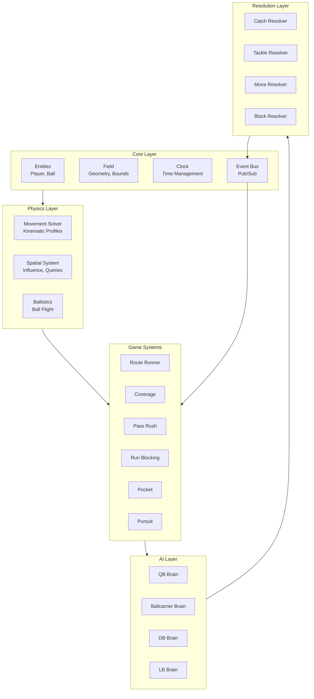
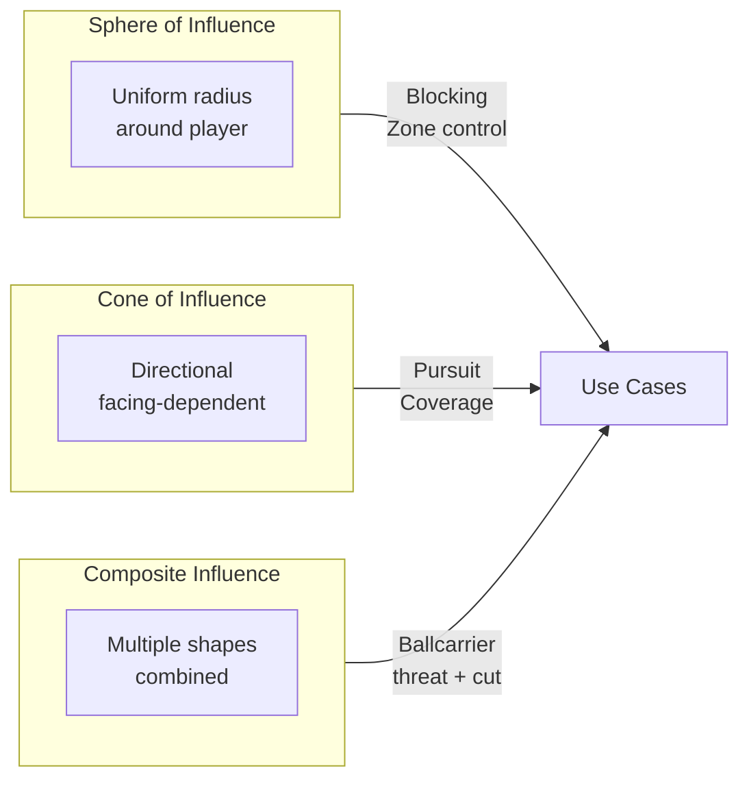
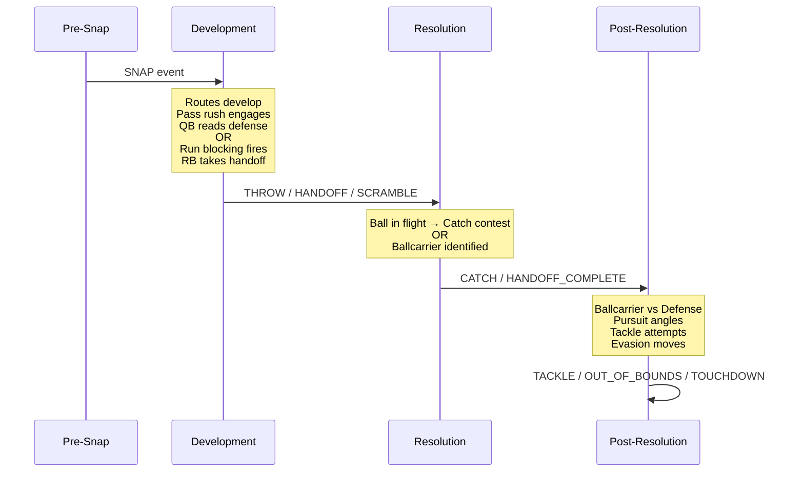
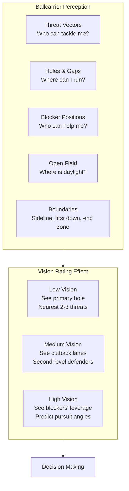
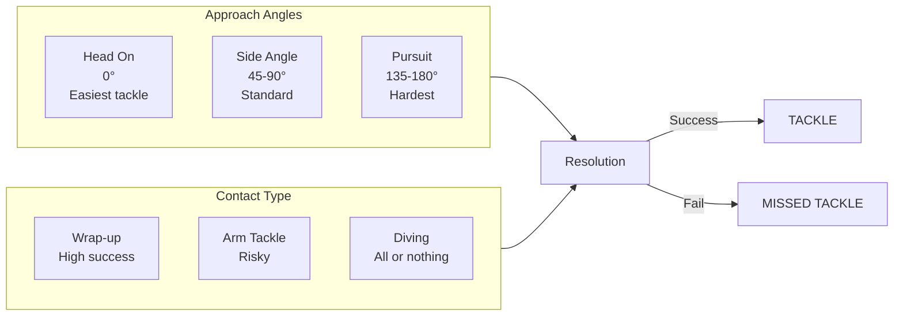
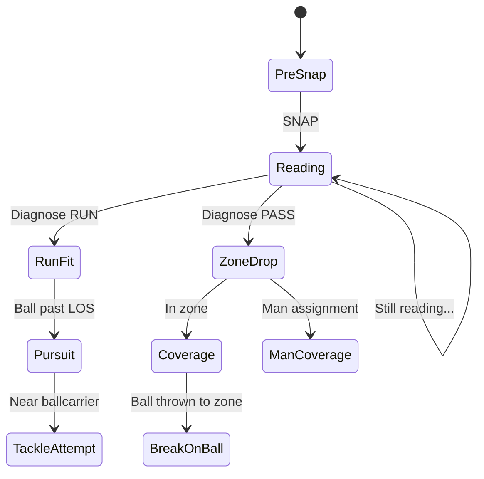
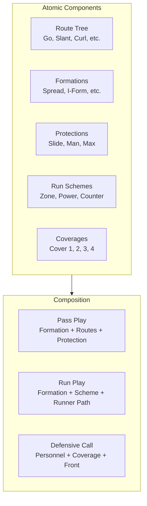

# Simulation v2: Architecture Design Document

## Overview

A ground-up redesign of the football play simulation engine, informed by lessons learned from v1. This system models complete football plays—passing and running—from snap to whistle, with realistic physics, AI decision-making, and stochastic outcomes driven by player attributes.

### Design Principles

1. **Space is continuous** — Simulation operates in real-world units (yards). Rendering is a separate projection concern.
2. **Influence over geometry** — Players control space through spheres and cones of influence, not just collision radii.
3. **Attributes → Capabilities → Decisions → Outcomes** — Clean data flow from player ratings to simulation results.
4. **AI is separate from physics** — Decision-making observes the world and emits intentions. Physics executes movement.
5. **Events for state transitions** — Phase changes and key moments emit events; systems subscribe and react.
6. **Stochastic at decision points** — Movement is deterministic given a target; randomness enters at contests and decisions.

---

## System Architecture



### Directory Structure

```
simulation_v2/
├── core/
│   ├── entities.py         # Player, Ball - pure data
│   ├── field.py            # Field geometry, coordinates
│   ├── clock.py            # Time management
│   └── events.py           # Event types and bus
│
├── physics/
│   ├── movement.py         # MovementProfile, MovementSolver
│   ├── spatial.py          # Influence zones, spatial queries
│   ├── body.py             # BodyModel, physical dimensions
│   └── ballistics.py       # Ball flight trajectories
│
├── systems/                 # Game systems (pre-resolution)
│   ├── routes.py           # WR route running
│   ├── coverage.py         # DB coverage logic
│   ├── pass_rush.py        # DL vs OL pass blocking
│   ├── run_blocking.py     # OL run blocking schemes
│   ├── pocket.py           # QB pocket movement
│   ├── backfield.py        # RB motion, handoffs
│   └── pursuit.py          # Defender pursuit angles
│
├── ai/                      # Decision-making brains
│   ├── qb_brain.py         # Read progression, throw decisions
│   ├── ballcarrier_brain.py # Vision, hole finding, moves
│   ├── db_brain.py         # Coverage decisions, ball tracking
│   └── lb_brain.py         # Run/pass read, gap fill
│
├── resolution/              # Contest resolution
│   ├── catch.py            # Catch probability
│   ├── tackle.py           # Tackle probability + geometry
│   ├── moves.py            # Juke/spin/truck outcomes
│   └── blocking.py         # Blocking engagement outcomes
│
├── plays/                   # Play definitions
│   ├── play.py             # Base play class
│   ├── atoms/              # Atomic components
│   │   ├── routes.py       # Route definitions
│   │   ├── formations.py   # Formation definitions
│   │   ├── protections.py  # Blocking schemes
│   │   └── coverages.py    # Coverage schemes
│   └── concepts/           # Composed play concepts
│
└── orchestrator.py          # Main simulation loop
```

---

## Core Layer

### Entities

Players and the ball are pure data containers with no behavior.

```python
@dataclass
class Player:
    """Core entity - just data, no behavior."""
    id: str
    position: Vec2
    velocity: Vec2
    facing: Vec2

    # Physical model
    body: BodyModel

    # Capabilities (derived from attributes)
    movement: MovementProfile

    # State
    has_ball: bool = False
    is_engaged: bool = False      # In a blocking engagement
    is_down: bool = False         # Play is over for this player

    # Current assignment (can change mid-play)
    assignment: Optional[Assignment] = None

    # Current influence zone (updated each tick)
    influence: Optional[Influence] = None

@dataclass
class Ball:
    """The football."""
    state: BallState  # HELD, IN_FLIGHT, LOOSE
    position: Vec2
    carrier_id: Optional[str] = None
    flight: Optional[BallFlight] = None
```

### Field Geometry

Single coordinate system used everywhere. All units in **yards**.

```python
# Field dimensions (yards)
FIELD_LENGTH = 100.0        # Goal line to goal line
FIELD_WIDTH = 53.333        # 53 1/3 yards
ENDZONE_DEPTH = 10.0

# Hash marks (NFL)
HASH_WIDTH = 6.167          # 18'6" from center
LEFT_HASH = -HASH_WIDTH
RIGHT_HASH = HASH_WIDTH

# Sidelines
LEFT_SIDELINE = -FIELD_WIDTH / 2   # -26.667
RIGHT_SIDELINE = FIELD_WIDTH / 2   # +26.667

# Coordinate system:
#   Origin (0, 0) = Center of field at line of scrimmage
#   +X = Right (offense's perspective)
#   +Y = Downfield (toward opponent's end zone)
#   -Y = Backfield (toward own end zone)
```

### Event System

Events signal state transitions. Systems subscribe to relevant events.

```python
class EventType(Enum):
    # Play lifecycle
    SNAP = "snap"
    HANDOFF = "handoff"
    THROW = "throw"
    CATCH = "catch"
    INCOMPLETE = "incomplete"
    INTERCEPTION = "interception"
    TACKLE = "tackle"
    OUT_OF_BOUNDS = "out_of_bounds"
    TOUCHDOWN = "touchdown"
    PLAY_DEAD = "play_dead"

    # State transitions
    ROUTE_BREAK = "route_break"
    PRESSURE_THRESHOLD = "pressure_threshold"
    BLOCK_SHED = "block_shed"
    HOLE_OPENED = "hole_opened"

    # Encounters
    TACKLE_ATTEMPT = "tackle_attempt"
    MOVE_ATTEMPT = "move_attempt"
    CATCH_CONTEST = "catch_contest"
```

---

## Physics Layer

### Movement Profiles

Players have capability profiles derived from their attributes.

```python
@dataclass
class MovementProfile:
    """Defines how an entity CAN move."""
    max_speed: float           # yards/second at top speed
    acceleration: float        # yards/second² to reach top speed
    deceleration: float        # yards/second² when slowing

    # Change of direction
    cut_speed_retention: float # 0-1, speed kept through hard cut
    cut_angle_threshold: float # radians defining a "cut"

    # Reaction
    reaction_time: float       # seconds before responding to stimulus

    @classmethod
    def from_attributes(cls, speed: int, accel: int, agility: int) -> "MovementProfile":
        """Derive movement profile from player attributes (0-99 scale)."""
        return cls(
            max_speed=4.5 + (speed / 100) * 3.0,      # 4.5-7.5 yards/sec
            acceleration=8.0 + (accel / 100) * 8.0,   # 8-16 yards/sec²
            deceleration=12.0 + (accel / 100) * 6.0,  # 12-18 yards/sec²
            cut_speed_retention=0.4 + (agility / 100) * 0.45,  # 40-85%
            cut_angle_threshold=0.5,  # ~30 degrees
            reaction_time=0.2 - (agility / 100) * 0.1,  # 100-200ms
        )
```

### Movement Solver

Single source of truth for all player movement.

```python
class MovementSolver:
    """Resolves movement for any entity with a MovementProfile."""

    def solve(
        self,
        current_pos: Vec2,
        current_vel: Vec2,
        target_pos: Vec2,
        profile: MovementProfile,
        dt: float,
    ) -> tuple[Vec2, Vec2]:
        """
        Given current state, target, and capabilities,
        compute position and velocity after dt seconds.
        """
        # Direction to target
        to_target = target_pos - current_pos
        if to_target.length() < 0.01:
            return current_pos, Vec2(0, 0)

        desired_dir = to_target.normalized()
        current_speed = current_vel.length()
        current_dir = current_vel.normalized() if current_speed > 0.01 else desired_dir

        # Check for direction change (cut)
        angle_change = current_dir.angle_to(desired_dir)

        if angle_change > profile.cut_angle_threshold:
            # Hard cut - lose speed based on agility
            current_speed *= profile.cut_speed_retention

        # Accelerate toward max speed
        if current_speed < profile.max_speed:
            current_speed = min(
                profile.max_speed,
                current_speed + profile.acceleration * dt
            )

        # Apply movement
        new_vel = desired_dir * current_speed
        new_pos = current_pos + new_vel * dt

        return new_pos, new_vel
```

### Body Model

Players have physical dimensions that matter for collisions and space control.

```python
@dataclass
class BodyModel:
    """Physical body representation."""
    height: float          # yards (for high points, hurdles)
    shoulder_width: float  # yards (collision width)
    weight: float          # lbs (for contact resolution)
    arm_length: float      # yards (tackle/catch reach)

    @property
    def collision_radius(self) -> float:
        """Simplified collision radius."""
        return self.shoulder_width / 2

    @property
    def tackle_reach(self) -> float:
        """Maximum tackle distance from center."""
        return self.collision_radius + self.arm_length

    @classmethod
    def from_measurements(
        cls,
        height_inches: int,
        weight_lbs: int,
        arm_length_inches: int = 33,
    ) -> "BodyModel":
        return cls(
            height=height_inches / 36,
            shoulder_width=0.5 + (weight_lbs - 180) / 350,  # ~0.5-0.9 yards
            weight=weight_lbs,
            arm_length=arm_length_inches / 36,
        )
```

### Typical Body Dimensions by Position

| Position | Height | Weight | Shoulder Width | Collision Radius |
|----------|--------|--------|----------------|------------------|
| OL | 6'5" | 315 lbs | ~0.89 yards | ~0.44 yards |
| DL | 6'4" | 295 lbs | ~0.83 yards | ~0.41 yards |
| LB | 6'2" | 245 lbs | ~0.69 yards | ~0.34 yards |
| RB | 5'10" | 215 lbs | ~0.60 yards | ~0.30 yards |
| WR | 6'1" | 200 lbs | ~0.56 yards | ~0.28 yards |
| DB | 6'0" | 195 lbs | ~0.54 yards | ~0.27 yards |
| TE | 6'5" | 255 lbs | ~0.71 yards | ~0.36 yards |
| QB | 6'3" | 225 lbs | ~0.63 yards | ~0.31 yards |

---

## Spatial System: Influence Zones

The key insight: **players control space, not just occupy it**.

### Influence Types



### Influence Implementation

```python
@dataclass
class SphereOfInfluence:
    """Radial influence around a player."""
    center: Vec2
    radius: float

    def influence_at(self, point: Vec2) -> float:
        """Influence strength at point (0-1)."""
        dist = self.center.distance_to(point)
        if dist >= self.radius:
            return 0.0
        return 1.0 - (dist / self.radius)

@dataclass
class ConeOfInfluence:
    """Directional influence in front of player."""
    origin: Vec2
    direction: Vec2       # Normalized facing
    range: float          # How far cone extends
    half_angle: float     # Cone width in radians

    def influence_at(self, point: Vec2) -> float:
        """Influence at point considering distance and angle."""
        to_point = point - self.origin
        dist = to_point.length()

        if dist > self.range or dist < 0.001:
            return 0.0

        angle = abs(self.direction.angle_to(to_point.normalized()))
        if angle > self.half_angle:
            return 0.0

        dist_factor = 1.0 - (dist / self.range)
        angle_factor = 1.0 - (angle / self.half_angle)

        return dist_factor * angle_factor
```

### Influence by Player State

| Player State | Influence Shape | Range | Width |
|--------------|-----------------|-------|-------|
| Blocker (engaged) | Sphere | ~1.5 yards | 360° |
| Blocker (free) | Cone | ~2 yards | ~90° |
| Defender (zone) | Cone | ~4-5 yards | ~140° |
| Defender (pursuit) | Cone | ~3-4 yards | ~45° |
| Ballcarrier | Composite: Cone + Sphere | Cone: 3-4y, Sphere: 1y | Cone: ~70° |
| Coverage DB | Cone (toward receiver) | ~2-3 yards | ~60° |

### Influence Field

Aggregate view for analysis and AI decision-making:

```python
class InfluenceField:
    """Computes net influence across the field."""

    def compute(
        self,
        offense: list[Player],
        defense: list[Player],
        bounds: FieldBounds,
        resolution: float = 0.5,  # yards per cell
    ) -> np.ndarray:
        """
        Returns 2D array where:
          positive = offense controls
          negative = defense controls
          zero = contested/neutral
        """
        # ... implementation
```

---

## Play Phases

Every play flows through distinct phases:



### Pre-Resolution Phase

Assignment-based, structured behavior:

- **Routes**: Receivers follow predetermined paths
- **Coverage**: DBs execute man/zone assignments
- **Pass Rush**: DL uses moves against OL
- **Run Blocking**: OL executes gap/zone schemes
- **QB**: Reads defense, manages pocket

### Post-Resolution Phase

Reactive, instinct-based behavior:

- **Ballcarrier AI**: Vision, hole finding, move selection
- **Pursuit**: Defenders take angles to ballcarrier
- **Tackle Attempts**: Geometric resolution
- **Blocking**: Sustain blocks, pick up new assignments

---

## Ballcarrier AI

The most complex AI component—requires spatial reasoning and dynamic decision-making.

### Perception System



### Threat Vectors

```python
@dataclass
class ThreatVector:
    """A defender threatening the ballcarrier."""
    defender_id: str
    position: Vec2
    velocity: Vec2

    # Calculated
    intercept_time: float      # Seconds until they can reach me
    intercept_point: Vec2      # Where we'd meet
    approach_angle: float      # Head-on vs pursuit
    tackle_probability: float  # Based on angle + ratings
```

### Hole Analysis

```python
@dataclass
class Hole:
    """A gap the ballcarrier can hit."""
    entry_point: Vec2
    exit_point: Vec2
    width: float               # Current width in yards
    closing_rate: float        # How fast it's shrinking
    time_window: float         # Seconds before it closes
    second_level_threats: int  # Defenders waiting beyond

    def quality_score(self, body: BodyModel) -> float:
        """How good is this hole for this ballcarrier?"""
        if self.width <= body.shoulder_width:
            return 0.0  # Can't fit

        fit_score = min(1.0, (self.width - body.shoulder_width) / body.shoulder_width)
        time_score = min(1.0, self.time_window / 0.5)  # 0.5 sec is comfortable
        threat_score = max(0.0, 1.0 - self.second_level_threats * 0.2)

        return fit_score * time_score * threat_score
```

### Ballcarrier Moves

```python
class BallcarrierMove(Enum):
    # Evasion moves
    JUKE = "juke"           # Quick lateral cut
    SPIN = "spin"           # 360 rotation
    DEAD_LEG = "dead_leg"   # Subtle hesitation
    HURDLE = "hurdle"       # Jump over low tackler

    # Power moves
    STIFF_ARM = "stiff_arm" # Arm extension
    TRUCK = "truck"         # Lower shoulder, run through

    # Speed moves
    SPEED_BURST = "speed_burst"  # Accelerate past

    # Safe moves
    PROTECT_BALL = "protect_ball"  # Two hands, lower target
    GO_DOWN = "go_down"            # Give yourself up
    OUT_OF_BOUNDS = "out_of_bounds"
```

### Move Resolution

| Move | Primary Attribute | Counter | Success Effect | Fail Effect |
|------|-------------------|---------|----------------|-------------|
| Juke | Agility | Tackle, Pursuit | +2-4 yards, new angle | Arm tackle |
| Spin | Agility | Awareness | +3-5 yards, behind defender | Fumble risk |
| Stiff Arm | Strength | Strength | Shed tackler | Minimal |
| Truck | Strength + Weight | Tackle + Weight | +1-3 yards through contact | Stopped |
| Hurdle | Agility | Height | +5-7 yards | Flipped, fumble risk |
| Speed Burst | Speed | Speed | Outrun defender | Caught from behind |

---

## Tackle System

### Tackle Geometry



### Tackle Resolution

```python
@dataclass
class TackleAttempt:
    """Geometric context for a tackle."""
    tackler: Player
    ballcarrier: Player

    approach_angle: float      # 0 = head-on, π = from behind
    closing_speed: float       # yards/sec of closure
    contact_distance: float    # How far tackle reaches

    @property
    def is_arm_tackle(self) -> bool:
        return self.contact_distance > self.tackler.body.collision_radius * 1.5

class TackleResolver:
    def resolve(self, attempt: TackleAttempt) -> TackleResult:
        # Base probability from ratings
        base = 0.5 + (attempt.tackler.attributes.tackling -
                      attempt.ballcarrier.attributes.elusiveness) / 200

        # Modifiers
        modifiers = {
            'angle': self._angle_modifier(attempt.approach_angle),
            'arm_tackle': 0.6 if attempt.is_arm_tackle else 1.0,
            'closing_speed': 0.9 + attempt.closing_speed * 0.05,
            'size': 1.0 + (attempt.tackler.body.weight -
                          attempt.ballcarrier.body.weight) / 200,
        }

        final_prob = base * product(modifiers.values())
        final_prob = clamp(final_prob, 0.1, 0.95)

        if random.random() < final_prob:
            return TackleResult.MADE
        else:
            return TackleResult.MISSED
```

---

## Linebacker AI

LBs operate in both phases and must diagnose plays.

### Run/Pass Read



### Read Time

```python
def get_read_time(lb: Player) -> float:
    """How long before LB commits to run/pass."""
    # Base 0.4 seconds, reduced by play recognition
    base = 0.4
    reduction = (lb.attributes.play_recognition / 100) * 0.2
    return base - reduction  # 0.2 - 0.4 seconds
```

### Gap Responsibility

```python
class GapAssignment(Enum):
    A_GAP_LEFT = "a_left"    # Between C and LG
    A_GAP_RIGHT = "a_right"  # Between C and RG
    B_GAP_LEFT = "b_left"    # Between LG and LT
    B_GAP_RIGHT = "b_right"  # Between RG and RT
    C_GAP_LEFT = "c_left"    # Outside LT
    C_GAP_RIGHT = "c_right"  # Outside RT
    D_GAP_LEFT = "d_left"    # Wide left
    D_GAP_RIGHT = "d_right"  # Wide right
```

---

## Play Definition System

Plays are composed from atomic building blocks.

### Atomic Components



### Route Definition

```python
@dataclass
class RouteDefinition:
    """Atomic route definition."""
    name: str
    route_type: RouteType

    # Path defined as waypoints relative to alignment
    waypoints: list[RouteWaypoint]

    # Timing
    break_depth: float     # Yards downfield at break
    break_direction: float # Angle of break (radians)

    # Variations
    hot_adjustment: Optional["RouteDefinition"] = None  # Blitz adjustment

    @classmethod
    def slant(cls, depth: float = 3.0) -> "RouteDefinition":
        return cls(
            name="Slant",
            route_type=RouteType.SLANT,
            waypoints=[
                RouteWaypoint(Vec2(0, 1), is_break=False),      # Release
                RouteWaypoint(Vec2(3, depth), is_break=True),   # Break inside
                RouteWaypoint(Vec2(12, depth + 5), is_break=False),  # Continue
            ],
            break_depth=depth,
            break_direction=math.radians(45),  # 45° inside
        )
```

### Formation Definition

```python
@dataclass
class FormationDefinition:
    """Offensive formation."""
    name: str
    positions: dict[PositionSlot, Vec2]  # Relative to ball

    @classmethod
    def spread(cls) -> "FormationDefinition":
        return cls(
            name="Spread",
            positions={
                PositionSlot.QB: Vec2(0, -5),       # Shotgun
                PositionSlot.RB: Vec2(2, -6),       # Offset right
                PositionSlot.X: Vec2(-23, 0),       # Split end left
                PositionSlot.H: Vec2(-8, 0),        # Slot left
                PositionSlot.Y: Vec2(8, 0),         # Slot right
                PositionSlot.Z: Vec2(23, 0),        # Flanker right
                PositionSlot.LT: Vec2(-6, 0),
                PositionSlot.LG: Vec2(-3, 0),
                PositionSlot.C: Vec2(0, 0),
                PositionSlot.RG: Vec2(3, 0),
                PositionSlot.RT: Vec2(6, 0),
            }
        )
```

### Play Composition

```python
@dataclass
class PassPlay:
    """A complete pass play."""
    name: str
    formation: FormationDefinition
    protection: ProtectionScheme

    # Route assignments by position slot
    routes: dict[PositionSlot, RouteDefinition]

    # QB info
    read_progression: list[PositionSlot]  # Order to read receivers
    dropback_type: DropbackType

    # Hot routes / audibles
    hot_routes: Optional[dict[str, dict[PositionSlot, RouteDefinition]]] = None

@dataclass
class RunPlay:
    """A complete run play."""
    name: str
    formation: FormationDefinition
    scheme: RunBlockingScheme

    # Blocking assignments
    blocking: list[BlockingAssignment]

    # Ballcarrier path
    designed_hole: GapAssignment
    ball_carrier_slot: PositionSlot
    initial_path: list[Vec2]  # Before read

    # Read key (for zone schemes)
    read_key: Optional[PositionSlot] = None  # Defender to read
```

---

## Simulation Loop

### Main Orchestrator

```python
class PlaySimulator:
    """Orchestrates a complete play simulation."""

    def __init__(self):
        self.clock = Clock()
        self.event_bus = EventBus()
        self.movement_solver = MovementSolver()
        self.spatial_system = SpatialSystem()

        # Systems
        self.systems = [
            RouteSystem(),
            CoverageSystem(),
            PassRushSystem(),
            RunBlockingSystem(),
            PocketSystem(),
            PursuitSystem(),
        ]

        # AI
        self.qb_brain = QBBrain()
        self.ballcarrier_brain = BallcarrierBrain()
        self.lb_brain = LBBrain()
        self.db_brain = DBBrain()

        # Resolvers
        self.catch_resolver = CatchResolver()
        self.tackle_resolver = TackleResolver()
        self.move_resolver = MoveResolver()

    def simulate(self, play: Play, offense: list[Player], defense: list[Player]) -> PlayResult:
        """Simulate a play from snap to whistle."""
        state = self._initialize(play, offense, defense)

        self.event_bus.emit(Event(EventType.SNAP))

        while not state.is_complete:
            dt = self.clock.tick()

            # Update influence zones
            self._update_influences(state)

            # Run systems based on phase
            if state.phase == PlayPhase.DEVELOPMENT:
                self._run_development_phase(state, dt)
            elif state.phase == PlayPhase.POST_RESOLUTION:
                self._run_post_resolution_phase(state, dt)

            # Check for phase transitions
            self._check_transitions(state)

            # Check for play end
            self._check_play_end(state)

        return self._compile_result(state)
```

### Time Management

```python
class Clock:
    """Manages simulation time."""

    def __init__(self, tick_rate: float = 0.05):
        """
        Args:
            tick_rate: Seconds per tick (0.05 = 50ms = 20 ticks/sec)
        """
        self.tick_rate = tick_rate
        self.current_time = 0.0
        self.tick_count = 0

    def tick(self) -> float:
        """Advance time by one tick, return dt."""
        self.current_time += self.tick_rate
        self.tick_count += 1
        return self.tick_rate

    def time_since(self, event_time: float) -> float:
        """Seconds since an event occurred."""
        return self.current_time - event_time
```

---

## Key Improvements Over v1

| Aspect | v1 Approach | v2 Approach |
|--------|-------------|-------------|
| **Coordinates** | Two systems (pocket, play) with conversion | Single unified system |
| **Physics** | Ad-hoc per-system, magic numbers | MovementSolver with profiles |
| **Space** | Point positions, collision radii | Influence zones, spatial queries |
| **AI** | Mixed with physics | Separated, observes and emits intentions |
| **Decisions** | Thresholds + bypasses (panic throw) | Unified utility system |
| **Events** | Scattered state checks | Centralized event bus |
| **Run game** | Not implemented | First-class support |
| **Ballcarrier** | Not implemented | Full perception/decision model |
| **LBs** | Not implemented | Run/pass read, gap fit, pursuit |
| **Plays** | Hardcoded | Atomic composition |
| **Scale** | Pixel-aware | Pure yards, rendering separate |

---

## Implementation Phases

### Phase 1: Core Foundation
- [ ] Vec2, coordinate system, field geometry
- [ ] Entity definitions (Player, Ball)
- [ ] MovementProfile and MovementSolver
- [ ] BodyModel with real dimensions
- [ ] Event bus

### Phase 2: Spatial System
- [ ] Sphere and Cone of Influence
- [ ] SpatialSystem with queries
- [ ] InfluenceField computation
- [ ] Gap analysis

### Phase 3: Pre-Resolution Systems
- [ ] Route runner
- [ ] Coverage (man/zone)
- [ ] Pass rush with engagement model
- [ ] Run blocking (gap/zone schemes)
- [ ] QB pocket movement

### Phase 4: AI Layer
- [ ] QB brain (read progression, utility-based decisions)
- [ ] DB brain (coverage decisions, ball tracking)
- [ ] LB brain (run/pass read, gap fill)
- [ ] Ballcarrier brain (vision, hole finding)

### Phase 5: Resolution Layer
- [ ] Catch resolver (probabilistic)
- [ ] Tackle resolver (geometry-aware)
- [ ] Move resolver (juke, spin, etc.)
- [ ] Block resolver (engagement outcomes)

### Phase 6: Play System
- [ ] Atomic route definitions
- [ ] Formation definitions
- [ ] Protection schemes
- [ ] Run schemes
- [ ] Play composition

### Phase 7: Integration
- [ ] Main orchestrator
- [ ] Phase transitions
- [ ] Full play simulation
- [ ] Results compilation

---

## Open Questions

1. **Fatigue modeling**: How does player stamina affect capabilities over a play? Over a game?

2. **Injury system**: When do injuries occur? What body parts? How does geometry affect injury risk?

3. **Pre-snap motion**: How do we model motion, shifts, and their effects on defensive alignment?

4. **Audibles**: How does the play definition system support in-play adjustments?

5. **Special teams**: Separate system or extension of this framework?

6. **Multiplayer coordination**: How do blockers communicate to pick up stunts/blitzes?

---

## Appendix: Real-World Reference Data

### Player Speed Benchmarks (40-yard dash → yards/sec)

| 40 Time | Top Speed (yards/sec) | Player Type |
|---------|----------------------|-------------|
| 4.3s | ~7.5 | Elite WR/CB |
| 4.4s | ~7.2 | Fast skill player |
| 4.5s | ~7.0 | Average WR/RB |
| 4.6s | ~6.7 | LB, Safety |
| 4.8s | ~6.3 | Average LB |
| 5.0s | ~6.0 | DL |
| 5.2s+ | ~5.5 | OL |

### Gap Widths (Real NFL Data)

| Situation | Typical Width |
|-----------|---------------|
| At snap (between OL) | 0.5-0.8 yards |
| After initial push | 0.8-1.2 yards |
| "Good" hole | 1.5-2.0 yards |
| "Huge" hole | 2.5+ yards |
| Minimum viable | 0.7 yards (squeeze) |

### Tackle Success Rates (NFL Averages)

| Situation | Success Rate |
|-----------|--------------|
| Head-on, wrapped up | ~90% |
| Side angle, contact | ~75% |
| Pursuit angle | ~60% |
| Arm tackle | ~45% |
| Diving attempt | ~50% |
| In open field | ~55% |
